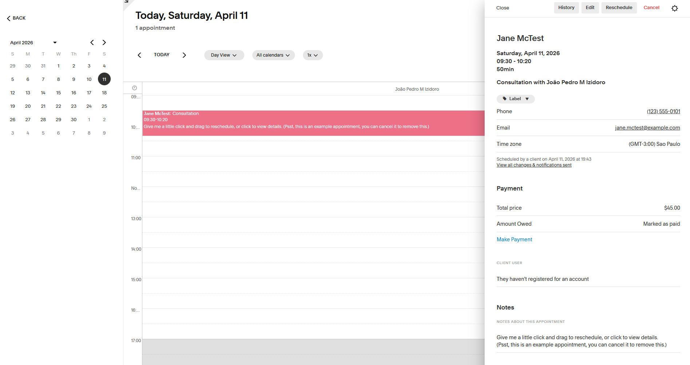
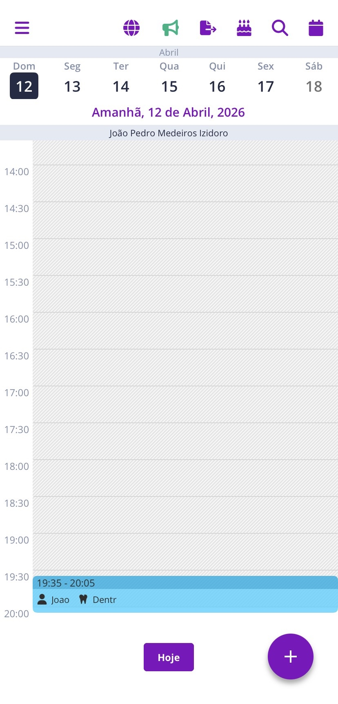
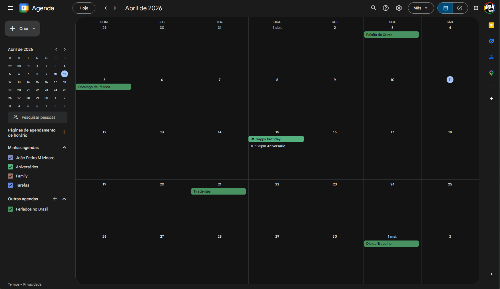

<h1 style="color:#D89F0F">1. Visão do Produto</h1>
O Planici resolve o problema encontrado em softwares complicados, incompletos ou caros de agenda e gestão de negócio, utilizando uma interface intuitiva para gerenciar os compromissos, gastos e lucros, e clientes de um micro e pequeno negócio.

<h2 style="color:#770404">1.1. Contexto e Problema</h2>
Profissionais de atendimento personalizado (terapeutas, nutricionistas, personal trainers) costumam trabalhar sozinhos ou com equipes pequenas e acabam concentrando agenda, cadastro de clientes, procedimentos, preços e finanças.
Isso aumenta a complexidade da rotina e o risco de desorganização e perda de informações. Sem uma ferramenta unificada, recorrem a planilhas, agendas físicas e apps genéricos.
   
Exemplo: uma terapeuta com CNPJ usa Excel para agenda e financeiro, mas sente falta de calendário, vínculo estruturado entre clientes e procedimentos, controle de pagamentos e personalização.
   
A solução atual é parcial e consome tempo, enquanto apps especializados são caros ou pouco flexíveis.

<!-- #region 1.2 ORIGEM DA DEMANDA E SOLUÇÃO -->

<h2 style="color:#770404">1.2. Origem da Demanda e Evidências </h2>
A demanda foi identificada a partir de contato direto com uma profissional autônoma da área de terapia. A evidência principal é o relato detalhado da própria usuária sobre suas dificuldades operacionais, combinado com a observação do fluxo de trabalho atual, como o uso de planilhas Excel para agenda e controle financeiro, sem integração entre as informações.
A partir dessa demanda pontual, identificou-se um padrão recorrente no perfil de micro-empreendedores de serviços personalizados: atuação individual, baixo suporte técnico e necessidade de ferramentas acessíveis e simples. Essa percepção motivou o escopo expandido do projeto para além da demanda original.
<h3 style="color:#C90606">Projeto solicitado por:</h3>
<ul>
  <li><strong>Profissional autônoma:</strong> Terapeuta com CNPJ próprio (informado em sigilo; ex.: 62.XXX.XXX/0001-00), atuando de forma individual.</li>
  <li><strong>Contexto:</strong> Necessidade de substituir controle manual em planilhas por ferramenta integrada e personalizada.</li>
  <li><strong>Problema relatado:</strong> Os aplicativos especializados disponíveis no mercado são caros e não permitem a customização necessária para o modelo de negócio da profissional.</li>
</ul>

<!-- #endregion -->

<!-- #region 1.3 ANÁLISE DE SOLUÇÕES EXISTENTES -->

<h2>1.3. Análise de Soluções Existentes</h2>

<!-- #region PRIMEIRA SOLUÇÃO: ACUITY SCHEDULING -->

<h3>Primeira Solução: Acuity Scheduling</h3>

<a href="https://pt-br.acuityscheduling.com/">Link</a> 

<strong>Público alvo: </strong>Coaches, Consultores, Terapeutas, Personal Trainers

<strong>Principais Funcionalidades:</strong>
<ul>
  <li>Agendamento Online</li>
  <li>Formulários Customizáveis</li>
  <li>Integração com Stripe, Paypal</li>
  <li>Rastreamento de Serviços prestados</li>
  <li>Notificação por email e SMS</li>
  <li>Sincronização Bidirecional com Google Calendar</li>
  <li>Personalização Visual</li>
  <li>API para integração</li>
</ul>

<strong>Principais Limitações:</strong>
<ul>
  <li>Versão Starter limitada com custo alto (USD 20/mês)</li>
  <li>Versão completa (Premium) USD 61/mês</li>
  <li>Interface complexa, muitas opções</li>
  <li>Voltada para booking online (cliente agendando sozinho)</li>
  <li>Requer conhecimento técnico para setup avançado</li>
</ul>

  
<h4>Imagem</h4>

  
  

 

<!-- #endregion -->

<!-- #region SEGUNDA SOLUÇÃO: MINHAAGENDA -->

<h3>Segunda Solução: MinhaAgenda</h3>

<a href="https://minhaagendaapp.com.br/">Link</a> 

<strong>Público alvo: </strong>Coaches, Consultores, Terapeutas, Personal Trainers

<strong>Principais Funcionalidades:</strong>
<ul>
  <li>Calendario Visual com agendamento online</li>
  <li>App mobile nativo</li>
  <li>Integração com Stripe</li>
  <li>Gestão Básica de clientes</li>
  <li>Notificação por SMS</li>
  <li>Relatório de receita (versão premium)</li>
</ul>

<strong>Principais Limitações:</strong>
<ul>
  <li>Versão gratuita limitada (máx. 50 agendamentos/mês)</li>
  <li>Sem customização personalizada de campos de cliente e agenda</li>
  <li>Interface web confusa</li>
  <li>Somente SMS, sem integração com WhatsApp</li>
  <li>Focado para mobile, não permite nem criação de conta via web</li>
  <li>Sem aplicativo desktop</li>
</ul>

  
<h4>Imagem</h4>

  
  

   

<!-- #endregion -->

<!-- #region TERCEIRA SOLUÇÃO: GOOGLE CALENDAR -->

<h3>Terceira Solução: Google Calendar</h3>

<a href="https://calendar.google.com/calendar/u/0/r?pli=1">Link</a> 

<strong>Público alvo: </strong>Usuários gerais, profissionais, empresas, qualquer pessoa com conta Google

<strong>Principais Funcionalidades:</strong>
<ul>
  <li>Calendario Visual com agendamento online</li>
  <li>Calendário com views de dia, semana e mês</li>
  <li>Criação e edição de eventos</li>
  <li>Notificações por email</li>
  <li>Compartilhamento de agenda com outras pessoas</li>
  <li>Sincronização entre dispositivos</li>
  <li>Busca por disponibilidade</li>
</ul>

<strong>Principais Limitações:</strong>
<ul>
  <li>Sem sistema de gestão de clientes</li>
  <li>Não há forma de armazenar dados</li>
  <li>Sem histórico de serviços prestados</li>
  <li>Interface não permite personalização</li>
  <li>Pensado para calendário pessoal, não negócio</li>
</ul>

  
<h4>Imagem</h4>

  

  

<!-- #endregion -->

<!-- #region DIFERENCIAL DO PROJETO-->
<h3 style="color:#C90606">Diferencial do Projeto</h3>

<h4>Por que criar algo novo?</h4>

<ul>
  <li>Versão paga mais barata que as soluções existentes.</li>
  <li>Versão gratuita mantém todas as funcionalidades padrão, sem limitação de tempo.</li>
  <li>Customização de tema completa, inspirada em aplicações como Notion e Jira</li>
  <li>Interface montada com foco em UX e intuitividade</li>
</ul>

<h4>Lacunas não resolvidas pelas soluções existentes</h4>
Nenhuma solução existente combina TODOS os seguintes requisitos:

<strong>Integração completa.</strong>
<ul>
  <li><strong>MinhaAgenda</strong>: Tem agenda. Falta personalização customizada.</li>
  <li><strong>Acuity</strong>: Tem personalização completa. Falta plano gratuito.</li>
  <li><strong>Google Calendar</strong>: Tem agenda completa, falta o restante da lógica completo (clientes, pagamentos).</li>
</ul>

<strong>Preço Acessível</strong>
<ul>
  <li><strong>MinhaAgenda</strong>: Plano grátis aceitável</li>
  <li><strong>Acuity</strong>: Sem plano grátis, plano mais barato a R$ 100, incompleto.</li>
  <li><strong>Google Calendar</strong>: Grátis, porém o mais incompleto da lista em questão de features.</li>
</ul>

<strong>Personalização da Marca.</strong>
<ul>
  <li><strong>MinhaAgenda</strong>: Sem personalização.</li>
  <li><strong>Acuity</strong>: Permite personalização de tema avançado.</li>
  <li><strong>Google Calendar</strong>: Sem personalização.</li>
</ul>

<strong>Simplicidade</strong>
<ul>
  <li><strong>MinhaAgenda</strong>: Simples, mas features limitadas.</li>
  <li><strong>Acuity</strong>: Complexa, muitas interfaces.</li>
  <li><strong>Google Calendar</strong>: Simples, mas features limitadas.</li>
</ul>

<h4>Nicho Atendido</h4>
Profissionais autônomos com foco em serviços personalizados que atuem individualmente.
O nicho principal é no modelo de negócio individual, e não venda de produtos, e de faturamento baixo-médio.

> [!IMPORTANT]
> **Nota de escopo — entrega acadêmica vs. produto comercial**
>
> O Portfólio II entregará um MVP acadêmico funcional focado no fluxo essencial de gestão de agenda, clientes, serviços, pagamentos manuais e visão financeira básica. Funcionalidades comerciais mais amplas, como planos pagos, múltiplos usuários, integrações com WhatsApp, formulários avançados, automações e arquitetura distribuída, são tratadas como evolução futura e não compõem o escopo obrigatório da entrega acadêmica. A visão de produto descrita nesta seção (versão gratuita/paga, personalização completa de tema) é direcionamento comercial futuro, não compromisso do MVP.

<!-- #endregion-->

<!-- #endregion -->

<!-- #region 1.4 PUBLICO ALVO -->

<h2 style="color:#770404">1.4. Público Alvo</h2>

O sistema é voltado para profissionais autônomos, empresários individuais e profissionais de MEI que prestam serviços personalizados de forma individual, sem equipe de suporte administrativo. O perfil principal inclui terapeutas, esteticistas, nutricionistas, personal trainers, consultores, entre outros.

<strong>Perfil do usuário:</strong>
<ul>
  <li>Atua de forma independente, sem funcionários ou suporte administrativo.</li>
  <li>Faixa etária ampla (25 a 60+ anos), reforçando a necessidade de interface simples e sem curva de aprendizado.</li>
  <li>Já teve contato com outras ferramentas de gestão ou calendário, mas abandonou por complexidade ou custo.</li>
  <li>Não possui conhecimento técnico em tecnologia, mas sabe usar smartphone e navegador no dia a dia.</li>
</ul>

<strong>Contexto de Uso:</strong>
<ul>
  <li>O sistema será acessado tanto pelo celular quanto pelo computador, com design mobile-first</li>
  <li>O momento típico de uso é imediatamente após fechar um atendimento ou novo plano com o cliente. O fluxo esperado é: <i>fechou o acordo -> abriu o app -> registrou a consulta</i>, em menos de 5 minutos</li>
  <li>Não há tolerância para interfaces lentas ou fluxos longos: O usuário precisa concluir ações essenciais com poucos cliques.</li>
</ul>

<strong>Nível técnico esperado:</strong>
Nenhum conhecimento técnico necessário, o sistema deve funcionar sem manual, tutorial obrigatório ou configuração inicial complexa.

<!-- #endregion -->

<!-- #region 1.5 OBJETIVOS DO PROJETO -->

<h2 style="color:#770404">1.5. Objetivos do Projeto</h2>
<h3 style="color:#C90606">Objetivo Geral</h3>
Oferecer aos profissionais autônomos de serviços personalizados uma ferramenta integrada, intuitiva e acessível para gestão de agenda, clientes e finanças, eliminando a dependência de planilhas e reduzindo a sobrecarga administrativa do dia a dia.

<h4 style="color:#C90606">Objetivos Específicos</h4>

- Implementar um sistema de autenticação seguro com cadastro por e-mail/senha e login social via Google OAuth, garantindo isolamento completo de dados por tenant.
- Permitir a criação de um espaço de trabalho (tenant) por profissional no onboarding, com um único usuário (papel Owner) no MVP.
- Desenvolver o cadastro e a gestão básica de clientes (criar, editar, buscar e inativar preservando histórico).
- Desenvolver o cadastro e a gestão básica de serviços/procedimentos (nome, duração estimada e valor padrão, com inativação preservando histórico).
- Construir um módulo de agenda com disponibilidade básica (fixa e livre), criação manual de agendamentos, bloqueio de horários, visualização diária e semanal e prevenção de conflito de horário.
- Disponibilizar um link público simples de agendamento por tenant, permitindo que clientes externos solicitem horários sem criar conta, com fluxo de confirmação ou recusa pelo profissional.
- Implementar o registro manual de pagamentos por atendimento, com controle de status (pago, pendente, cancelado) e visão financeira básica (resumo de receitas por período).
- Garantir acessibilidade (WCAG 2.1 AA) nos fluxos principais do MVP.
- Garantir conformidade com a LGPD por meio de consentimento explícito no cadastro, minimização de dados coletados, aviso de privacidade no link público e isolamento de informações por tenant com Row-Level Security no banco de dados.
- Aplicar TDD nos fluxos críticos, com cobertura mínima de 75% no backend e 25% no frontend, análise estática contínua via SonarCloud e deploy público documentado.
- Entregar uma aplicação responsiva e de alta usabilidade, com tempo de carregamento das páginas principais inferior a 2 segundos em conexão 4G e fluxos essenciais concluídos em menos de 5 cliques.

> **Evolução futura (fora do MVP):** notificações automáticas por e-mail/WhatsApp, formulários personalizados, personalização de labels por ocupação profissional, planos/pacotes de serviços, comparativos e rankings financeiros, exportação de relatórios, multiusuário por tenant e arquitetura distribuída serão avaliados em fases posteriores, caso a necessidade seja validada. Ver [Tabela MVP × Pós-MVP](#27-tabela-mvp--pós-mvp).
 

<!-- #endregion -->

<!-- #region 1.6 Métricas de Sucesso (KPIs) -->

<h3 style="color:#770404">1.6. Métricas de Sucesso (KPIs)</h3>

<ul>
  <li>
  A usuária principal executa o fluxo central completo (criar conta → criar tenant → cadastrar serviço → cadastrar cliente → configurar agenda → criar agendamento → registrar pagamento → consultar visão financeira) sem auxílio de outras ferramentas.
  </li>
  <li>Tempo para concluir um agendamento completo inferior a 5 minutos e em menos de 5 cliques, alinhado às metas das seções 1.4 e 1.5 (valor canônico do fluxo essencial).</li>
  <li>Cliente e serviço cadastrados sem auxílio, em menos de 2 minutos cada.</li>
  <li>Solicitação de agendamento pelo link público concluída por um cliente externo sem instruções prévias.</li>
  <li><strong>Validação com usuários:</strong> taxa de sucesso &ge; 80% por tarefa nos testes com 3 a 5 profissionais autônomos (ver <a href="#29-validação-com-usuários">seção 2.9</a>).</li>
  <li>Tempo de resposta das telas de leitura (agenda, clientes, financeiro) inferior a 500ms; operações de escrita inferiores a 1s, conforme RNF-02. O carregamento de página (page load) segue o RNF-01 (P95 &lt; 2s).</li>
  <li>Zero perda de dados em operação normal; em cenário de desastre, a perda máxima admitida segue o RPO definido no RNF-06 (RPO &le; 24h).</li>
</ul>

<!-- #endregion -->

