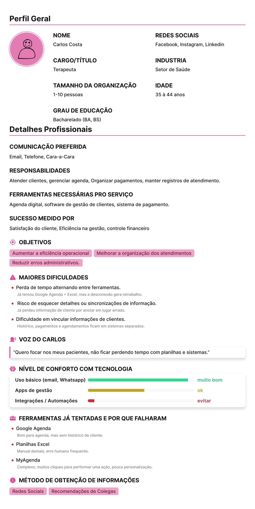
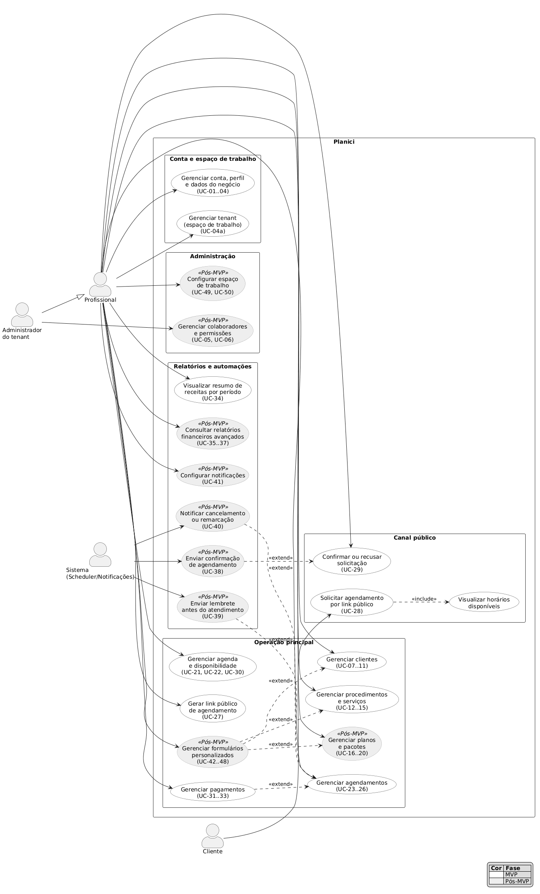

<h1>2. Engenharia de Requisitos</h1>

<!-- #region 2.1 PERSONAS -->

<h2>2.1 Personas</h2>

<h3>Persona primária: Mariana — Terapeuta autônoma (usuária-origem)</h3>
<ul>
  <li><strong>Perfil:</strong> Terapeuta autônoma com CNPJ, atuando individualmente, sem equipe de suporte administrativo. Representa a usuária que originou a demanda (seção 1.2) e a "usuária principal" referida nos KPIs (seção 1.6).</li>
  <li><strong>Faixa etária:</strong> 35–55 anos. Usa smartphone e navegador no dia a dia, sem conhecimento técnico.</li>
  <li><strong>Cenário atual:</strong> Controla agenda e finanças em planilhas Excel, sem integração entre as informações.</li>
  <li><strong>Necessidades:</strong> Registrar atendimento, cliente e pagamento logo após fechar o acordo, em poucos cliques; vincular clientes a procedimentos e planos; acompanhar receitas; personalizar a linguagem do sistema ao seu contexto (ex.: "Pacientes" em vez de "Clientes").</li>
  <li><strong>Dores:</strong> Ferramentas especializadas caras e pouco flexíveis; soluções genéricas que não cobrem clientes e finanças.</li>
</ul>

<a href="/docs/img/persona-carlos.pdf" download>PDF Persona Carlos (persona secundária)</a>

  
<h4>Persona Carlos - Imagem<h4/>

  

<!-- #endregion -->

<!-- #region 2.2 USE CASES -->

<h2>2.2 Casos de Uso Principais</h2>

## Casos de uso por módulo

### 2.2.1. Autenticação e conta
| Código | Caso de uso                                    | Ator principal          | Requisitos relacionados | Fase    |
| ------ | ---------------------------------------------- | ----------------------- | ----------------------- | ------- |
| UC-01  | Criar conta com e-mail e senha                 | Profissional            | RF-01                   | MVP     |
| UC-02  | Entrar com conta Google                        | Profissional            | RF-02                   | MVP     |
| UC-03  | Recuperar senha                                | Profissional            | RF-03                   | MVP     |
| UC-04  | Gerenciar perfil e dados do negócio            | Profissional            | RF-04                   | MVP     |
| UC-04a | Criar e selecionar tenant (espaço de trabalho) | Profissional            | RF-04a                  | MVP     |
| UC-05  | Convidar colaborador para o espaço de trabalho | Administrador do tenant | RF-05                   | Pós-MVP |
| UC-06  | Definir permissões de colaborador              | Administrador do tenant | RF-06                   | Pós-MVP |

### 2.2.2. Clientes
| Código | Caso de uso                             | Ator principal | Requisitos relacionados | Fase |
| ------ | --------------------------------------- | -------------- | ----------------------- | ---- |
| UC-07  | Cadastrar cliente                       | Profissional   | RF-07                   | MVP  |
| UC-08  | Editar cliente                          | Profissional   | RF-08                   | MVP  |
| UC-09  | Inativar cliente             | Profissional   | RF-08                   | MVP  |
| UC-10  | Buscar e filtrar clientes               | Profissional   | RF-09                   | MVP  |
| UC-11  | Visualizar ficha e histórico do cliente | Profissional   | RF-10                   | MVP  |

### 2.2.3. Procedimentos e serviços
| Código | Caso de uso                      | Ator principal | Requisitos relacionados | Fase |
| ------ | -------------------------------- | -------------- | ----------------------- | ---- |
| UC-12  | Cadastrar procedimento           | Profissional   | RF-11                   | MVP  |
| UC-13  | Editar procedimento              | Profissional   | RF-12                   | MVP  |
| UC-14  | Excluir ou inativar procedimento | Profissional   | RF-12                   | MVP  |
| UC-15  | Listar procedimentos cadastrados | Profissional   | RF-13                   | MVP  |

### 2.2.4. Pacotes e planos
| Código | Caso de uso                  | Ator principal | Requisitos relacionados | Fase    |
| ------ | ---------------------------- | -------------- | ----------------------- | ------- |
| UC-16  | Criar plano ou pacote        | Profissional   | RF-14                   | Pós-MVP |
| UC-17  | Associar serviços a um plano | Profissional   | RF-15                   | Pós-MVP |
| UC-18  | Editar plano                 | Profissional   | RF-16                   | Pós-MVP |
| UC-19  | Excluir ou inativar plano    | Profissional   | RF-16                   | Pós-MVP |
| UC-20  | Listar planos cadastrados    | Profissional   | RF-17                   | Pós-MVP |

### 2.2.5. Agenda e agendamentos
| Código | Caso de uso                                     | Ator principal       | Requisitos relacionados | Fase |
| ------ | ----------------------------------------------- | -------------------- | ----------------------- | ---- |
| UC-21  | Configurar disponibilidade fixa                 | Profissional         | RF-18                   | MVP  |
| UC-22  | Configurar disponibilidade livre                | Profissional         | RF-19                   | MVP  |
| UC-23  | Criar agendamento manual                        | Profissional         | RF-20                   | MVP  |
| UC-24  | Editar agendamento                              | Profissional         | RF-21                   | MVP  |
| UC-25  | Cancelar agendamento                            | Profissional         | RF-21                   | MVP  |
| UC-26  | Visualizar agenda diária ou semanal             | Profissional         | RF-22                   | MVP  |
| UC-27  | Gerar link público de agendamento               | Profissional/Sistema | RF-23                   | MVP  |
| UC-28  | Solicitar agendamento por link público          | Cliente              | RF-23                   | MVP  |
| UC-29  | Confirmar ou recusar solicitação de agendamento | Profissional         | RF-24                   | MVP  |
| UC-30  | Bloquear horário na agenda                      | Profissional         | RF-25                   | MVP  |

### 2.2.6. Pagamentos
| Código | Caso de uso                                   | Ator principal | Requisitos relacionados | Fase |
| ------ | --------------------------------------------- | -------------- | ----------------------- | ---- |
| UC-31  | Registrar pagamento de atendimento            | Profissional   | RF-26                   | MVP  |
| UC-32  | Editar pagamento registrado                   | Profissional   | RF-27                   | MVP  |
| UC-33  | Visualizar status de pagamento do atendimento | Profissional   | RF-28                   | MVP  |

### 2.2.7. Visão financeira e relatórios.
| Código | Caso de uso                               | Ator principal | Requisitos relacionados | Fase    |
| ------ | ----------------------------------------- | -------------- | ----------------------- | ------- |
| UC-34  | Visualizar resumo de receitas por período | Profissional   | RF-29                   | MVP     |
| UC-35  | Comparar receitas entre períodos          | Profissional   | RF-30                   | Pós-MVP |
| UC-36  | Visualizar ranking de procedimentos       | Profissional   | RF-31                   | Pós-MVP |
| UC-37  | Exportar relatório financeiro             | Profissional   | RF-32                   | Pós-MVP |

### 2.2.8. Notificações
| Código | Caso de uso                                | Ator principal | Requisitos relacionados | Fase    |
| ------ | ------------------------------------------ | -------------- | ----------------------- | ------- |
| UC-38  | Enviar confirmação de agendamento          | Sistema        | RF-33                   | Pós-MVP |
| UC-39  | Enviar lembrete antes do atendimento       | Sistema        | RF-34                   | Pós-MVP |
| UC-40  | Notificar cancelamento ou remarcação       | Sistema        | RF-35                   | Pós-MVP |
| UC-41  | Configurar canais e eventos de notificação | Profissional   | RF-36                   | Pós-MVP |

### 2.2.9. Formulários personalizados
| Código | Caso de uso                                     | Ator principal | Requisitos relacionados | Fase    |
| ------ | ----------------------------------------------- | -------------- | ----------------------- | ------- |
| UC-42  | Criar modelo de formulário                      | Profissional   | RF-37                   | Pós-MVP |
| UC-43  | Adicionar e ordenar campos do formulário        | Profissional   | RF-38                   | Pós-MVP |
| UC-44  | Editar modelo de formulário                     | Profissional   | RF-39                   | Pós-MVP |
| UC-45  | Excluir modelo de formulário                    | Profissional   | RF-39                   | Pós-MVP |
| UC-46  | Aplicar formulário a cliente, serviço ou plano  | Profissional   | RF-40                   | Pós-MVP |
| UC-47  | Editar respostas de formulário aplicado         | Profissional   | RF-41                   | Pós-MVP |
| UC-48  | Visualizar formulários aplicados a uma entidade | Profissional   | RF-42                   | Pós-MVP |

### 2.2.10. Configuração do espaço de trabalho
| Código | Caso de uso                      | Ator principal | Requisitos relacionados | Fase    |
| ------ | -------------------------------- | -------------- | ----------------------- | ------- |
| UC-49  | Configurar ocupação profissional | Profissional   | RF-43                   | Pós-MVP |
| UC-50  | Personalizar labels do sistema   | Profissional   | RF-43                   | Pós-MVP |

> [!NOTE]
> O diagrama agrupa os casos de uso por módulo e indica a fase de cada um por cor: branco = MVP, cinza (estereótipo `«Pós-MVP»`) = Pós-MVP. Os códigos entre parênteses referenciam as tabelas acima. Fonte editável do diagrama: `../img/diagrams/use-case.puml`.

<!-- #endregion -->

<!-- #region 2.3 RFs -->

<h2>2.3 Requisitos Funcionais (RF)</h2>

> [!NOTE]
> **Legenda de prioridade:** <strong>MVP</strong> — obrigatório para a entrega do Portfólio II; <strong>Pós-MVP</strong> — planejado como evolução futura, fora do escopo obrigatório da entrega acadêmica. A [Tabela MVP × Pós-MVP](#27-tabela-mvp--pós-mvp) é a fonte canônica em caso de dúvida.

<table>
  <tr>
    <th colspan="3">Autenticação e conta</th>
  </tr>
  <tr>
    <th>Requisito</th>
    <th>Descrição</th>
    <th>Prioridade</th>
  </tr>
  <tr>
    <td>RF-01</td>
    <td><strong>Cadastro por e-mail e senha</strong> O profissional pode criar uma conta informando nome, e-mail e senha.</td>
    <td>MVP</td>
  </tr>
  <tr>
    <td>RF-02</td>
    <td><strong>Login via Google OAuth</strong> O profissional pode autenticar com a conta Google.</td>
    <td>MVP</td>
  </tr>
  <tr>
    <td>RF-03</td>
    <td><strong>Recuperação de senha</strong> O sistema envia link de redefinição de senha por e-mail.</td>
    <td>MVP</td>
  </tr>
  <tr>
    <td>RF-04</td>
    <td><strong>Gerenciamento de perfil</strong> O profissional pode editar nome, foto, dados de contato e informações do negócio.</td>
    <td>MVP</td>
  </tr>
  <tr>
    <td>RF-04a</td>
    <td><strong>Criar e selecionar tenant (espaço de trabalho)</strong> No onboarding, o profissional cria seu primeiro tenant (espaço de trabalho) e, quando possuir mais de um, pode selecionar entre eles. A criação do tenant é passo obrigatório do fluxo de primeiro acesso (login → registro → criação do tenant → dashboard), e todos os dados operacionais ficam vinculados ao tenant ativo. Conforme RN-02.</td>
    <td>MVP</td>
  </tr>
  <tr>
    <td>RF-05</td>
    <td><strong>Multiusuário por tenant</strong> O profissional pode convidar colaboradores com acesso ao mesmo espaço de trabalho. <em>RBAC (Role-Based Access Control)/convite de colaboradores é Pós-MVP; no MVP o tenant possui um único usuário (o profissional, papel Owner).</em></td>
    <td>Pós-MVP</td>
  </tr>
  <tr>
    <td>RF-06</td>
    <td><strong>Controle de permissões</strong> O administrador do tenant define o nível de acesso de cada colaborador, como somente agenda ou acesso financeiro. <em>Recurso Pós-MVP; o controle de papéis/permissões só se aplica quando o multiusuário (RF-05) estiver disponível.</em></td>
    <td>Pós-MVP</td>
  </tr>
</table>

<table>
  <tr>
    <th colspan="3">Cadastro de clientes</th>
  </tr>
  <tr>
    <th>Requisito</th>
    <th>Descrição</th>
    <th>Prioridade</th>
  </tr>
  <tr>
    <td>RF-07</td>
    <td><strong>Criar cliente</strong> O profissional pode cadastrar um cliente com nome, telefone, e-mail e observações (campos fixos mínimos no MVP; formulários personalizados são Pós-MVP).</td>
    <td>MVP</td>
  </tr>
  <tr>
    <td>RF-08</td>
    <td><strong>Editar, inativar e excluir cliente</strong> O profissional pode atualizar os dados de um cliente. A exclusão definitiva só é permitida para clientes <strong>sem</strong> histórico vinculado (atendimentos e pagamentos; planos e formulários quando essas funcionalidades Pós-MVP existirem). Clientes <strong>com</strong> histórico vinculado não são removidos fisicamente: a operação resulta em inativação (soft delete), preservando o histórico para consultas, relatórios e controle financeiro. Conforme RN-05 e RN-24.</td>
    <td>MVP</td>
  </tr>
  <tr>
    <td>RF-09</td>
    <td><strong>Busca e filtro de clientes</strong> O profissional pode buscar clientes por nome ou e-mail.</td>
    <td>MVP</td>
  </tr>
  <tr>
    <td>RF-10</td>
    <td><strong>Histórico de atendimentos do cliente</strong> Na ficha do cliente, o profissional visualiza todos os atendimentos anteriores, procedimentos realizados e valores pagos (planos ativos passam a compor a ficha quando o módulo de planos, Pós-MVP, existir).</td>
    <td>MVP</td>
  </tr>
</table>

<table>
  <tr>
    <th colspan="3">Procedimentos e serviços</th>
  </tr>
  <tr>
    <th>Requisito</th>
    <th>Descrição</th>
    <th>Prioridade</th>
  </tr>
  <tr>
    <td>RF-11</td>
    <td><strong>Criar procedimento</strong> O profissional cadastra procedimentos com nome, duração estimada e valor padrão.</td>
    <td>MVP</td>
  </tr>
  <tr>
    <td>RF-12</td>
    <td><strong>Editar, inativar e excluir procedimento</strong> O profissional pode atualizar um procedimento do catálogo. A exclusão definitiva só é permitida para procedimentos <strong>sem</strong> vínculo a agendamentos, planos ou histórico financeiro. Procedimentos <strong>com</strong> esse vínculo não são removidos fisicamente: a operação resulta em inativação (soft delete), impedindo novos usos e preservando o histórico. Conforme RN-06 e RN-24.</td>
    <td>MVP</td>
  </tr>
  <tr>
    <td>RF-13</td>
    <td><strong>Listagem de procedimentos</strong> O profissional visualiza todos os procedimentos cadastrados em uma lista.</td>
    <td>MVP</td>
  </tr>
</table>

<table>
  <tr>
    <th colspan="3">Pacotes e planos</th>
  </tr>
  <tr>
    <th>Requisito</th>
    <th>Descrição</th>
    <th>Prioridade</th>
  </tr>
  <tr>
    <td>RF-14</td>
    <td><strong>Criar plano</strong> O profissional cadastra um pacote de serviços com nome, descrição, preço, moeda e ciclo de cobrança (mensal, semanal, avulso etc.).</td>
    <td>Pós-MVP</td>
  </tr>
  <tr>
    <td>RF-15</td>
    <td><strong>Associar serviços a um plano</strong> O profissional define quais serviços fazem parte de um plano, com quantidade e possibilidade de substituir o preço individual do serviço dentro do pacote.</td>
    <td>Pós-MVP</td>
  </tr>
  <tr>
    <td>RF-16</td>
    <td><strong>Editar, inativar e excluir plano</strong> O profissional pode atualizar um plano do catálogo. A exclusão definitiva só é permitida para planos <strong>sem</strong> uso em agendamentos, histórico de clientes ou registros financeiros. Planos <strong>com</strong> esse uso não são removidos fisicamente: a operação resulta em inativação (soft delete), impedindo novos usos e mantendo o histórico preservado. Conforme RN-08 e RN-24.</td>
    <td>Pós-MVP</td>
  </tr>
  <tr>
    <td>RF-17</td>
    <td><strong>Listagem de planos</strong> O profissional visualiza todos os planos cadastrados em uma lista.</td>
    <td>Pós-MVP</td>
  </tr>
</table>

<table>
  <tr>
    <th colspan="3">Agendas e Agendamentos</th>
  </tr>
  <tr>
    <th>Requisito</th>
    <th>Descrição</th>
    <th>Prioridade</th>
  </tr>
  <tr>
    <td>RF-18</td>
    <td><strong>Definir disponibilidade fixa</strong> O profissional configura blocos de horário fixos por dia da semana (ex: seg–sex 09h–18h com intervalos de 30 min).</td>
    <td>MVP</td>
  </tr>
  <tr>
    <td>RF-19</td>
    <td><strong>Definir disponibilidade livre</strong> O profissional pode criar manualmente janelas de horário disponíveis para datas específicas.</td>
    <td>MVP</td>
  </tr>
  <tr>
    <td>RF-20</td>
    <td><strong>Criar agendamento pelo profissional</strong> O profissional agenda um atendimento escolhendo cliente, serviço, data e horário (a seleção de plano passa a existir quando o módulo de planos, Pós-MVP, for entregue).</td>
    <td>MVP</td>
  </tr>
  <tr>
    <td>RF-21</td>
    <td><strong>Editar e cancelar agendamento</strong> O profissional pode alterar data, horário, plano/serviço ou cancelar um agendamento existente.</td>
    <td>MVP</td>
  </tr>
  <tr>
    <td>RF-22</td>
    <td><strong>Visualização de agenda (dia/semana)</strong> O profissional visualiza os agendamentos em formato de agenda diária ou semanal.</td>
    <td>MVP</td>
  </tr>
  <tr>
    <td>RF-23</td>
    <td><strong>Link público de agendamento</strong> O sistema gera um link único por tenant que permite ao cliente visualizar horários disponíveis e solicitar um agendamento sem criar conta.</td>
    <td>MVP</td>
  </tr>
  <tr>
    <td>RF-24</td>
    <td><strong>Confirmação de agendamento pelo profissional</strong> Agendamentos feitos pelo link público ficam como "pendentes" até o profissional confirmar ou recusar.</td>
    <td>MVP</td>
  </tr>
  <tr>
    <td>RF-25</td>
    <td><strong>Bloqueio de horário</strong> O profissional pode bloquear horários específicos para impedi-los de aparecer como disponíveis no link público.</td>
    <td>MVP</td>
  </tr>
</table>

<table>
  <tr>
    <th colspan="3">Pagamentos</th>
  </tr>
  <tr>
    <th>Requisito</th>
    <th>Descrição</th>
    <th>Prioridade</th>
  </tr>
  <tr>
    <td>RF-26</td>
    <td><strong>Registrar pagamento no agendamento</strong> O profissional registra se o atendimento foi pago, informando valor, forma de pagamento (dinheiro, PIX, cartão, etc.) e data.</td>
    <td>MVP</td>
  </tr>
  <tr>
    <td>RF-27</td>
    <td><strong>Editar registro de pagamento</strong> O profissional pode corrigir os dados de pagamento de um atendimento já registrado.</td>
    <td>MVP</td>
  </tr>
  <tr>
    <td>RF-28</td>
    <td><strong>Status de pagamento por atendimento</strong> Cada agendamento exibe claramente se está pago, pendente ou cancelado.</td>
    <td>MVP</td>
  </tr>
</table>

<table>
  <tr>
    <th colspan="3">Visão Financeira e Relatórios</th>
  </tr>
  <tr>
    <th>Requisito</th>
    <th>Descrição</th>
    <th>Prioridade</th>
  </tr>
  <tr>
    <td>RF-29</td>
    <td><strong>Resumo de receitas por período</strong> O profissional visualiza o total recebido em um intervalo de datas selecionado.</td>
    <td>MVP</td>
  </tr>
  <tr>
    <td>RF-30</td>
    <td><strong>Comparativo entre períodos</strong> O sistema apresenta a comparação de receita entre dois períodos (ex: mês atual vs. mês anterior).</td>
    <td>Pós-MVP</td>
  </tr>
  <tr>
    <td>RF-31</td>
    <td><strong>Ranking de procedimentos</strong> O sistema exibe os procedimentos mais realizados e os que mais geraram receita no período.</td>
    <td>Pós-MVP</td>
  </tr>
  <tr>
    <td>RF-32</td>
    <td><strong>Exportação de relatório</strong> O profissional pode exportar o relatório financeiro em PDF ou Excel.</td>
    <td>Pós-MVP</td>
  </tr>
</table>

<table>
  <tr>
    <th colspan="3">Notificações</th>
  </tr>
  <tr>
    <th>Requisito</th>
    <th>Descrição</th>
    <th>Prioridade</th>
  </tr>
  <tr>
    <td>RF-33</td>
    <td><strong>Notificação de confirmação de agendamento</strong> Ao confirmar um agendamento, o sistema envia ao cliente uma notificação com os detalhes por e-mail e/ou WhatsApp, desde que haja canal de envio configurado e habilitado para o evento. Se nenhum canal estiver configurado, a operação prossegue normalmente sem envio. Conforme RN-17 e RN-19.</td>
    <td>Pós-MVP</td>
  </tr>
  <tr>
    <td>RF-34</td>
    <td><strong>Lembrete antes do horário</strong> O sistema envia um lembrete automático ao cliente com antecedência configurável (ex: 24h ou 1h antes), apenas para agendamentos confirmados e desde que haja canal de envio configurado e habilitado para o evento. Sem canal configurado, nenhum envio é tentado. Conforme RN-17, RN-18 e RN-19.</td>
    <td>Pós-MVP</td>
  </tr>
  <tr>
    <td>RF-35</td>
    <td><strong>Notificação de cancelamento ou remarcação</strong> Quando o profissional cancela ou altera um agendamento, o sistema notifica o cliente automaticamente, desde que haja canal de envio configurado e habilitado para o evento. Se nenhum canal estiver configurado, a operação prossegue normalmente sem envio. Conforme RN-17 e RN-19.</td>
    <td>Pós-MVP</td>
  </tr>
  <tr>
    <td>RF-36</td>
    <td><strong>Configuração de canais de notificação</strong> O profissional configura as credenciais e canais de envio (e-mail, WhatsApp via Evolution API) e escolhe quais eventos disparam cada canal. As preferências são armazenadas nas configurações do tenant.</td>
    <td>Pós-MVP</td>
  </tr>
</table>

<table>
  <tr>
    <th colspan="3">Formulários personalizados</th>
  </tr>
  <tr>
    <th>Requisito</th>
    <th>Descrição</th>
    <th>Prioridade</th>
  </tr>
  <tr>
    <td>RF-37</td>
    <td><strong>Criar modelo de formulário</strong> O profissional cria um modelo de formulário com nome, descrição e tipo de entidade-alvo sugerida (cliente, serviço ou plano).</td>
    <td>Pós-MVP</td>
  </tr>
  <tr>
    <td>RF-38</td>
    <td><strong>Adicionar e ordenar campos</strong> O profissional adiciona campos ao formulário (texto, número, data, seleção, imagem, arquivo, etc.), define rótulo, obrigatoriedade e ordem de exibição.</td>
    <td>Pós-MVP</td>
  </tr>
  <tr>
    <td>RF-39</td>
    <td><strong>Editar e excluir modelo de formulário</strong> O profissional pode atualizar ou remover um modelo de formulário e seus campos.</td>
    <td>Pós-MVP</td>
  </tr>
  <tr>
    <td>RF-40</td>
    <td><strong>Aplicar formulário a uma entidade</strong> O profissional aplica um modelo de formulário a um cliente, serviço ou plano específico e preenche as respostas.</td>
    <td>Pós-MVP</td>
  </tr>
  <tr>
    <td>RF-41</td>
    <td><strong>Editar respostas de formulário aplicado</strong> O profissional pode atualizar as respostas de um formulário já aplicado a uma entidade.</td>
    <td>Pós-MVP</td>
  </tr>
  <tr>
    <td>RF-42</td>
    <td><strong>Visualizar formulários de uma entidade</strong> Na ficha de um cliente, serviço ou plano, o profissional visualiza todos os formulários aplicados e suas respostas.</td>
    <td>Pós-MVP</td>
  </tr>
</table>

<table>
  <tr>
    <th colspan="3">Configuração do espaço de trabalho</th>
  </tr>
  <tr>
    <th>Requisito</th>
    <th>Descrição</th>
    <th>Prioridade</th>
  </tr>
  <tr>
    <td>RF-43</td>
    <td><strong>Configurar ocupação e labels</strong> O profissional seleciona sua ocupação (ex: psicólogo, personal trainer, advogado) e pode personalizar os nomes exibidos para clientes, serviços e planos no sistema (ex: "Pacientes", "Consultas", "Mensalidades").</td>
    <td>Pós-MVP</td>
  </tr>
</table>

<!-- #endregion-->

<!-- #region 2.4 RNFs -->

<h2>2.4 Requisitos Não Funcionais (RNF)</h2>

### Desempenho
 
<table>
  <tr>
    <th>Requisito</th>
    <th>Atributo de Qualidade</th>
    <th>Descrição</th>
    <th>Métrica / Critério de Aceitação</th>
    <th>Prioridade</th>
  </tr>
  <tr>
    <td>RNF-01</td>
    <td><strong>Page Load Performance</strong></td>
    <td>As principais páginas do sistema (agenda, clientes, financeiro) devem carregar rapidamente em conexões móveis para garantir boa experiência ao profissional em campo. O impacto direto é na adoção e retenção do produto.</td>
    <td>P95 &lt; 2s em conexão 4G</td>
    <td>MVP</td>
  </tr>
  <tr>
    <td>RNF-02</td>
    <td><strong>API Response Time</strong></td>
    <td>As chamadas de API devem responder dentro de limites aceitáveis para operações de leitura e escrita, assegurando fluidez nas interações do usuário com o sistema sob carga normal.</td>
    <td>Leitura &lt; 500ms | Escrita &lt; 1s em carga normal</td>
    <td>MVP</td>
  </tr>
  <tr>
    <td>RNF-03</td>
    <td><strong>Public Booking Link Performance</strong></td>
    <td>O link público de agendamento é acessado por clientes externos em dispositivos variados, muitas vezes sem sessão em cache. O carregamento lento representa perda direta de agendamentos para o profissional.</td>
    <td>&lt; 3s em first load (sem cache)</td>
    <td>MVP</td>
  </tr>
</table>

---
 
### Disponibilidade e Escalabilidade
 
<table>
  <tr>
    <th>Requisito</th>
    <th>Atributo de Qualidade</th>
    <th>Descrição</th>
    <th>Métrica / Critério de Aceitação</th>
    <th>Prioridade</th>
  </tr>
  <tr>
    <td>RNF-04</td>
    <td><strong>Availability</strong></td>
    <td>O sistema deve garantir disponibilidade mínima mensal compatível com infraestrutura de baixo custo. Indisponibilidade impacta diretamente agendamentos e receita do profissional.</td>
    <td>SLA >= 98.9% (~8h downtime/mês)</td>
    <td>MVP</td>
  </tr>
  <tr>
    <td>RNF-05</td>
    <td><strong>Disaster Recovery (RTO)</strong></td>
    <td>Em caso de queda do servidor, o sistema deve retornar ao ar em tempo hábil de forma automatizada, minimizando intervenção manual e impacto nos profissionais durante o horário de atendimento.</td>
    <td>RTO <= 2h | Reinicialização automatizada (process manager + health checks)</td>
    <td>MVP</td>
  </tr>
  <tr>
    <td>RNF-06</td>
    <td><strong>Disaster Recovery (RPO)</strong></td>
    <td>O banco de dados deve ser copiado automaticamente uma vez ao dia para proteger os dados de clientes e agendamentos contra perda acidental ou falha de infraestrutura.</td>
    <td>RPO <= 24h | Backup diário automático | Retenção >= 7 dias | Restaurável em produção</td>
    <td>MVP</td>
  </tr>
  <tr>
    <td>RNF-07</td>
    <td><strong>Data Isolation (Multi-tenancy)</strong></td>
    <td>Todos os dados devem ser isolados por tenant para garantir que nenhum profissional acesse dados de outro, mesmo em caso de erro de aplicação. O modelo multi-tenant exige que o isolamento seja garantido na camada de banco de dados.</td>
    <td>Row-Level Security (RLS) obrigatório em todas as tabelas com <code>tenant_id</code> | Zero vazamento entre tenants</td>
    <td>MVP</td>
  </tr>
</table>

---
 
### Segurança
 
<table>
  <tr>
    <th>Requisito</th>
    <th>Atributo de Qualidade</th>
    <th>Descrição</th>
    <th>Métrica / Critério de Aceitação</th>
    <th>Prioridade</th>
  </tr>
  <tr>
    <td>RNF-08</td>
    <td><strong>Authentication Security</strong></td>
    <td>O sistema deve armazenar senhas com hash seguro e utilizar tokens de curta duração com rotação, reduzindo a superfície de ataque em caso de comprometimento de credenciais.</td>
    <td>bcrypt cost ≥ 12 | JWT exp ≤ 24h | Refresh tokens rotativos e invalidados no logout | Política de senha: mínimo de 8 caracteres, ao menos 1 número e 1 símbolo (ver RN-26)</td>
    <td>MVP</td>
  </tr>
  <tr>
    <td>RNF-09</td>
    <td><strong>Transport Security</strong></td>
    <td>Todo o tráfego entre cliente e servidor deve ser criptografado para proteger dados sensíveis de clientes e profissionais contra interceptação.</td>
    <td>TLS ≥ 1.2 em todos os endpoints | Renovação automática de certificados (cloudflare)</td>
    <td>MVP</td>
  </tr>
  <tr>
    <td>RNF-10</td>
    <td><strong>API Security / Attack Protection</strong></td>
    <td>A API deve implementar múltiplas camadas de proteção contra ataques comuns (injeção, força bruta, abuso de recursos), garantindo integridade dos dados e disponibilidade do serviço.</td>
    <td>Rate limit: 100 req/min por IP | ORM parametrizado (anti SQL injection) | Headers: CORS restrito, CSP, X-Frame-Options</td>
    <td>MVP</td>
  </tr>
  <tr>
    <td>RNF-11</td>
    <td><strong>Audit Logging</strong></td>
    <td>Ações críticas devem ser registradas para fins de auditoria, rastreabilidade e detecção de uso indevido. Os logs devem incluir contexto suficiente para investigação de incidentes.</td>
    <td>MVP: registro de login, alteração de dados e exclusões/inativações — com timestamp, usuário e IP. Pós-MVP: exportações, retenção ≥ 90 dias e trilha completa de auditoria</td>
    <td>MVP</td>
  </tr>
</table>

---
 
### LGPD e Privacidade
 
<table>
  <tr>
    <th>Requisito</th>
    <th>Atributo de Qualidade</th>
    <th>Descrição</th>
    <th>Métrica / Critério de Aceitação</th>
    <th>Prioridade</th>
  </tr>
  <tr>
    <td>RNF-12</td>
    <td><strong>Consent & Legal Basis</strong></td>
    <td>O sistema deve exigir aceite explícito dos termos de uso e política de privacidade no cadastro, com registro rastreável, atendendo à exigência legal de consentimento prevista na LGPD.</td>
    <td>Aceite registrado com timestamp e versão do documento | Exibição obrigatória no onboarding</td>
    <td>MVP</td>
  </tr>
  <tr>
    <td>RNF-13</td>
    <td><strong>Right of Access & Data Portability</strong></td>
    <td>O profissional deve poder exportar todos os seus dados e os dados dos seus clientes em formato legível, exercendo o direito de portabilidade previsto na LGPD.</td>
    <td>Exportação automatizada (self-service) em JSON ou CSV | Entrega em ≤ 72h após solicitação. <em>No MVP, o direito é garantido por atendimento manual via canal do DPO em até 15 dias (ver seção 6.2 — Direitos do Titular); a automação é Pós-MVP.</em></td>
    <td>Pós-MVP</td>
  </tr>
  <tr>
    <td>RNF-14</td>
    <td><strong>Right to Erasure</strong></td>
    <td>O profissional deve poder solicitar a exclusão permanente da conta e de todos os dados associados (clientes, agendamentos, arquivos), exercendo o direito ao esquecimento previsto na LGPD.</td>
    <td>Remoção completa de todos os dados associados em ≤ 30 dias após solicitação. <em>No MVP, o direito é garantido por atendimento manual via canal do DPO (ver seção 6.2); a tela de autoatendimento é Pós-MVP.</em></td>
    <td>Pós-MVP</td>
  </tr>
  <tr>
    <td>RNF-15</td>
    <td><strong>Data Minimization</strong></td>
    <td>O sistema deve coletar apenas os dados estritamente necessários para o funcionamento das funcionalidades, sem compartilhamento com terceiros sem consentimento, seguindo o princípio de minimização da LGPD.</td>
    <td>Nenhum campo obrigatório além do mínimo funcional | Campos opcionais claramente identificados | Zero compartilhamento com terceiros sem consentimento</td>
    <td>MVP</td>
  </tr>
</table>

---
 
### Usabilidade e Acessibilidade
 
<table>
  <tr>
    <th>Requisito</th>
    <th>Atributo de Qualidade</th>
    <th>Descrição</th>
    <th>Métrica / Critério de Aceitação</th>
    <th>Prioridade</th>
  </tr>
  <tr>
    <td>RNF-16</td>
    <td><strong>Responsive Design</strong></td>
    <td>O sistema deve funcionar corretamente em smartphones e desktops, dado que profissionais frequentemente gerenciam sua agenda pelo celular. O link público de agendamento deve ser otimizado para mobile, pois é acessado majoritariamente por clientes em dispositivos móveis.</td>
    <td>Layout funcional em breakpoints: 'sm': '40rem', 'md': '48rem', 'lg': '64rem'</td>
    <td>MVP</td>
  </tr>
  <tr>
    <td>RNF-17</td>
    <td><strong>Browser Compatibility</strong></td>
    <td>O sistema deve funcionar sem degradação nas principais versões dos navegadores utilizados pelo público-alvo, evitando fricção no acesso por parte de profissionais e clientes.</td>
    <td>Suporte às 2 últimas versões de: Chrome, Firefox, Safari e Edge</td>
    <td>MVP</td>
  </tr>
  <tr>
    <td>RNF-18</td>
    <td><strong>Accessibility</strong></td>
    <td>Os fluxos principais do MVP (login, criação de tenant, cadastro de cliente, cadastro de serviço, agenda, agendamento manual, link público, registro de pagamento e visão financeira básica) devem atender às diretrizes de acessibilidade WCAG 2.1 nível AA, garantindo que usuários com deficiências visuais ou motoras consigam utilizá-los.</td>
    <td>WCAG 2.1 AA nos fluxos principais: navegação por teclado, foco visível, contraste adequado, labels acessíveis nos campos, feedback de erro textual (não apenas visual), estados vazios compreensíveis, botões com nome acessível e fluxo público utilizável em mobile</td>
    <td>MVP</td>
  </tr>
</table>

---
 
### Manutenibilidade e Qualidade
 
<table>
  <tr>
    <th>Requisito</th>
    <th>Atributo de Qualidade</th>
    <th>Descrição</th>
    <th>Métrica / Critério de Aceitação</th>
    <th>Prioridade</th>
  </tr>
  <tr>
    <td>RNF-19</td>
    <td><strong>Test Coverage & TDD</strong></td>
    <td>A estratégia de testes adota <strong>TDD nos fluxos críticos</strong> (autenticação, tenant, agenda/conflito de horário, link público e pagamentos). Testes obrigatórios: unitários no backend; integração no backend para autenticação, tenant, clientes, serviços, agenda, link público e pagamentos; testes de componentes/fluxos principais no frontend; e pelo menos um teste E2E cobrindo o fluxo principal do MVP (conta → tenant → serviço → cliente → agenda → agendamento → pagamento → visão financeira).</td>
    <td>Cobertura mínima: <strong>backend ≥ 75%</strong> | <strong>frontend ≥ 25%</strong> | ≥ 1 teste E2E do fluxo principal</td>
    <td>MVP</td>
  </tr>
  <tr>
    <td>RNF-20</td>
    <td><strong>CI/CD, Version Control & Static Analysis</strong></td>
    <td>O processo de deploy deve ser automatizado com etapa obrigatória de testes, reduzindo risco de regressões em produção e garantindo rastreabilidade de mudanças via controle de versão. O <strong>SonarCloud</strong> será utilizado como ferramenta de análise estática de código, code smells, bugs, duplicações, cobertura de testes e vulnerabilidades; o pipeline de CI executa a análise automatizada e bloqueia merge/deploy quando o quality gate mínimo não for atendido.</td>
    <td>Git com branches protegidas | Pipeline CI/CD com gate de testes obrigatório antes do deploy em produção | Quality gate do SonarCloud bloqueante no CI</td>
    <td>MVP</td>
  </tr>
  <tr>
    <td>RNF-21</td>
    <td><strong>Observability & Alerting</strong></td>
    <td>O sistema deve ter monitoramento de uptime e alertas automáticos em caso de indisponibilidade ou erros críticos, permitindo resposta rápida a incidentes antes que impactem os profissionais.</td>
    <td>Alerta disparado em <= 5 min após falha detectada (Sentry para erros de aplicação + monitor de uptime dedicado)</td>
    <td>MVP</td>
  </tr>
</table>

---
 
### Escalabilidade
 
<table>
  <tr>
    <th>Requisito</th>
    <th>Atributo de Qualidade</th>
    <th>Descrição</th>
    <th>Métrica / Critério de Aceitação</th>
    <th>Prioridade</th>
  </tr>
  <tr>
    <td>RNF-22</td>
    <td><strong>Horizontal Scalability</strong></td>
    <td>A camada de aplicação deve ser stateless para permitir escalonamento horizontal sem refatoração estrutural, suportando o crescimento da base de tenants sem degradação de performance.</td>
    <td>API stateless (sem sessão server-side), permitindo escalonamento horizontal sem refatoração estrutural (metas numéricas de escala são evolução futura)</td>
    <td>MVP</td>
  </tr>
  <tr>
    <td>RNF-23</td>
    <td><strong>Pagination & Memory Efficiency</strong></td>
    <td>Todas as listagens com potencial de crescimento ilimitado devem usar paginação ou scroll infinito para evitar sobrecarga de memória e lentidão na interface conforme o volume de dados aumenta.</td>
    <td>Máximo 50 registros por página/request em todas as listagens (clientes, agendamentos, formulários)</td>
    <td>MVP</td>
  </tr>
</table>

---

<!-- #endregion -->

<!-- #region 2.5 Regras de Negócio -->

<h2>2.5 Regras de Negócio</h2>

> [!TIP]
> As regras de negócio definem condições, restrições e comportamentos obrigatórios do sistema Planici para garantir consistência, segurança e coerência entre clientes, agenda, procedimentos, planos, pagamentos e configurações do espaço de trabalho. Regras marcadas com **[Pós-MVP]** valem apenas quando a funcionalidade correspondente (adiada) for implementada.

### RN-01: Acesso autenticado

Apenas usuários autenticados podem acessar os recursos internos do sistema, como cadastro de clientes, agenda, procedimentos, planos, pagamentos, relatórios, formulários e configurações do espaço de trabalho.

Recursos públicos, como o link de agendamento disponibilizado ao cliente, podem ser acessados sem autenticação, desde que estejam vinculados a um tenant válido.

---

### RN-02: Isolamento por tenant

Todos os dados operacionais do sistema devem pertencer a um tenant, incluindo clientes, procedimentos, planos, agendamentos, pagamentos, formulários, configurações e colaboradores.

Um usuário não pode visualizar, editar ou excluir dados pertencentes a outro tenant, salvo se possuir vínculo autorizado com esse espaço de trabalho.

---

### RN-03: Permissões de colaboradores [Pós-MVP]

Quando o recurso de múltiplos usuários estiver disponível, somente administradores do tenant poderão convidar colaboradores e alterar suas permissões.

Colaboradores só poderão executar ações compatíveis com seu nível de acesso. Por exemplo, um colaborador com acesso apenas à agenda não poderá visualizar relatórios financeiros ou alterar configurações do tenant.

---

### RN-04: Cadastro de clientes

Todo cliente deve estar vinculado a um tenant.

O nome e email do cliente são obrigatórios. Telefone e observações podem ser opcionais, mas, quando informados, devem respeitar formatos válidos.

Não deve ser permitido cadastrar dois clientes com o mesmo e-mail dentro do mesmo tenant.

---

### RN-05: Exclusão de clientes

Clientes que possuam histórico de atendimentos ou pagamentos (e, quando as funcionalidades Pós-MVP existirem, planos ou formulários aplicados) não devem ser removidos definitivamente do sistema.

Nesses casos, o cliente deve ser apenas inativado, preservando o histórico necessário para consultas futuras, relatórios e controle financeiro.

---

### RN-06: Cadastro de procedimentos

Todo procedimento deve estar vinculado a um tenant.

Um procedimento deve possuir, no mínimo, nome, duração estimada e valor padrão.

O valor padrão de um procedimento não pode ser negativo.

Procedimentos vinculados a agendamentos, planos ou histórico financeiro não devem ser excluídos definitivamente; devem ser inativados.

---

### RN-07: Cadastro de planos [Pós-MVP]

Todo plano deve estar vinculado a um tenant.

Um plano deve possuir nome, preço, moeda e ciclo de cobrança.

O preço de um plano não pode ser negativo.

Um plano pode conter um ou mais procedimentos associados.

Quando um procedimento for associado a um plano, o sistema deve permitir definir a quantidade incluída e, se necessário, um preço específico para aquele procedimento dentro do pacote.

---

### RN-08: Exclusão de planos [Pós-MVP]

Planos já utilizados em agendamentos, histórico de clientes ou registros financeiros não devem ser removidos definitivamente.

Nesses casos, o plano deve ser inativado para impedir novos usos, mantendo o histórico anterior preservado.

---

### RN-09: Disponibilidade da agenda

O profissional pode configurar disponibilidades fixas por dia da semana ou janelas de disponibilidade específicas para datas determinadas.

Horários fora da disponibilidade configurada não devem aparecer como disponíveis no link público de agendamento.

Horários bloqueados manualmente pelo profissional também não devem aparecer como disponíveis.

Precedência em caso de sobreposição: para uma data específica, a disponibilidade livre (RF-19) substitui a regra fixa daquele dia da semana (RF-18), não se somando a ela. Bloqueios manuais prevalecem sobre ambas as formas de disponibilidade.

---

### RN-10: Criação de agendamentos

Todo agendamento deve estar vinculado a um tenant.

Um agendamento criado pelo profissional deve possuir cliente, serviço, data e horário (a opção de vincular plano passa a existir com o módulo de planos, Pós-MVP).

Não deve ser permitido criar dois agendamentos no mesmo horário para o mesmo profissional quando houver conflito de disponibilidade.

Não deve ser permitido criar agendamento em horário bloqueado.

---

### RN-11: Agendamentos pelo link público

Agendamentos solicitados por meio do link público devem ser criados inicialmente com status pendente.

O cliente não precisa possuir conta no sistema para solicitar um agendamento pelo link público.

O agendamento só passa a ser confirmado após aprovação do profissional.

O profissional pode confirmar ou recusar solicitações recebidas pelo link público.

---

### RN-12: Alteração e cancelamento de agendamentos

O profissional pode alterar data, horário, cliente ou serviço de um agendamento existente, desde que o novo horário esteja disponível.

Agendamentos cancelados devem manter o registro histórico no sistema.

Um agendamento cancelado não deve ser considerado como receita recebida, exceto se houver pagamento registrado e mantido pelo profissional.

---

### RN-13: Status de pagamento

Cada agendamento deve possuir um status de pagamento claramente identificado, como pago, pendente ou cancelado.

Um pagamento registrado deve conter valor, forma de pagamento e data de pagamento.

O valor pago não pode ser negativo.

A data de pagamento não pode ser posterior à data atual. O registro de pagamentos com data futura (previsão) não é permitido no MVP; todo pagamento registrado refere-se a um valor já recebido.

---

### RN-14: Edição de pagamentos

O profissional pode corrigir dados de pagamento já registrados.

Alterações em pagamentos devem atualizar os valores utilizados nos relatórios financeiros.

Pagamentos associados a agendamentos cancelados devem ser tratados conforme a regra definida pelo profissional, podendo ser mantidos, estornados ou desconsiderados dos relatórios.

---

### RN-15: Relatórios financeiros

Os relatórios financeiros devem considerar apenas dados pertencentes ao tenant do usuário autenticado.

O resumo de receitas deve considerar somente pagamentos registrados como pagos.

Pagamentos pendentes não devem ser somados como receita recebida.

Agendamentos cancelados não devem gerar receita, salvo quando houver pagamento confirmado vinculado ao agendamento.

---

### RN-16: Ranking de procedimentos [Pós-MVP]

O ranking de procedimentos deve considerar os procedimentos realizados dentro do período selecionado pelo profissional.

O sistema pode ordenar o ranking por quantidade de realizações ou por receita gerada.

Procedimentos inativados devem continuar aparecendo em relatórios históricos quando tiverem sido utilizados no período consultado.

---

### RN-17: Notificações de agendamento [Pós-MVP]

Ao confirmar um agendamento, o sistema deve enviar uma notificação ao cliente quando houver canal de envio configurado.

Quando um agendamento for cancelado ou remarcado, o cliente deve ser notificado automaticamente, se o canal estiver habilitado.

Se nenhum canal de notificação estiver configurado, o sistema deve permitir a operação normalmente, mas não deve tentar enviar mensagens.

---

### RN-18: Lembretes automáticos [Pós-MVP]

O sistema deve enviar lembretes automáticos antes do horário do atendimento conforme a antecedência configurada pelo profissional.

Lembretes só devem ser enviados para agendamentos confirmados.

Agendamentos pendentes, recusados ou cancelados não devem receber lembretes automáticos.

---

### RN-19: Configuração de notificações [Pós-MVP]

As configurações de canais de notificação pertencem ao tenant.

O profissional pode escolher quais eventos disparam notificações, como confirmação, cancelamento, remarcação e lembrete.

Credenciais de integração, quando utilizadas, devem ser armazenadas de forma segura e não devem ser exibidas integralmente após o cadastro.

---

### RN-20: Formulários personalizados [Pós-MVP]

Todo modelo de formulário deve pertencer a um tenant.

Um modelo de formulário deve possuir nome e uma entidade-alvo sugerida, como cliente, serviço ou plano.

Campos obrigatórios definidos em um formulário devem ser preenchidos antes que o formulário aplicado seja salvo.

A ordem dos campos definida pelo profissional deve ser preservada na exibição do formulário.

---

### RN-21: Aplicação de formulários [Pós-MVP]

Um formulário personalizado pode ser aplicado a uma entidade compatível, como cliente, serviço ou plano.

As respostas preenchidas devem permanecer vinculadas à entidade em que o formulário foi aplicado.

Alterações futuras no modelo do formulário não devem apagar automaticamente respostas já registradas.

---

### RN-22: Personalização de labels [Pós-MVP]

O profissional pode personalizar os nomes exibidos para entidades do sistema, como clientes, serviços e planos.

A personalização de labels altera apenas a exibição na interface, sem modificar a estrutura interna dos dados.

Por exemplo, o sistema pode exibir "Pacientes" no lugar de "Clientes", mas a entidade continua representando o cadastro de clientes no domínio do sistema.

Para evitar ambiguidade ao longo do documento, fica fixado o termo canônico do domínio: "Serviço" e "Procedimento" referem-se à mesma entidade interna (`service`); da mesma forma, "Plano" e "Pacote" referem-se à mesma entidade interna (`plan`). As variações de nomenclatura existem apenas na camada de labels descrita por esta regra.

---

### RN-23: Configuração de ocupação profissional [Pós-MVP]

O profissional deve poder selecionar sua ocupação para adaptar a linguagem e a experiência do sistema ao seu contexto de uso.

A ocupação selecionada pode influenciar sugestões de labels, modelos de formulário e termos exibidos na interface.

---

### RN-24: Integridade do histórico

Dados utilizados em histórico de atendimentos, relatórios financeiros ou registros de pagamento não devem ser excluídos fisicamente sem validação adicional.

Quando necessário, o sistema deve preferir inativação, cancelamento ou arquivamento em vez de exclusão definitiva.

---

### RN-25: Validação de operações críticas

Operações que afetam agenda, pagamentos, permissões, exclusão de dados ou configurações do tenant devem passar por validação adicional antes de serem concluídas.

O mecanismo de validação adicional é definido assim: para operações reversíveis (ex.: cancelar agendamento, editar pagamento), exibir um diálogo de confirmação obrigatório antes de concluir. Para operações destrutivas e irreversíveis (ex.: exclusão definitiva de cliente, procedimento ou plano sem histórico), além do diálogo, exigir que o usuário digite um texto de confirmação (ex.: o nome da entidade ou a palavra "EXCLUIR") para habilitar a ação.

Exemplos de operações críticas:

- excluir ou inativar cliente;
- cancelar agendamento;
- editar pagamento;
- remover procedimentos já utilizados;
- (Pós-MVP) alterar permissões de colaborador, alterar configurações de notificação e remover planos já utilizados.

---

### RN-26: Política de senha

No cadastro por e-mail e senha (RF-01) e na redefinição de senha (RF-03), a senha definida pelo usuário deve atender, no mínimo, aos seguintes critérios mensuráveis:

- comprimento mínimo de 8 caracteres;
- pelo menos 1 número;
- pelo menos 1 símbolo (caractere não alfanumérico).

Senhas que não atendam a todos os critérios devem ser rejeitadas, com indicação clara dos requisitos não cumpridos. Esta regra dá respaldo formal aos critérios exibidos no mockup de definição de senha (seção 4.2) e complementa o RNF-08.

<!-- #endregion -->

<!-- #region 2.6 Fora de Escopo -->

<h2>2.6 Fora de Escopo</h2>

Os itens abaixo não fazem parte do escopo do Planici e não serão implementados no contexto deste projeto.

### 2.6.1. Interação cruzada entre tenants:
O sistema não permite que um profissional visualize, edite ou acesse dados de outro tenant, a partir de um já existente. Não há marketplace, listagem pública de profissionais nem nenhum tipo de visualização de perfil entre usuários distintos.

### 2.6.2. Aplicativo mobile nativo:
O Planici é uma aplicação web com design responsivo e mobile-first. Não será desenvolvido app nativo para iOS ou Android.

### 2.6.3. Processamento de pagamentos online:
O sistema registra pagamentos manualmente informados pelo profissional. Não há integração com gateways de pagamento (ex: Stripe, PagSeguro, Mercado Pago) nem cobrança automática de clientes.

### 2.6.4. Emissão de documentos fiscais:
O sistema não emite notas fiscais, NFS-e, NF-e nem qualquer documento fiscal regulamentado.

### 2.6.5. Gestão de estoque ou venda de produtos:
O sistema é voltado exclusivamente para gestão de serviços. Não há suporte a controle de estoque, catálogo de produtos físicos ou e-commerce.

### 2.6.6. Múltiplas unidades ou filiais:
O escopo é o profissional autônomo individual. Não há suporte nativo a gestão de múltiplas unidades, franquias ou redes de atendimento.

### 2.6.7. Integração com prontuários eletrônicos ou sistemas de saúde regulamentados:
O sistema não se integra a prontuários eletrônicos, sistemas do CFM, TISS ou qualquer plataforma de saúde regulamentada. Formulários personalizados podem ser utilizados para registros internos, mas sem valor legal ou clínico.

### 2.6.8. Funcionalidades de marketing:
O sistema não oferece email marketing, campanhas promocionais, cupons de desconto, automações de vendas ou ferramentas de CRM voltadas a captação de novos clientes.

> [!NOTE]
> Os itens desta seção **não serão implementados** em nenhuma fase. Funcionalidades planejadas mas adiadas (notificações, formulários personalizados, planos etc.) não são "fora de escopo": estão classificadas como Pós-MVP na [Tabela MVP × Pós-MVP](#27-tabela-mvp--pós-mvp).

<!-- #endregion -->

<!-- #region 2.7 Tabela MVP x Pós-MVP -->

<h2>2.7 Tabela MVP × Pós-MVP</h2>

Fonte canônica da fase de cada área do produto. Em caso de divergência entre seções, prevalece esta tabela.

| Área | MVP / Portfólio II | Pós-MVP / Evolução futura |
|---|---|---|
| Autenticação | Cadastro, login (e-mail/senha e Google OAuth), recuperação de senha e tenant único por usuário | Login social adicional, políticas avançadas de sessão |
| Tenant | Criação de um espaço de trabalho por profissional (usuário único, papel Owner) | Múltiplos usuários por tenant, convites, papéis e permissões |
| Clientes | CRUD básico, busca e inativação quando houver histórico | Campos avançados, segmentações e importação/exportação |
| Serviços | CRUD básico de serviços/procedimentos | Pacotes complexos, regras avançadas de preço |
| Agenda | Disponibilidade básica (fixa e livre), visualização diária/semanal, agendamento manual e bloqueio de horários | Scheduler avançado, lembretes automáticos, integrações de calendário |
| Link público | Solicitação simples de horário sem conta, com confirmação/recusa pelo profissional | Confirmações automáticas, antifraude avançado, personalização profunda |
| Pagamentos | Registro manual de pagamento e status | Integração com gateways, cobrança online, conciliação automática |
| Financeiro | Resumo básico por período | Exportações avançadas, comparativos, rankings e dashboards completos |
| Notificações | Feedbacks internos simples da aplicação; e-mail transacional de conta via AWS SES (verificação de e-mail e recuperação de senha) | Notificações automáticas de agendamento por e-mail, WhatsApp, templates e webhooks |
| Formulários | Campos fixos mínimos | Formulários personalizados completos com anexos |
| Personalização | — | Ocupação profissional e labels customizadas |
| Arquitetura | NestJS modular, Next.js, PostgreSQL e RLS; AWS S3 para foto de perfil | RabbitMQ, arquitetura distribuída, microservices, workers complexos, CQRS/event-driven |
| Qualidade | TDD, 75% backend, 25% frontend, SonarCloud e CI/CD | Observabilidade avançada e quality gates mais rigorosos |

<!-- #endregion -->

<!-- #region 2.8 Matriz de Rastreabilidade -->

<h2>2.8 Matriz de Rastreabilidade</h2>

Ligação entre problema, requisito, fluxo, tela, regra de negócio, KPI e teste/critério de aceite do fluxo central do MVP.

| Problema / necessidade | Requisito | Fluxo / caso de uso | Tela / mockup | Regra de negócio | KPI | Teste / critério de aceite |
|---|---|---|---|---|---|---|
| Profissional precisa de espaço próprio e seguro | RF-01–RF-04a | Onboarding / criação de tenant (3.1, UC-01–UC-04a) | Telas de registro e tenant (4.2) | RN-01, RN-02, RN-26 | Fluxo central sem auxílio | Testes de integração de auth/tenant; teste de zero vazamento entre tenants |
| Profissional perde tempo organizando clientes em planilhas | RF-07–RF-10 | Criar cliente (UC-07) | Tela de cadastro de cliente (pendente) | RN-04, RN-05 | Cliente criado em < 2 min | Critério 3.3.1 + teste de integração de clientes |
| Profissional precisa organizar serviços ofertados | RF-11–RF-13 | Criar serviço (UC-12) | Tela de serviços (pendente) | RN-06 | Serviço criado sem auxílio em < 2 min | Critério 3.3.2 + teste de integração de serviços |
| Profissional precisa controlar horários disponíveis | RF-18–RF-22, RF-25 | Configurar agenda e agendar (UC-21–UC-26, UC-30) | Tela de agenda (pendente) | RN-09, RN-10, RN-12 | Agendamento em < 5 min e < 5 cliques | Critério 3.3.3 + testes de concorrência de conflito |
| Cliente precisa solicitar horário sem conta | RF-23, RF-24 | Link público (UC-27–UC-29) | Tela pública de agendamento (pendente) | RN-11 | Solicitação concluída sem instruções | Critério 3.3.4 + teste E2E do link público |
| Profissional precisa controlar recebimentos | RF-26–RF-29 | Registrar pagamento e consultar financeiro (UC-31–UC-34) | Tela de pagamento/financeiro (pendente) | RN-13, RN-14, RN-15 | Consulta financeira compreendida na validação | Critério 3.3.5 + teste de integração de pagamentos |

<!-- #endregion -->

<!-- #region 2.9 Validação com Usuários -->

<h2>2.9 Validação com Usuários</h2>

### Plano de validação do MVP

O MVP será validado com **3 a 5 profissionais autônomos** de perfis distintos (ex.: terapeuta, nutricionista, personal trainer, esteticista, consultor autônomo). Cada participante executará as tarefas do fluxo central: criar conta; criar tenant; cadastrar cliente; cadastrar serviço; configurar agenda; criar agendamento manual; solicitar horário pelo link público; registrar pagamento; consultar a visão financeira básica.

Métricas coletadas: taxa de sucesso por tarefa; tempo de execução por tarefa; dúvidas ou bloqueios observados; feedback qualitativo; intenção de uso.

| Participante | Perfil | Tarefas testadas | Taxa de sucesso | Principais dificuldades | Ajustes gerados |
|---|---|---:|---:|---|---|
| P1 | Terapeuta | MVP completo | A preencher | A preencher | A preencher |
| P2 | Nutricionista | MVP completo | A preencher | A preencher | A preencher |
| P3 | Personal trainer | MVP completo | A preencher | A preencher | A preencher |
| P4 (opcional) | Esteticista | MVP completo | A preencher | A preencher | A preencher |
| P5 (opcional) | Consultor autônomo | MVP completo | A preencher | A preencher | A preencher |

### Validação pós-MVP com a usuária principal

| Etapa | Descrição | Métrica |
|---|---|---|
| Teste guiado | Usuária executa fluxo completo sem intervenção | Taxa de sucesso por tarefa |
| Medição de tempo | Cronometrar cliente → serviço → agenda → pagamento | Tempo total e tempo por etapa |
| Feedback qualitativo | Registrar dúvidas, termos confusos e fricções | Lista de ajustes priorizados |
| Reteste | Repetir fluxo após correções | Redução de erros e tempo |

<!-- #endregion -->

