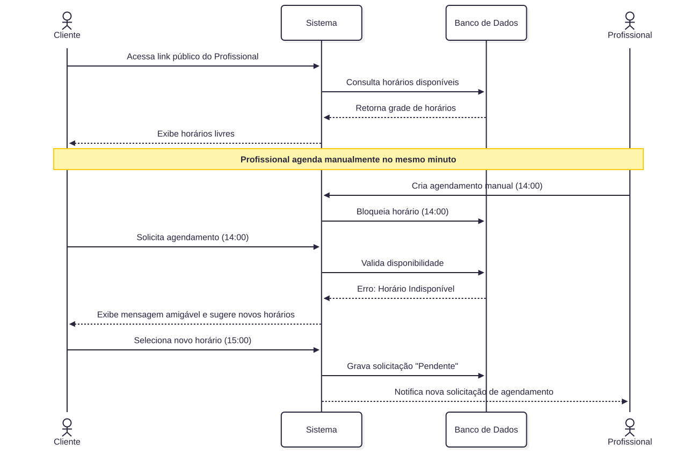

<h1>3. Fluxos e Comportamento do Sistema</h1>

> [!NOTE]
> Esta seção apresenta os principais fluxos de uso do sistema Planici, demonstrando como o usuário interage com as funcionalidades principais, desde a autenticação até o gerenciamento de clientes, serviços, planos, agendamentos e informações financeiras.

<!-- #region 3.1 OnBoard -->

<h2>3.1 Fluxo principal de Usuário (OnBoarding)</h2>
O fluxo principal descreve a primeira interação do profissional com o sistema: desde o acesso inicial até a entrada no espaço de trabalho configurado. No MVP, cada profissional cria seu próprio ambiente (Tenant) no onboarding; o ingresso em um tenant existente via convite é evolução Pós-MVP (RF-05).

Os fluxos cobertos pelo MVP são:

1. Primeiro acesso e criação de tenant.
2. Cadastro de cliente.
3. Cadastro de serviço.
4. Configuração de agenda.
5. Agendamento manual.
6. Solicitação pelo link público.
7. Confirmação/recusa da solicitação pelo profissional.
8. Registro de pagamento manual.
9. Consulta da visão financeira básica.

Os critérios de aceite dos fluxos centrais estão na <a href="#33-critérios-de-aceite-do-fluxo-principal">seção 3.3</a>.

> [!WARNING]
> **Pendência de imagem:** o diagrama `main-flow.svg` ainda exibe a opção de ingressar em tenant por convite; atualizar para o fluxo MVP (criação de tenant apenas).

<br/>

<a href="./img/diagrams/main-flow.svg" download>Baixar Diagrama</a>
<details open>
  <summary>Flowchart</summary>
  
  <br/>
  
</details>


<!-- #endregion-->

<!-- #region 3.2 Fluxo Alternativos -->

<h2>3.2 Fluxos alternativos</h2>
Além do fluxo principal, o sistema precisa lidar de forma resiliente com cenários de erro, cancelamentos e comportamentos atípicos. Abaixo estão detalhados os principais fluxos alternativos de operação diária.

### Fluxo 1: Cliente Agenda horário pelo Link Público (conflito)
Este cenário descreve o comportamento quando um cliente tenta agendar um horário que acabou de ser ocupado, demonstrando a proteção contra _overbooking_.

<details open>
  <summary>Flowchart</summary>
  
</details>

### Fluxo 2: Cancelamento de Agendamento pelo Profissional
Neste fluxo, o profissional precisa cancelar um atendimento. O sistema deve garantir que o histórico seja mantido e que a receita não seja contabilizada indevidamente. No MVP, o profissional comunica o cliente por canal externo; a notificação automática (RF-35) é Pós-MVP.

<details open>
  <summary>Flowchart</summary>
  
</details>

### Fluxo 3: Exclusão de Entidade com Dependências (Tentativa de deletar Serviço)
Este diagrama ilustra a regra de negócio que impede a exclusão (Hard Delete) de dados que possuem histórico atrelado, aplicando a inativação (Soft Delete).

<details open>
  <summary>Flowchart</summary>
  
</details>

<!-- #endregion -->

<!-- #region 3.3 Critérios de Aceite -->

<h2>3.3 Critérios de Aceite do Fluxo Principal</h2>

Critérios de aceite dos fluxos centrais do MVP, em formato Gherkin. Cada cenário é coberto por testes automatizados conforme o RNF-19 e referenciado pela [Matriz de Rastreabilidade](#28-matriz-de-rastreabilidade).

### 3.3.1 Criar cliente (RF-07, RN-02, RN-04)

```gherkin
Cenário: Criar cliente com dados mínimos
Dado que o profissional está autenticado
E possui um tenant ativo
Quando acessa a tela de clientes
E informa nome e ao menos um contato válido
E confirma o cadastro
Então o cliente é criado vinculado ao tenant ativo
E aparece na listagem de clientes
E pode ser selecionado em um agendamento
E não fica acessível para outros tenants
```

### 3.3.2 Criar serviço (RF-11, RN-06)

```gherkin
Cenário: Criar serviço/procedimento
Dado que o profissional está autenticado
E possui um tenant ativo
Quando acessa a tela de serviços
E informa nome, duração e valor padrão
E confirma o cadastro
Então o serviço é criado vinculado ao tenant ativo
E fica disponível para seleção em agendamentos
E pode ser inativado sem apagar histórico já vinculado
```

### 3.3.3 Configurar agenda (RF-18, RF-19, RN-09, RN-10)

```gherkin
Cenário: Configurar disponibilidade básica
Dado que o profissional está autenticado
E possui um tenant ativo
Quando define dias e horários de atendimento
E salva a configuração de agenda
Então o sistema registra a disponibilidade do tenant
E utiliza essa disponibilidade para exibir horários possíveis
E impede horários conflitantes ou fora da janela configurada
```

### 3.3.4 Solicitar agendamento pelo link público (RF-23, RF-24, RN-11)

```gherkin
Cenário: Cliente solicita horário pelo link público
Dado que existe um tenant com link público ativo
E há horários disponíveis configurados
Quando o cliente acessa o link público
E escolhe um serviço, data e horário disponível
E informa nome e contato
E aceita ou toma ciência do aviso de privacidade
E envia a solicitação
Então o sistema cria uma solicitação de agendamento com status pendente
E o horário não deve ser confirmado automaticamente sem ação do profissional
E o profissional consegue visualizar a solicitação na agenda
```

### 3.3.5 Registrar pagamento manual (RF-26, RN-13, RN-15)

```gherkin
Cenário: Registrar pagamento de um atendimento
Dado que existe um agendamento vinculado a cliente e serviço
Quando o profissional informa valor, forma de pagamento, data e status pago
E confirma o registro
Então o pagamento é associado ao agendamento
E o status financeiro do atendimento é atualizado
E o valor pago passa a compor a visão financeira básica do período correspondente
```

<!-- #endregion -->

