<h1>4. Mockups e Experiência do Usuário (UX)</h1>

> [!NOTE]
> Esta seção apresenta a visualização inicial do Planici antes da implementação, com base nos mockups desenvolvidos no Figma (mobile-first).

**Ferramenta Utilizada:** Figma

[Link do protótipo](https://www.figma.com/design/rWWne0gLS6YsVEuz4c7Amg/Planici?node-id=0-1&t=J5LLtwXO2fQxcF8H-1) _também disponível no [README.md](../README.md)_

<!-- #region 4.1 Fluxo de Navegação -->

<h2>4.1 Fluxo de Navegação</h2>

O fluxo é dividido em três zonas funcionais:

**Onboarding:** `loading -> login -> register` (fluxo multi-step)

**Setup do negócio:** Após o primeiro login, o usuário é direcionado para criar seu tenant (o negócio que ele gerencia): `tenants -> tenants/new` (tipo -> nome/detalhes -> confirmação)

**Área principal:** Após o setup, o usuário acessa o dashboard com acesso às seções do MVP: `agenda`, `clientes`, `serviços` e `financeiro`. As seções `forms` e `planos` são Pós-MVP e não compõem o dashboard do MVP.

**Fluxo Linear:** `login -> register -> tenants/new -> dashboard -> agenda/clientes/serviços/financeiro`

O perfil do usuário é independente do tenant, o mesmo usuário pode gerenciar múltiplos negócios, semelhante ao modelo de organizações do Supabase.

  
Fluxograma

  

<!-- #endregion -->

<!-- #region 4.2 Wireframes -->

<h2>4.2 Wireframes ou Mockups das Telas</h2>

Os mockups do Planici foram desenvolvidos no Figma seguindo uma abordagem mobile-first. As telas abaixo representam os principais pontos de interação do usuário, desde o primeiro acesso até a entrada na área principal da aplicação.

### Fluxo Principal de Onboarding e Autenticação

#### Tela Inicial — Login / Registro

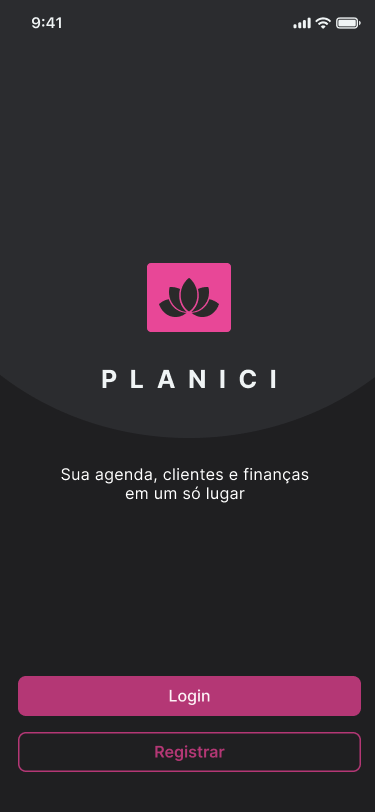

**Descrição:**  
Ponto de entrada do aplicativo. O usuário escolhe entre acessar uma conta existente ou iniciar um novo cadastro.

**Ações principais:**

- Clicar em **Login**;
- Clicar em **Registrar**.

**Requisitos relacionados:** RF-01, RF-02.

---

#### Registro — Passo 1: Dados Básicos

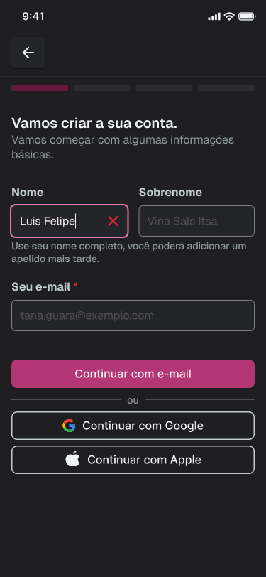

**Descrição:**  
Primeira etapa do cadastro. O usuário informa nome, sobrenome e e-mail, ou escolhe continuar utilizando autenticação externa, como Google.

**Ações principais:**

- Informar nome;
- Informar sobrenome;
- Informar e-mail;
- Continuar com Google;
- Avançar para a próxima etapa.

**Requisitos relacionados:** RF-01, RF-02.

---

#### Registro — Passo 2: Verificação de E-mail

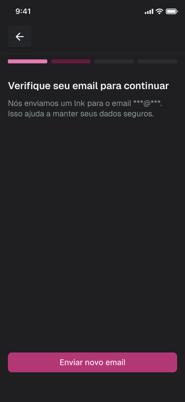

**Descrição:**  
Após informar o e-mail, o sistema orienta o usuário a verificar sua caixa de entrada. Essa etapa garante que a conta esteja associada a um endereço válido.

**Ações principais:**

- Verificar o e-mail informado;
- Solicitar reenvio do link de confirmação, se necessário;
- Continuar o cadastro após a confirmação.

**Requisitos relacionados:** RF-01.

---

#### Registro — Passo 3: Definição de Senha

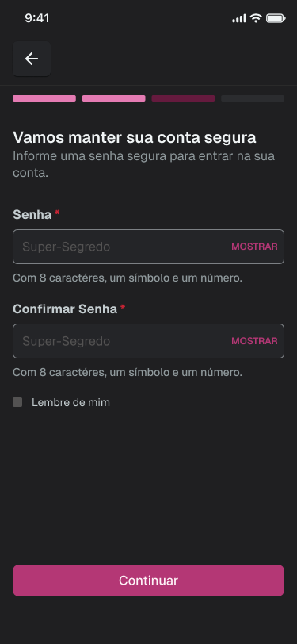

**Descrição:**  
O usuário cria uma senha segura para acessar o sistema. A interface informa os critérios mínimos exigidos, como quantidade mínima de caracteres, presença de número e símbolo.

**Ações principais:**

- Informar senha;
- Confirmar senha;
- Visualizar os critérios de segurança;
- Avançar para a próxima etapa.

**Requisitos relacionados:** RF-01, RNF-08, RN-26.

---

#### Registro — Passo 4: Informações Pessoais

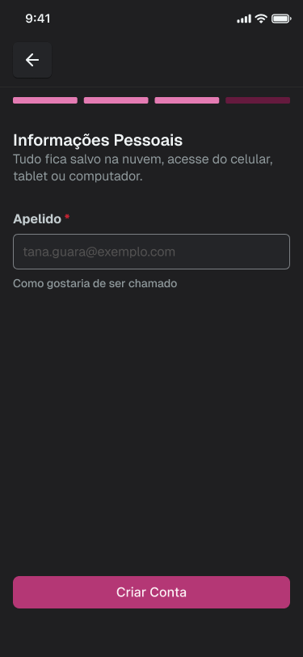

**Descrição:**  
O usuário define um apelido ou nome de exibição. Essa informação permite personalizar a forma como o sistema se comunica com o usuário, sem depender apenas do nome completo cadastrado.

**Ações principais:**

- Informar apelido;
- Revisar a informação preenchida;
- Criar a conta.

**Requisitos relacionados:** RF-04.

---

#### Registro — Passo 5: Termos de Serviço

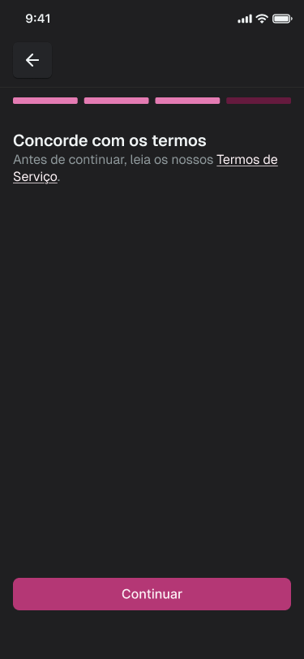

**Descrição:**  
Antes de finalizar o cadastro, o usuário deve aceitar os Termos de Serviço da aplicação. Essa etapa formaliza o consentimento necessário para uso do sistema.

**Ações principais:**

- Acessar os Termos de Serviço;
- Aceitar os termos;
- Continuar para a aplicação.

**Requisitos relacionados:** RNF-12, RNF-15.

---

### Setup do Negócio — Tenant

#### Empresas — Lista de Tenants

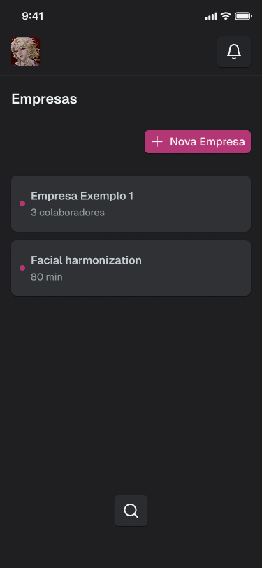

**Descrição:**  
Após o login, o usuário visualiza os negócios aos quais possui acesso. Cada empresa representa um tenant, ou seja, um espaço de trabalho independente dentro do sistema.

**Ações principais:**

- Visualizar empresas cadastradas;
- Selecionar uma empresa existente;
- Criar uma nova empresa;
- Acessar opções do perfil.

**Requisitos relacionados:** RF-04, RF-04a.

---

#### Empresas — Estado Vazio

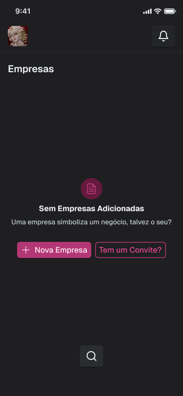

**Descrição:**  
Quando o usuário ainda não possui nenhuma empresa cadastrada ou vinculada à sua conta, o sistema apresenta uma tela de estado vazio com chamadas claras para ação.

**Ações principais:**

- Criar nova empresa.

*(O ingresso em empresa existente por convite é Pós-MVP — RF-05.)*

**Requisitos relacionados:** RF-04, RF-04a.

---

#### Novo Tenant — Passo 1: Área de Atuação [personalização decorrente é Pós-MVP]

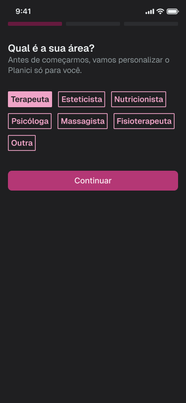

**Descrição:**  
O usuário seleciona sua área profissional. Essa informação será utilizada para adaptar a linguagem da aplicação ao contexto do usuário.

**Ações principais:**

- Selecionar uma área profissional;
- Escolher a opção **Outra**, caso a área não esteja listada;
- Continuar para a personalização do sistema.

**Requisitos relacionados:** RF-43, RN-23.

---

#### Novo Tenant — Passo 1b: Área Personalizada [Pós-MVP]

**Descrição:**  
Caso o usuário selecione a opção **Outra**, o sistema permite informar manualmente uma área de atuação. Essa resposta pode ser usada para sugerir nomes personalizados para as seções da aplicação.

**Ações principais:**

- Informar área de atuação personalizada;
- Confirmar a informação;
- Prosseguir para a etapa de personalização.

**Requisitos relacionados:** RF-43, RN-23.

---

#### Novo Tenant — Passo 2: Personalização dos Nomes [Pós-MVP]

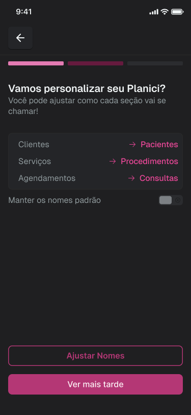

**Descrição:**  
O sistema sugere a renomeação das principais seções da aplicação com base na área escolhida. Por exemplo, para uma terapeuta, “Clientes” pode se tornar “Pacientes”, “Serviços” pode se tornar “Procedimentos” e “Agendamentos” pode se tornar “Consultas”.

**Ações principais:**

- Visualizar sugestões de nomes personalizados;
- Ajustar os nomes das seções;
- Manter os nomes padrão;
- Concluir ou adiar a personalização.

**Requisitos relacionados:** RF-43, RN-22, RN-23.

---

### Área Principal da Aplicação

#### Visão Geral das Telas Principais

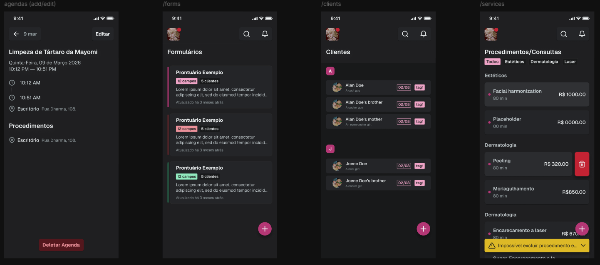

**Descrição:**  
Após concluir o setup do negócio, o usuário acessa a área principal do sistema. Essa visão apresenta os principais módulos do Planici: agenda, formulários, clientes e procedimentos/serviços.

**Ações principais por módulo:**

- **Agenda:** visualizar e editar agendamentos, consultar horários, procedimentos e localização;
- **Clientes:** buscar clientes, visualizar registros e criar novos cadastros;
- **Procedimentos/Consultas:** visualizar serviços cadastrados, adicionar novos procedimentos, excluir ou expandir categorias;
- **Formulários (Pós-MVP):** visualizar formulários cadastrados e criar novos modelos.

**Requisitos relacionados:** RF-07 a RF-13, RF-18 a RF-29 (MVP); RF-37 a RF-42 (Pós-MVP).

---

### Cobertura de Telas do MVP

| Fluxo | Mobile | Desktop/Web | Estados necessários | Status |
|---|---|---|---|---|
| Login | Sim | Sim | erro/loading/sucesso | A validar (mockup mobile existe; desktop pendente) |
| Onboarding / criação de tenant | Sim | Sim | vazio/erro/sucesso | A validar (mockup mobile existe; desktop pendente) |
| Cadastro de cliente | Sim | Sim | vazio/erro/sucesso | Pendente (mockup dedicado) |
| Cadastro de serviço | Sim | Sim | vazio/erro/sucesso | Pendente (mockup dedicado) |
| Agenda | Sim | Sim | vazio/conflito/loading | Pendente (mockup dedicado) |
| Agendamento manual | Sim | Sim | erro/confirmação | Pendente (mockup dedicado) |
| Link público | Sim | Sim | vazio/erro/confirmação | Pendente (mockup) |
| Pagamento manual | Sim | Sim | erro/sucesso | Pendente (mockup) |
| Financeiro básico | Sim | Sim | vazio/loading | Pendente (mockup) |

> [!WARNING]
> **Tarefas pendentes de UX (não inventar evidências):**
> 1. Criar/atualizar no Figma e exportar para `docs/img/fluxo/` os mockups pendentes da tabela acima, em mobile **e** desktop.
> 2. Revisar o protótipo no Figma: equilibrar cobertura mobile/desktop, organizar fluxos navegáveis, nomear telas com clareza e incluir estados de erro, vazios, loading e confirmação de ações críticas.
> 3. Remover do fluxo navegável do MVP as telas de personalização de nomes e de convite (Pós-MVP).

<!-- #endregion -->

<!-- #region 4.3 Fluxo de interação do usuário -->

## 4.3 Fluxo de Interação do Usuário

O fluxo de interação escolhido para representar a experiência principal do Planici é o onboarding completo do profissional, desde o primeiro acesso até a entrada na área principal do sistema. Esse fluxo foi selecionado por ser essencial para validar a proposta de valor do produto: permitir que um profissional autônomo configure rapidamente seu espaço de trabalho e comece a organizar sua rotina.

### Fluxo: criação de conta, configuração do tenant e acesso ao dashboard

1. O usuário acessa a tela inicial do Planici.
2. O usuário escolhe entre entrar em uma conta existente ou criar uma nova conta.
3. Caso escolha criar conta, o usuário informa seus dados básicos: nome, sobrenome e e-mail.
4. O sistema solicita a verificação do e-mail informado.
5. Após a verificação, o usuário define uma senha segura.
6. O usuário informa um apelido ou nome de exibição.
7. O usuário aceita os Termos de Serviço e conclui o cadastro.
8. Após o primeiro login, o sistema verifica se o usuário já participa de algum tenant.
9. Caso o usuário ainda não possua tenant, o sistema exibe o estado vazio da tela de empresas.
10. O usuário cria um novo tenant (o ingresso em tenant existente por convite é Pós-MVP).
11. Ao criar um novo tenant, o usuário seleciona sua área de atuação.
12. *(Pós-MVP)* Caso a área não esteja disponível, o usuário seleciona “Outra” e informa uma área personalizada.
13. *(Pós-MVP)* O sistema sugere nomes personalizados para as seções principais da aplicação, e o usuário aceita, ajusta ou mantém os nomes padrão.
14. O sistema cria o tenant e direciona o usuário para a área principal.
15. O usuário acessa o dashboard e passa a navegar entre agenda, clientes, serviços e financeiro.

### Representação visual do fluxo

<!-- #endregion -->

