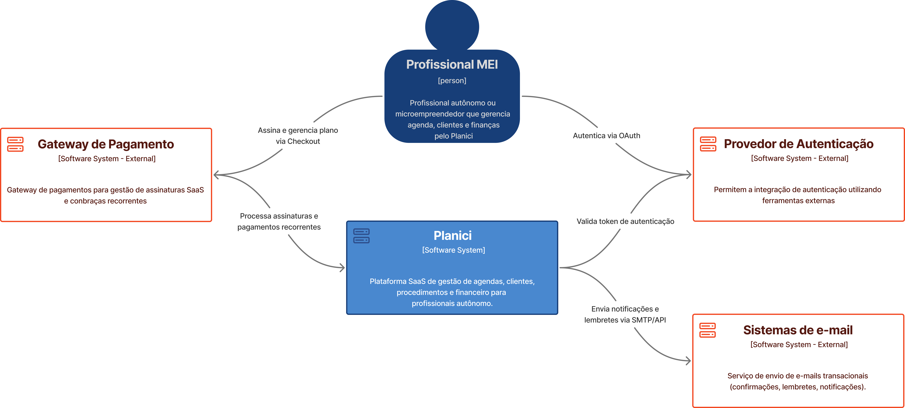
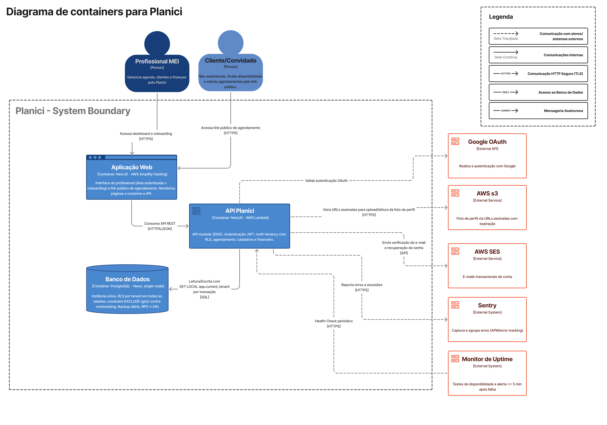

# 5. Arquitetura do Sistema

> [!NOTE]
> Esta seção apresenta a visualização da arquitetura geral do Planici, e como ele será construído.

<!-- #region 5.1 Diagrama C4 -->

<h2>5.1 Diagrama C4</h2>

<!-- #region CONTEXTO -->

<h3>Nível 1: Diagrama de Contexto</h3>

> [!TIP]
> A visão macro do sistema. O foco não é a tecnologia, mas sim como o software se encaixa no ecossistema e no mundo real.




<!-- #endregion 5.1.1 -->

<!-- #region CONTAINERS -->

<h3>Nível 2: Diagrama de Container</h3>

> [!TIP]
> O primeiro "zoom". Este diagrama é a decomposição do sistema em unidades de execução independentes.



<!-- #endregion 5.1.2 -->

<!-- #region COMPONENTES -->

<h3>Nível 3: Diagrama de Componentes</h3>

> [!TIP]
> Este diagrama decompõe o sistema em seus componentes internos, detalhando responsabilidades e interações.


> [!NOTE]
> Além dos componentes ilustrados, a arquitetura do MVP inclui o **AWS S3** como object storage para o binário da foto de perfil (RF-04) e o **AWS SES** para e-mails transacionais de conta (verificação de e-mail e recuperação de senha — RF-01/RF-03). Uploads de campos de formulário (RF-38) e o scheduler temporal de lembretes (RF-34) são Pós-MVP. Detalhes em 5.3.3 e 5.3.4.

> [!WARNING]
> **Pendência de imagem:** os diagramas C4 (contexto, containers e componentes) ainda exibem RabbitMQ, filas e o módulo de notificações como parte do MVP; atualizar para a topologia enxuta (frontend Next.js, backend NestJS, PostgreSQL, S3, SES), com os componentes Pós-MVP destacados como evolução.

<!-- #endregion 5.1.2 -->

<!-- #endregion 5.1 -->

<!-- #region 5.2 Diagrama ER -->

<h2>5.2 Modelo de Dados</h2>

O modelo de dados é representado por meio de um Modelo Entidade-Relacionamento (MER):

> [!TIP]
> O arquivo .dbml em 'docs/schema.dbml' apresenta o modelo de dados usado no website _dbdiagram.io_.


<!-- #endregion -->

<!-- #region 5.3 Principais Componentes -->

## 5.3 Principais Componentes
 
O Planici é organizado em três camadas principais: frontend, backend e infraestrutura.

Cada uma é composta por módulos com responsabilidades bem delimitadas.
 
### 5.3.1 Frontend — Next.js
 
A interface web do Planici é construída em Next.js com abordagem mobile-first. É dividida em três zonas funcionais:
 
**Área autenticada**: acessível apenas ao profissional logado. No MVP, concentra os módulos de agenda, clientes, serviços e visão financeira básica (planos e formulários personalizados são Pós-MVP). Todas as operações nessa zona exigem um token JWT válido e vínculo com um tenant ativo.
 
**Fluxo de onboarding**: cobre o registro de conta, login (e-mail/senha e OAuth), recuperação de senha e criação ou seleção de tenant (a personalização de labels é Pós-MVP). É o caminho obrigatório antes de qualquer acesso à área autenticada.
 
**Link público de agendamento**: página acessível sem autenticação, gerada por tenant. Permite que clientes externos visualizem horários disponíveis e solicitem agendamentos. Totalmente separada da área autenticada para não expor nenhum dado interno do profissional.
 
### 5.3.2 Backend — NestJS
 
No MVP, o backend é um **NestJS modular**, organizado em módulos independentes por domínio e guiado por princípios de DDD (Domain-Driven Design) na separação entre domínio, aplicação e infraestrutura. Padrões de maior complexidade — arquitetura hexagonal completa, CQRS e orientação a eventos — são evolução Pós-MVP (ver 5.3.4), a ser adotada apenas se a necessidade for validada; a arquitetura do MVP evita dependências distribuídas para reduzir risco de entrega.
 
**Auth module**: gerencia autenticação por e-mail/senha com bcrypt, OAuth via Google, emissão e rotação de tokens JWT e refresh tokens. No MVP não há RBAC: cada tenant possui um único usuário (papel Owner). É o ponto de entrada de toda requisição autenticada.
 
**Tenant module**: isola dados por espaço de trabalho, aplica Row-Level Security (RLS) em conjunto com o banco e gerencia as configurações gerais do tenant. No MVP cada tenant possui um único usuário (papel Owner); convites de colaboradores, permissões granulares por papel e personalização de labels/ocupação profissional são funcionalidades Pós-MVP (ver RF-05/RF-06 e RF-43).

Para que o RLS funcione com a API stateless e pool de conexões, o `tenant_id` autenticado é propagado ao contexto de sessão do PostgreSQL a cada requisição: um interceptor abre uma transação e executa `SET LOCAL app.current_tenant = <tenant_id>` antes das consultas; as políticas de RLS filtram pelas linhas cujo `tenant_id` corresponde a essa variável. Como `SET LOCAL` tem escopo de transação, o valor é descartado automaticamente no commit/rollback, garantindo que a conexão devolvida ao pool não carregue o contexto de um tenant para outro. Um teste automatizado de "zero vazamento entre tenants" valida esse isolamento.
 
**Scheduling module**: responsável pela lógica de disponibilidade (fixa e livre), criação e validação de agendamentos, detecção de conflitos de horário, bloqueios manuais e controle do fluxo de agendamentos pendentes oriundos do link público.

A proteção contra overbooking (RN-10, Fluxo 1) não depende apenas da validação na camada de aplicação, pois duas requisições simultâneas — por exemplo, uma do link público e outra do profissional — poderiam passar pela checagem antes de qualquer gravação. A garantia é dada no nível do banco: uma constraint de exclusão por range de tempo por profissional (`EXCLUDE USING gist` sobre `tstzrange` de início/fim, combinada ao `profissional_id` via extensão `btree_gist`) impede a persistência de dois agendamentos sobrepostos para o mesmo profissional. Em alternativa ou complemento, a criação ocorre em transação que aplica `SELECT ... FOR UPDATE` sobre as linhas de disponibilidade/agendamentos do intervalo, serializando concorrentes. A violação da constraint é tratada como conflito de horário e retornada ao solicitante.
 
**Domain module**: agrupa os cadastros centrais do negócio no MVP: clientes e serviços/procedimentos. Cada entidade segue regras de inativação ao invés de exclusão quando possui histórico vinculado. (Planos/pacotes e formulários personalizados serão incorporados a este módulo na fase Pós-MVP.)
 
**Finance module**: registra e edita pagamentos por atendimento e calcula o resumo de receitas por período. Considera apenas pagamentos com status "pago" na agregação de receita. (Comparativo entre períodos, ranking de procedimentos e exportação de relatórios são Pós-MVP.)
 
**Mailer (AWS SES)**: envio dos e-mails transacionais de conta do MVP — verificação de e-mail no cadastro (RF-01) e link de recuperação de senha (RF-03) — por meio do AWS SES. Não há módulo de notificações de agendamento no MVP; esse módulo, com seus canais, eventos e scheduler de lembretes, é evolução Pós-MVP (ver 5.3.4).
 
### 5.3.3 Infraestrutura
 
**PostgreSQL (single-node no MVP)**: banco de dados relacional executado em instância única no MVP. Todas as leituras e escritas vão para o mesmo nó, o que garante naturalmente a consistência read-after-write exigida pelos fluxos críticos — por exemplo, criar agendamento (RF-20) e em seguida verificar conflito (RN-10) ou visualizar a agenda (RF-22), e registrar pagamento (RF-26) e em seguida consultar o resumo financeiro (RF-29/RN-15) —, sem o risco de lag de replicação. Row-Level Security é aplicado em todas as tabelas com `tenant_id`, garantindo isolamento mesmo em caso de erro na camada de aplicação. Backup diário automático com retenção mínima de sete dias (RPO menor ou igual a 24h). A réplica de leitura (topologia primário-réplica com streaming) é tratada como **evolução futura opcional**, a ser introduzida apenas quando a carga justificar; quando adotada, fluxos sensíveis a read-after-write devem ler do primário.
 
**Object storage (AWS S3)**: armazenamento do binário da foto de perfil do profissional (RF-04). O binário não é guardado no PostgreSQL, evitando impacto em performance (RNF-01/RNF-02) e backup (RNF-06); o banco persiste apenas os metadados e a referência ao objeto. Acesso por URLs assinadas com expiração e limites de tamanho e tipo (allowlist de MIME) validados no upload. No Pós-MVP, o mesmo serviço passa a receber os campos de formulário do tipo imagem/arquivo (RF-38), com varredura de malware antes de disponibilizar o arquivo.

**E-mail transacional (AWS SES)**: entrega dos e-mails de verificação de conta e recuperação de senha. Credenciais IAM com escopo mínimo; domínios remetentes verificados (SPF/DKIM).
 
**Observabilidade e CI/CD**: a stack de observabilidade combina o **Sentry** para captura e agrupamento de erros da aplicação (APM/error tracking) com um **monitor de uptime dedicado** (ex.: UptimeRobot, Better Stack ou Grafana) responsável pelos testes de disponibilidade e pelo alerta automático em até cinco minutos após falha detectada (RNF-21) — não há dependência de Azure nem de qualquer provedor de nuvem específico nesta camada. Pipeline de CI/CD com gate de testes obrigatório e análise estática do **SonarCloud** com quality gate bloqueante antes do deploy em produção (RNF-20). Branches protegidas no repositório e logs mínimos de ações críticas (RNF-11); retenção estendida de 90 dias e trilha completa de auditoria são Pós-MVP.

**Topologia de deploy do MVP (serverless/gerenciada)**: para honrar a infraestrutura de baixo custo (RNF-04), o MVP opera inteiramente em serviços gerenciados — frontend Next.js no **AWS Amplify Hosting**, backend NestJS em **AWS Lambda**, **Neon** (PostgreSQL gerenciado) como banco, **AWS S3** para a foto de perfil e **AWS SES** para e-mails transacionais. A recuperação de falhas (RNF-05) é delegada ao provedor: Lambda e Amplify reiniciam/reprovisionam automaticamente, e o health check da API valida cada publicação. Réplica de banco, cluster e decomposição em microsserviços são introduzidos incrementalmente apenas quando a carga justificar. Detalhes operacionais na seção [5.5 Plano de Deploy Público](#55-plano-de-deploy-público).

### 5.3.4 Evolução Pós-MVP da arquitetura

Componentes avaliados apenas após a validação do MVP, quando a necessidade se confirmar:

- **RabbitMQ (ou fila no próprio PostgreSQL via outbox com `SELECT ... FOR UPDATE SKIP LOCKED`)**: desacoplamento dos fluxos assíncronos (notificações de agendamento por e-mail/WhatsApp, logs de auditoria em fila).
- **Notification module + scheduler temporal de lembretes**: cron worker + tabela `reminders` com chave de idempotência (agendamento + tipo + janela) para lembretes com antecedência configurável (RF-34/RN-18); o broker despacha, o scheduler agenda.
- **CQRS / arquitetura hexagonal completa / orientação a eventos**: adotados se a complexidade do domínio justificar; a estrutura modular do NestJS suporta a migração sem reescrita.
- **Workers dedicados e microservices**: decomposição incremental orientada por carga.
- **Réplica de leitura do PostgreSQL**: conforme descrito em 5.4; fluxos sensíveis a read-after-write continuam lendo do primário.

<!-- #endregion -->

<!-- #region 5.4 Stack Tecnológica -->

<h2>5.4 Stack Tecnológica</h2>

### Next.js - Frontend
**Motivo da escolha:** Next.js foi escolhido pela sua renderização server-side (SSR), performance otimizada e SEO nativo. Sua arquitetura baseada em file-system routing simplifica a organização do frontend, e o ecossistema React por baixo garante produtividade e acesso a uma quantidade enorme de bibliotecas.

O suporte nativo a TypeScript reforça a consistência de tipos entre backend e frontend, reduzindo erros de integração.


### NestJS - Backend
**Motivo da escolha:** NestJS foi escolhido como framework de backend por se alinhar diretamente com três pilares arquiteturais que guiam este projeto:

#### **1. Compatibilidade com Domain-Driven Design e Arquitetura Hexagonal**
O projeto adota como modelo de referência o repositório [domain-driven-hexagon](https://github.com/Sairyss/domain-driven-hexagon/tree/master), que aconselha a separação entre camadas de domínio, aplicação e infraestrutura, além de uso de ports & adapters para isolar a lógica de negócio de frameworks externos. O NestJS viabiliza essa estrutura de forma nativa: seu sistema de módulos (`  @Modules  `), injeção de dependência (Dependency Injection — DI Container), e decorators permite organizar o código exatamente nas camadas descritas pelo modelo.

#### **2. Suporte às boas práticas de backend em TypeScript**
Seguindo as diretrizes do [backend-best-practices](https://github.com/Sairyss/backend-best-practices), o projeto prioriza: validação robusta de entrada, tratamento centralizado de erros e uso de DTOs para contratos de API bem definidos. (A separação formal entre comandos e queries — padrão CQRS — é evolução Pós-MVP, ver 5.3.4.)

A estratégia de validação adota o **`class-validator` (com `class-transformer`) como ferramenta primária** para todos os DTOs e endpoints HTTP, por sua integração nativa ao NestJS via `ValidationPipe`, atendendo ao RNF-10 (validação de entrada em todos os endpoints) com um único contrato consistente. O `zod` fica reservado, quando necessário, à validação de dados que não passam por DTOs decorados (ex.: parsing de payloads de webhooks externos ou variáveis de ambiente), evitando a coexistência de dois padrões concorrentes sobre o mesmo boundary.

O NestJS oferece pipes, guards e interceptors que encapsulam preocupações transversais como autenticação, logging e validação sem poluir a lógica de negócio.

#### **3. Margem de evolução estrutural**
O NestJS possui suporte oficial a microservices e camadas de transporte (Redis, RabbitMQ, Kafka, gRPC): caso o sistema cresça no Pós-MVP e exija decomposição em serviços independentes, a migração é estruturalmente suportada sem reescrever a base do código. Nenhum desses componentes integra o MVP (ver 5.3.4).


### PostgreSQL - Banco de Dados
**Motivo da escolha:** O PostgreSQL foi escolhido como banco de dados principal por ser o SGBD relacional open-source com o conjunto de funcionalidades mais maduro disponível, combinando conformidade ACID, suporte nativo a JSON/JSONB (crucial para o domínio da aplicação), tipos avançados e extensibilidade via extensões. Recursos como a constraint `EXCLUDE USING gist` (com `btree_gist`) para impedir overbooking e o Row-Level Security para isolamento por tenant pesaram diretamente na escolha.

#### Topologia no MVP: instância única (single-node):
No MVP o PostgreSQL opera como instância única, alinhado à infraestrutura de baixo custo (RNF-04) e suficiente para a carga inicial. Concentrar leituras e escritas no mesmo nó preserva a consistência read-after-write dos fluxos críticos (agenda e financeiro), sem o lag de replicação que uma réplica assíncrona introduziria.

#### Evolução futura: réplica de leitura:
Caso a carga justifique, pode-se introduzir uma réplica de leitura (topologia primário-réplica com streaming) como otimização. Diferente do que uma analogia simplista sugere, replicação física **não** equivale a CQRS: o CQRS separa modelos de comando e de consulta no código e não exige réplica física nem tolera, por si só, leitura desatualizada em fluxos transacionais. Por isso, quando uma réplica for adotada, os fluxos sensíveis a read-after-write (criação de agendamento + detecção de conflito, registro de pagamento + resumo financeiro) continuarão lendo do nó primário.


### Serviços gerenciados AWS (S3 e SES)

**Motivo da escolha:** o MVP delega a serviços gerenciados as responsabilidades que não justificam infraestrutura própria: o **AWS S3** armazena o binário da foto de perfil (RF-04) com URLs assinadas, e o **AWS SES** entrega os e-mails transacionais de conta (verificação de e-mail e recuperação de senha, RF-01/RF-03) com custo próximo de zero na escala do projeto. Ambos se integram às credenciais IAM já necessárias para o deploy na AWS (Amplify + Lambda, ver seção 5.5).

> **Mensageria (Pós-MVP):** RabbitMQ — ou uma fila no próprio PostgreSQL (padrão outbox com `SELECT ... FOR UPDATE SKIP LOCKED`) — passa a ser avaliado quando as notificações automáticas de agendamento (RF-33 a RF-36) forem implementadas. Ver 5.3.4.

<!-- #endregion -->

<!-- #region 5.5 Plano de Deploy Público -->

<h2>5.5 Plano de Deploy Público</h2>

| Item | Definição |
|---|---|
| Frontend | AWS Amplify Hosting (Next.js) |
| Backend | AWS Lambda (NestJS) |
| Banco de dados | Neon — PostgreSQL gerenciado (sem orçamento para RDS) |
| Object storage | AWS S3 (foto de perfil, RF-04) |
| E-mail transacional | AWS SES (verificação de e-mail e recuperação de senha) |
| URL pública | `https://planici.co` |
| Ambiente | Produção pública para avaliação acadêmica |
| Build | Build automatizado no CI a partir da branch `main` |
| Backup | Backup diário automático do banco, RPO ≤ 24h, retenção ≥ 7 dias (RNF-06) |
| Migrations | Geradas com `drizzle-kit generate` e aplicadas automaticamente no pipeline antes da publicação; falha na migration bloqueia o deploy |
| Deploy | Pipeline CI/CD com testes + quality gate SonarCloud obrigatórios antes da publicação (RNF-20) |
| Validação do deploy | Health check da API, smoke test do fluxo principal e verificação da URL pública após cada publicação |
| Rollback | Reverter para o último build estável do provedor (Amplify/Lambda mantêm versões anteriores) e restaurar backup do banco quando necessário |

Variáveis de ambiente mínimas do MVP:

```env
DATABASE_URL=
JWT_SECRET=
JWT_REFRESH_SECRET=
NEXT_PUBLIC_API_URL=
CORS_ORIGIN=
GOOGLE_CLIENT_ID=
GOOGLE_CLIENT_SECRET=
AWS_REGION=
AWS_S3_BUCKET=
SES_FROM_EMAIL=
SONAR_TOKEN=
SENTRY_DSN=
NODE_ENV=production
```

> [!NOTE]
> As credenciais AWS (S3/SES/Lambda) são fornecidas via IAM role do ambiente de execução, sem chaves estáticas em variáveis de ambiente. Variáveis de WhatsApp/Evolution API, RabbitMQ e demais integrações **não** integram o MVP e serão documentadas quando as respectivas funcionalidades forem implementadas (Pós-MVP).

<!-- #endregion -->

