<h1 align="center">RFC: Request for Comments - Planici</h1>

<strong>Engenharia de Software - Catolica SC</strong>

<!-- #region IDENTIFICAÇÃO -->

<h1>Identificação</h1>

  <table width=100%>
    <thead>
      <tr>
        <th>Título do Projeto</th>
        <th>Linha de Projeto</th>
        <th>Autor</th>
        <th>Data da Proposta</th>
        <th>Versão</th>
      </tr>
    </thead>
    <tbody>
      <tr>
        <td align="center">Planici</td>
        <td align="center">Aplicação Web</td>
        <td align="center">João Pedro Medeiros Izidoro</td>
        <td align="center">10/03/2026</td>
        <td align="center">v1.0</td>
      </tr>
    </tbody>
  </table>

<!-- #endregion -->

<!-- #region ÍNDICE -->

  
<strong>Índice</strong>

  | # | Seção | Descrição |
|---|-------|-----------|
| — | [Identificação](#identificação) | Título, autor, data e versão do projeto |
| 1 | [Visão do Produto](#1-visão-do-produto) | Visão geral do que o Planici resolve |
| 1.1 | [Contexto e Problema](#11-contexto-e-problema) | Contexto de uso e problema identificado |
| 1.2 | [Origem da Demanda e Evidências](#12-origem-da-demanda-e-evidências-) | Como a demanda foi identificada |
| 1.3 | [Análise de Soluções Existentes](#13-análise-de-soluções-existentes) | Comparativo com Acuity, MinhaAgenda e Google Calendar |
| 1.4 | [Público Alvo](#14-público-alvo) | Perfil do usuário e contexto de uso |
| 1.5 | [Objetivos do Projeto](#15-objetivos-do-projeto) | Objetivo geral e específicos |
| 1.6 | [Métricas de Sucesso (KPIs)](#16-métricas-de-sucesso-kpis) | Critérios mensuráveis de sucesso |
| 2 | [Engenharia de Requisitos](#2-engenharia-de-requisitos) | Requisitos funcionais, não funcionais e regras de negócio |
| 2.1 | [Personas](#21-personas) | Persona Carlos |
| 2.2 | [Casos de Uso Principais](#22-casos-de-uso-principais) | UCs por módulo (autenticação, clientes, agenda, pagamentos...) |
| 2.3 | [Requisitos Funcionais (RF)](#23-requisitos-funcionais-rf) | RF-01 a RF-43, organizados por módulo |
| 2.4 | [Requisitos Não Funcionais (RNF)](#24-requisitos-não-funcionais-rnf) | Desempenho, segurança, LGPD, usabilidade, escalabilidade |
| 2.5 | [Regras de Negócio](#25-regras-de-negócio) | RN-01 a RN-25 |
| 2.6 | [Fora de Escopo](#26-fora-de-escopo) | O que o sistema não irá implementar |
| 3 | [Fluxos e Comportamento do Sistema](#3-fluxos-e-comportamento-do-sistema) | Fluxogramas dos principais fluxos |
| 3.1 | [Fluxo Principal de Usuário (OnBoarding)](#31-fluxo-principal-de-usuário-onboarding) | Primeiro acesso e criação do tenant |
| 3.2 | [Fluxos Alternativos](#32-fluxos-alternativos) | Conflito de horário, cancelamento, exclusão com dependências |
| 4 | [Mockups e Experiência do Usuário (UX)](#4-mockups-e-experiência-do-usuário-ux) | Protótipos no Figma (mobile-first) |
| 4.1 | [Fluxo de Navegação](#41-fluxo-de-navegação) | Zonas funcionais e fluxo linear de telas |
| 4.2 | [Wireframes ou Mockups das Telas](#42-wireframes-ou-mockups-das-telas) | Telas de onboarding, tenant setup e área principal |
| 4.3 | [Fluxo de Interação do Usuário](#43-fluxo-de-interação-do-usuário) | Passo a passo da criação de conta até o dashboard |
| 5 | [Arquitetura do Sistema](#5-arquitetura-do-sistema) | Visão técnica da arquitetura do Planici |
| 5.1 | [Diagrama C4](#51-diagrama-c4) | Diagramas de contexto e containers (C4 Model) |
| 5.2 | [Modelo de Dados](#52-modelo-de-dados) | Diagrama entidade-relacionamento (ERM) |
| 5.3 | [Principais Componentes](#53-principais-componentes) | Componentes principais do sistema |
| 5.4 | [Stack Tecnológica](#54-stack-tecnológica) | Next.js, NestJS, PostgreSQL e RabbitMQ |
| 6 | [Segurança e Privacidade](#6-segurança-e-privacidade) | Estratégia de segurança e conformidade LGPD |
| 6.1 | [Segurança da Aplicação](#61-segurança-da-aplicação) | Autenticação, autorização, OWASP e auditoria |
| 6.2 | [Privacidade e LGPD](#62-privacidade-e-lgpd) | Dados coletados, consentimento e direitos do usuário |
| 7 | [Planejamento do Projeto](#7-planejamento-do-projeto) | Marcos de entrega (M1–M9) por semana |
| 8 | [Referências](#8-referências) | Legislação, arquitetura, frameworks e ferramentas |

 

<!-- #endregion -->

<h1 style="color:#D89F0F">1. Visão do Produto</h1>
O Planici resolve o problema encontrado em softwares complicados, incompletos ou caros de agenda e gestão de negócio, utilizando uma interface intuitiva para gerenciar os compromissos, gastos e lucros, e clientes de um micro e pequeno negócio.

<h2 style="color:#770404">1.1. Contexto e Problema</h2>
Profissionais de atendimento personalizado (terapeutas, nutricionistas, personal trainers) costumam trabalhar sozinhos ou com equipes pequenas e acabam concentrando agenda, cadastro de clientes, procedimentos, preços e finanças.
Isso aumenta a complexidade da rotina e o risco de desorganização e perda de informações. Sem uma ferramenta unificada, recorrem a planilhas, agendas físicas e apps genéricos.
   
Exemplo: uma terapeuta com CNPJ usa Excel para agenda e financeiro, mas sente falta de calendário, vínculo estruturado entre clientes e procedimentos, controle de pagamentos e personalização.
   
A solução atual é parcial e consome tempo, enquanto apps especializados são caros ou pouco flexíveis.

<!-- #region 1.2 ORIGEM DA DEMANDA E SOLUÇÃO -->

<h2 style="color:#770404">1.2. Origem da Demanda e Evidências </h2>
A demanda foi identificada a partir de contato direto com uma profissional autônoma da área de terapia. A evidência principal é o relato detalhado da própria usuária sobre suas dificuldades operacionais, combinado com a observação do fluxo de trabalho atual, como o uso de planilhas Excel para agenda e controle financeiro, sem integração entre as informações.
A partir dessa demanda pontual, identificou-se um padrão recorrente no perfil de micro-empreendedores de serviços personalizados: atuação individual, baixo suporte técnico e necessidade de ferramentas acessíveis e simples. Essa percepção motivou o escopo expandido do projeto para além da demanda original.
<h3 style="color:#C90606">Projeto solicitado por:</h3>
<ul>
  <li><strong>Profissional autônoma:</strong> Terapeuta com CNPJ: 62.551.135\0001-00, atuando de forma individual.</li>
  <li><strong>Contexto:</strong> Necessidade de substituir controle manual em planilhas por ferramenta integrada e personalizada.</li>
  <li><strong>Problema relatado:</strong> Os aplicativos especializados disponíveis no mercado são caros e não permitem a customização necessária o modelo de negócio da profissional.</li>
</ul>

<!-- #endregion -->

<!-- #region 1.3 ANÁLISE DE SOLUÇÕES EXISTENTES -->

<h2>1.3. Análise de Soluções Existentes</h2>

<!-- #region PRIMEIRA SOLUÇÃO: ACUITY SCHEDULING -->

<h3>Primeira Solução: Acuity Scheduling</h3>

<a href="https://pt-br.acuityscheduling.com/">Link</a> 

<strong>Público alvo: </strong>Coaches, Consultores, Terapeutas, Personal Trainers

<strong>Principais Funcionalidades:</strong>
<ul>
  <li>Agendamento Online</li>
  <li>Formulários Customizáveis</li>
  <li>Integração com Stripe, Paypal</li>
  <li>Rastreamento de Serviços prestados</li>
  <li>Notificação por email e SMS</li>
  <li>Sincronização Bidirecional com Google Calendar</li>
  <li>Personalização Visual</li>
  <li>API para integração</li>
</ul>

<strong>Principais Limitações:</strong>
<ul>
  <li>Versão Starter limitada com custo alto (USD 20/mes)</li>
  <li>Versão completa (Premium) USD 61/mes</li>
  <li>Interface complexa, muitas opções</li>
  <li>Voltada para booking online (cliente agendando sozinho)</li>
  <li>Requer conhecimento técnico para setup avançado</li>
</ul>

  
<h4>Image<h4/>

  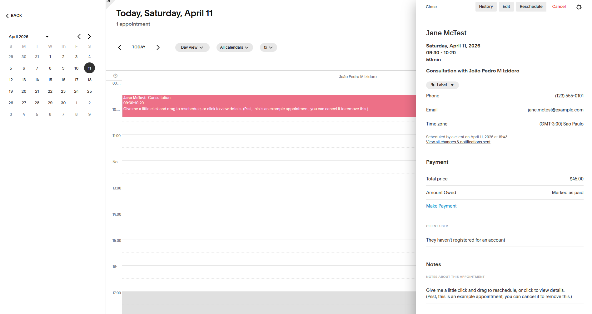
  

 

<!-- #endregion -->

<!-- #region SEGUNDA SOLUÇÃO: MINHAAGENDA -->

<h3>Segunda Solução: MinhaAgenda</h3>

<a href="https://minhaagendaapp.com.br/">Link</a> 

<strong>Público alvo: </strong>Coaches, Consultores, Terapeutas, Personal Trainers

<strong>Principais Funcionalidades:</strong>
<ul>
  <li>Calendario Visual com agendamento online</li>
  <li>App mobile nativo</li>
  <li>Integração com Stripe</li>
  <li>Gestão Básica de clientes</li>
  <li>Notificação por SMS</li>
  <li>Relatório de receita (versão premium)</li>
</ul>

<strong>Principais Limitações:</strong>
<ul>
  <li>Versão gratuita limitada (max 50 agendamentos/mes)</li>
  <li>Sem customização personalizada de campos de cliente e agenda</li>
  <li>Interface web confusa</li>
  <li>Somente SMS, sem integração com WhatsApp</li>
  <li>Focado para mobile, não permite nem criação de conta via web</li>
  <li>Sem aplicativo desktop</li>
</ul>

  
<h4>Image<h4/>

  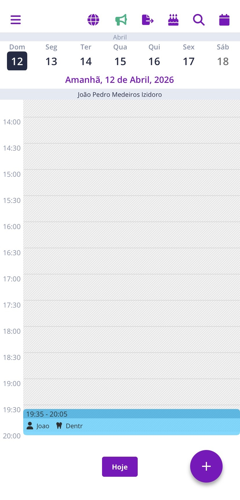
  

   

<!-- #endregion -->

<!-- #region TERCEIRA SOLUÇÃO: GOOGLE CALENDAR -->

<h3>Segunda Solução: Google Calendar</h3>

<a href="https://calendar.google.com/calendar/u/0/r?pli=1">Link</a> 

<strong>Público alvo: </strong>Usuários gerais, profissionais, empresas, qualquer pessoa com conta Google

<strong>Principais Funcionalidades:</strong>
<ul>
  <li>Calendario Visual com agendamento online</li>
  <li>Calendário com views de dia, semana e mês</li>
  <li>Criação e edição de eventos</li>
  <li>Notificações por email</li>
  <li>Compartilhamento de agenda com outras pessoas</li>
  <li>Sincronização entre dispositivos</li>
  <li>Busca por disponibilidade</li>
</ul>

<strong>Principais Limitações:</strong>
<ul>
  <li>Sem sistema de gestão de clientes</li>
  <li>Não há forma de armazenar dados</li>
  <li>Sem histórico de serviços prestados</li>
  <li>Interface não permite personalização</li>
  <li>Pensado para calendário pessoal, não negócio</li>
</ul>

  
<h4>Image<h4/>

  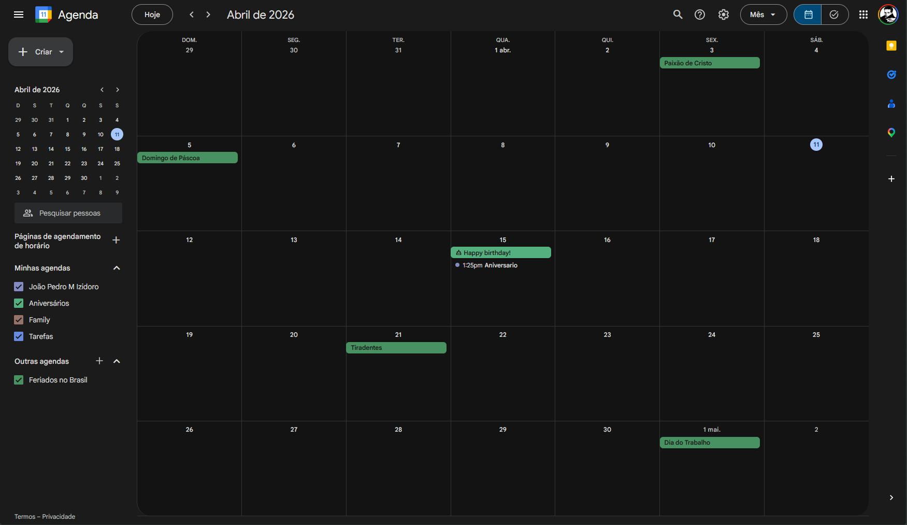

  

<!-- #endregion -->

<!-- #region DIFERENCIAL DO PROJETO-->
<h3 style="color:#C90606">Diferencial do Projeto</h3>

<h4>Por que criar algo novo?</h4>

<ul>
  <li>Versão paga mais barata que as soluções existentes.</li>
  <li>Versão gratuita mantém todas as funcionalidades padrão, sem limitação de tempo.</li>
  <li>Customização de tema completa, inspirada em aplicações como Notion e Jira</li>
  <li>Interface montada com foco em UX e intuitividade</li>
</ul>

<h4>Lacunas não resolvidas pelas soluções existentes</h4>
Nenhuma solução existente combina TODOS os seguintes requisitos:

<strong>Integração completa.</strong>
<ul>
  <li><strong>MinhaAgenda</strong>: Tem agenda. Falta personalização customizada.</li>
  <li><strong>Acuity</strong>: Tem personalização completa. Falta plano gratuito.</li>
  <li><strong>Google Calendar</strong>: Tem agenda completa, falta o restante da lógica completo (clientes, pagamentos).</li>
</ul>

<strong>Preço Acessível</strong>
<ul>
  <li><strong>MinhaAgenda</strong>: Plano grátis aceitável</li>
  <li><strong>Acuity</strong>: Sem plano grátis, plano mais barato à R$100, incompleto.</li>
  <li><strong>Google Calendar</strong>: Grátis, porém o mais incompleto da lista em questão de features.</li>
</ul>

<strong>Personalização da Marca.</strong>
<ul>
  <li><strong>MinhaAgenda</strong>: Sem personalização.</li>
  <li><strong>Acuity</strong>: Permite personalização de tema avançado.</li>
  <li><strong>Google Calendar</strong>: Sem personalização.</li>
</ul>

<strong>Simplicidade</strong>
<ul>
  <li><strong>MinhaAgenda</strong>: Simples, mas features limitadas.</li>
  <li><strong>Acuity</strong>: Complexa, muitas interfaces.</li>
  <li><strong>Google Calendar</strong>: Simples, mas features limitadas.</li>
</ul>

<h4>Nicho Atendido</h4>
Profissionais autonomos com foco em serviços personalizados que atuem individualmente.
O nicho principal é no modelo de negócio individual, e não venda de produtos, e de faturamento baixo-médio.

<!-- #endregion-->

<!-- #endregion -->

<!-- #region 1.4 PUBLICO ALVO -->

<h2 style="color:#770404">1.4. Público Alvo</h2>

O sistema é voltado para profissionais autônomos, empresários individuais e profissionais de MEI que prestam serviços personalizados de forma individual, sem equipe de suporte administrativo. O perfil principal inclui terapeutas, esteticistas, nutricionistas, personal trainers, consultores, entre outros.

<strong>Perfil do usuário:</strong>
<ul>
  <li>Atua de forma independente, sem funcionários ou suporte administrativo.</li>
  <li>Faixa etária ampla (25 a 60+ anos), reforçando a necessidade de interface simples e sem curva de aprendizado.</li>
  <li>Já teve contato com outras ferramentas de gestão ou calendário, mas abandonou por complexidade ou custo.</li>
  <li>Não possui conhecimento técnico em tecnologia, mas sabe usar smartphone e navegador no dia-a-dia.</li>
</ul>

<strong>Contexto de Uso:</strong>
<ul>
  <li>O sistema será acessado tanto pelo celular quanto pelo computador, com design mobile-first</li>
  <li>O momento típico de uso é imediatamente após fechar um atendimento ou novo plano com o cliente. O fluxo esperado é: <i>fechou o acordo -> abriu o app -> registrou a consulta</i>, em menos de 5 minutos</li>
  <li>Não há tolerância para interfaces lentas ou fluxos longos: O usuário precisa concluir ações essenciais com poucos cliques.</li>
</ul>

<strong>Nível técnico esperado:</strong>
Nenhum conhecimento técnico necessário, o sistema deve funcionar sem manual, tutorial obrigatório ou configuração inicial complexa.

<!-- #endregion -->

<!-- #region 1.5 OBJETIVOS DO PROJETO -->

<h2 style="color:#770404">1.5. Objetivos do Projeto</h2>
<h3 style="color:#C90606">Objetivo Geral</h3>
Oferecer aos profissionais autônomos de serviços personalizados uma ferramenta integrada, intuitiva e acessível para gestão de agenda, clientes e finanças, eliminando a dependência de planilhas e reduzindo a sobrecarga administrativa do dia a dia.

<h4 style="color:#C90606">Objetivos Específicos</h4>

- Implementar um sistema de autenticação seguro com suporte a cadastro por e-mail/senha e login via OAuth (Google e Apple), garantindo isolamento completo de dados por tenant.
- Desenvolver os módulos de cadastro e gestão de clientes, serviços, procedimentos e planos, permitindo que o profissional organize seu catálogo de ofertas e seu histórico de atendimentos em um único lugar.
- Construir um módulo de agenda com suporte a disponibilidade fixa e livre, criação manual de agendamentos, bloqueio de horários e visualização diária e semanal.
- Disponibilizar um link público de agendamento por tenant, permitindo que clientes externos solicitem horários sem criar conta, com fluxo de confirmação ou recusa pelo profissional.
- Implementar o módulo financeiro com registro de pagamentos por atendimento, controle de status (pago, pendente, cancelado), resumo de receitas por período e ranking de procedimentos.
- Criar um sistema de notificações automáticas via e-mail e WhatsApp para confirmações, lembretes e cancelamentos de agendamentos, configurável pelo profissional.
- Desenvolver um mecanismo de formulários personalizados aplicáveis a clientes, serviços e planos, permitindo que cada profissional adapte os campos coletados ao seu modelo de negócio.
- Oferecer personalização da interface por ocupação profissional, incluindo renomeação de entidades do sistema (como "Clientes" para "Pacientes") sem alterar a estrutura interna dos dados.
- Garantir conformidade com a LGPD por meio de consentimento explícito no cadastro, minimização de dados coletados e isolamento de informações por tenant com Row-Level Security no banco de dados.
- Entregar uma aplicação responsiva e de alta usabilidade, com tempo de carregamento das páginas principais inferior a 2 segundos em conexão 4G e fluxos essenciais concluídos em menos de 5 cliques.
 

<!-- #endregion -->

<!-- #region 1.6 Métricas de Sucesso (KPIs) -->

<h3 style="color:#770404">1.6. Métricas de Sucesso (KPIs)</h3>

<ul>
  <li>
  A usuária principal consegue realizar as tarefas do dia-a-dia (agendamento, registro de cliente, lançamento financeiro) sem precisar de auxílio de outras ferramentas.
  Tempo para
  </li>
  <li>Tempo para completar um agendamento completo inferior a 2 minutos.</li>
  <li>Tempo de resposta das principais telas inferior a 300ms</li>
  <li>Zero perda de dados registrados pela usuária durante o período de uso do MVP.</li>
  <li>Pelo menos 80% das funcionalidades do plano gratuito utilizadas ativamente pela usuária após 30 dias.</li>
</ul>

<!-- #endregion -->

<h1>2. Engenharia de Requisitos</h1>

<!-- #region 2.1 PERSONAS -->

<h2>2.1 Personas</h2>
<a href="/docs/img/persona-carlos.pdf" download>PDF Persona Carlos</a>

  
<h4>Persona Carlos - Imagem<h4/>

  

<!-- #endregion -->

<!-- #region 2.2 USE CASES -->

<h2>2.2 Casos de Uso Principais</h2>

<table>
  <tr>
    <th colspan="2">Atores Principais</th>
  </tr>
  <tr>
    <th>Ator</th>
    <th>Descrição</th>
  </tr>
  <tr>
    <td>Profissional</td>
    <td>Usuário principal do sistema. Gerencia clientes, agenda, procedimentos, planos, pagamentos e relatórios.</td>
  </tr>
  <tr>
    <td>Cliente</td>
    <td>Pessoa atentidade pelo profissional. Interage principalmente pelo link público de agendamento.</td>
  </tr>
  <tr>
    <td>Administrador de tenant</td>
    <td>Pessoa atendidade pelo profissional. Interage principalmente pelo link público de agendamento.</td>
  </tr>
  <tr>
    <td>Sistema</td>
    <td>Executa ações automáticas, como envio de lembretes, notificações e geração de relatórios.</td>
  </tr>
</table>

## Casos de uso por módulo

### 2.2.1. Autenticação e conta
| Código | Caso de uso                                    | Ator principal          | Requisitos relacionados |
| ------ | ---------------------------------------------- | ----------------------- | ----------------------- |
| UC-01  | Criar conta com e-mail e senha                 | Profissional            | RF-01                   |
| UC-02  | Entrar com conta Google                        | Profissional            | RF-02                   |
| UC-03  | Recuperar senha                                | Profissional            | RF-03                   |
| UC-04  | Gerenciar perfil e dados do negócio            | Profissional            | RF-04                   |
| UC-05  | Convidar colaborador para o espaço de trabalho | Administrador do tenant | RF-05                   |
| UC-06  | Definir permissões de colaborador              | Administrador do tenant | RF-06                   |

### 2.2.2. Clientes
| Código | Caso de uso                             | Ator principal | Requisitos relacionados |
| ------ | --------------------------------------- | -------------- | ----------------------- |
| UC-07  | Cadastrar cliente                       | Profissional   | RF-07                   |
| UC-08  | Editar cliente                          | Profissional   | RF-08                   |
| UC-09  | Inativar cliente             | Profissional   | RF-08                   |
| UC-10  | Buscar e filtrar clientes               | Profissional   | RF-09                   |
| UC-11  | Visualizar ficha e histórico do cliente | Profissional   | RF-10                   |

### 2.2.3. Procedimentos e serviços
| Código | Caso de uso                      | Ator principal | Requisitos relacionados |
| ------ | -------------------------------- | -------------- | ----------------------- |
| UC-12  | Cadastrar procedimento           | Profissional   | RF-11                   |
| UC-13  | Editar procedimento              | Profissional   | RF-12                   |
| UC-14  | Excluir ou inativar procedimento | Profissional   | RF-12                   |
| UC-15  | Listar procedimentos cadastrados | Profissional   | RF-13                   |

### 2.2.4. Pacotes e planos
| Código | Caso de uso                  | Ator principal | Requisitos relacionados |
| ------ | ---------------------------- | -------------- | ----------------------- |
| UC-16  | Criar plano ou pacote        | Profissional   | RF-14                   |
| UC-17  | Associar serviços a um plano | Profissional   | RF-15                   |
| UC-18  | Editar plano                 | Profissional   | RF-16                   |
| UC-19  | Excluir ou inativar plano    | Profissional   | RF-16                   |
| UC-20  | Listar planos cadastrados    | Profissional   | RF-17                   |

### 2.2.5. Agenda e agendamentos
| Código | Caso de uso                                     | Ator principal       | Requisitos relacionados |
| ------ | ----------------------------------------------- | -------------------- | ----------------------- |
| UC-21  | Configurar disponibilidade fixa                 | Profissional         | RF-18                   |
| UC-22  | Configurar disponibilidade livre                | Profissional         | RF-19                   |
| UC-23  | Criar agendamento manual                        | Profissional         | RF-20                   |
| UC-24  | Editar agendamento                              | Profissional         | RF-21                   |
| UC-25  | Cancelar agendamento                            | Profissional         | RF-21                   |
| UC-26  | Visualizar agenda diária ou semanal             | Profissional         | RF-22                   |
| UC-27  | Gerar link público de agendamento               | Profissional/Sistema | RF-23                   |
| UC-28  | Solicitar agendamento por link público          | Cliente              | RF-23                   |
| UC-29  | Confirmar ou recusar solicitação de agendamento | Profissional         | RF-24                   |
| UC-30  | Bloquear horário na agenda                      | Profissional         | RF-25                   |

### 2.2.6. Pagamentos
| Código | Caso de uso                                   | Ator principal | Requisitos relacionados |
| ------ | --------------------------------------------- | -------------- | ----------------------- |
| UC-31  | Registrar pagamento de atendimento            | Profissional   | RF-26                   |
| UC-32  | Editar pagamento registrado                   | Profissional   | RF-27                   |
| UC-33  | Visualizar status de pagamento do atendimento | Profissional   | RF-28                   |

### 2.2.7. Visão financeira e relatórios.
| Código | Caso de uso                               | Ator principal | Requisitos relacionados |
| ------ | ----------------------------------------- | -------------- | ----------------------- |
| UC-34  | Visualizar resumo de receitas por período | Profissional   | RF-29                   |
| UC-35  | Comparar receitas entre períodos          | Profissional   | RF-30                   |
| UC-36  | Visualizar ranking de procedimentos       | Profissional   | RF-31                   |
| UC-37  | Exportar relatório financeiro             | Profissional   | RF-32                   |

### 2.2.8. Notificações
| Código | Caso de uso                                | Ator principal | Requisitos relacionados |
| ------ | ------------------------------------------ | -------------- | ----------------------- |
| UC-38  | Enviar confirmação de agendamento          | Sistema        | RF-33                   |
| UC-39  | Enviar lembrete antes do atendimento       | Sistema        | RF-34                   |
| UC-40  | Notificar cancelamento ou remarcação       | Sistema        | RF-35                   |
| UC-41  | Configurar canais e eventos de notificação | Profissional   | RF-36                   |

### 2.2.9. Formulários personalizados
| Código | Caso de uso                                     | Ator principal | Requisitos relacionados |
| ------ | ----------------------------------------------- | -------------- | ----------------------- |
| UC-42  | Criar modelo de formulário                      | Profissional   | RF-37                   |
| UC-43  | Adicionar e ordenar campos do formulário        | Profissional   | RF-38                   |
| UC-44  | Editar modelo de formulário                     | Profissional   | RF-39                   |
| UC-45  | Excluir modelo de formulário                    | Profissional   | RF-39                   |
| UC-46  | Aplicar formulário a cliente, serviço ou plano  | Profissional   | RF-40                   |
| UC-47  | Editar respostas de formulário aplicado         | Profissional   | RF-41                   |
| UC-48  | Visualizar formulários aplicados a uma entidade | Profissional   | RF-42                   |

### 2.2.10. Configuração do espaço de trabalho
| Código | Caso de uso                      | Ator principal | Requisitos relacionados |
| ------ | -------------------------------- | -------------- | ----------------------- |
| UC-49  | Configurar ocupação profissional | Profissional   | RF-43                   |
| UC-50  | Personalizar labels do sistema   | Profissional   | RF-43                   |

<!-- #endregion -->

<!-- #region 2.3 RFs -->

<h2>2.3 Requisitos Funcionais (RF)</h2>

<table>
  <tr>
    <th colspan="3">Autenticação e conta</th>
  </tr>
  <tr>
    <th>Requisito</th>
    <th>Descrição</th>
    <th>Prioridade</th>
  </tr>
  <tr>
    <td>RF-01</td>
    <td><strong>Cadastro por e-mail e senha</strong> O profissional pode criar uma conta informando nome, e-mail e senha.</td>
    <td>MVP</td>
  </tr>
  <tr>
    <td>RF-02</td>
    <td><strong>Login via Google e Apple (OAuth)</strong> O profissional pode autenticar com a conta Google ou Apple.</td>
    <td>MVP</td>
  </tr>
  <tr>
    <td>RF-03</td>
    <td><strong>Recuperação de senha</strong> O sistema envia link de redefinição de senha por e-mail.</td>
    <td>MVP</td>
  </tr>
  <tr>
    <td>RF-04</td>
    <td><strong>Gerenciamento de perfil</strong> O profissional pode editar nome, foto, dados de contato e informações do negócio.</td>
    <td>MVP</td>
  </tr>
  <tr>
    <td>RF-05</td>
    <td><strong>Multiusuário por tenant</strong> Contas nos planos Basic ou superior podem convidar colaboradores com acesso ao mesmo espaço de trabalho.</td>
    <td>WANTS</td>
  </tr>
  <tr>
    <td>RF-06</td>
    <td><strong>Controle de permissões</strong> O administrador do tenant define o nível de acesso de cada colaborador, como somente agenda ou acesso financeiro.</td>
    <td>WANTS</td>
  </tr>
</table>

<table>
  <tr>
    <th colspan="3">Cadastro de clientes</th>
  </tr>
  <tr>
    <th>Requisito</th>
    <th>Descrição</th>
    <th>Prioridade</th>
  </tr>
  <tr>
    <td>RF-07</td>
    <td><strong>Criar cliente</strong> O profissional pode cadastrar um cliente com nome, telefone, e-mail e observações, ou utilizar um formulário personalizado.</td>
    <td>MVP</td>
  </tr>
  <tr>
    <td>RF-08</td>
    <td><strong>Editar e excluir cliente</strong> O profissional pode atualizar ou remover um cadastro de cliente.</td>
    <td>MVP</td>
  </tr>
  <tr>
    <td>RF-09</td>
    <td><strong>Busca e filtro de clientes</strong> O profissional pode buscar clientes por nome ou e-mail.</td>
    <td>MVP</td>
  </tr>
  <tr>
    <td>RF-10</td>
    <td><strong>Histórico de atendimentos do cliente</strong> Na ficha do cliente, o profissional visualiza todos os atendimentos anteriores, procedimentos realizados, planos ativos e valores pagos.</td>
    <td>MVP</td>
  </tr>
</table>

<table>
  <tr>
    <th colspan="3">Procedimentos e serviços</th>
  </tr>
  <tr>
    <th>Requisito</th>
    <th>Descrição</th>
    <th>Prioridade</th>
  </tr>
  <tr>
    <td>RF-11</td>
    <td><strong>Criar procedimento</strong> O profissional cadastra procedimentos com nome, duração estimada, valor padrão, ou utiliza um formulário personalizado.</td>
    <td>MVP</td>
  </tr>
  <tr>
    <td>RF-12</td>
    <td><strong>Editar e excluir procedimento</strong> O profissional pode atualizar ou remover um procedimento do catálogo.</td>
    <td>MVP</td>
  </tr>
  <tr>
    <td>RF-13</td>
    <td><strong>Listagem de procedimentos</strong> O profissional visualiza todos os procedimentos cadastrados em uma lista.</td>
    <td>MVP</td>
  </tr>
</table>

<table>
  <tr>
    <th colspan="3">Pacotes e planos</th>
  </tr>
  <tr>
    <th>Requisito</th>
    <th>Descrição</th>
    <th>Prioridade</th>
  </tr>
  <tr>
    <td>RF-14</td>
    <td><strong>Criar plano</strong> O profissional cadastra um pacote de serviços com nome, descrição, preço, moeda, ciclo de cobrança (mensal, semanal, avulso etc.), ou utiliza um formulário personalizado.</td>
    <td>MVP</td>
  </tr>
  <tr>
    <td>RF-15</td>
    <td><strong>Associar serviços a um plano</strong> O profissional define quais serviços fazem parte de um plano, com quantidade e possibilidade de substituir o preço individual do serviço dentro do pacote.</td>
    <td>MVP</td>
  </tr>
  <tr>
    <td>RF-16</td>
    <td><strong>Editar e excluir plano</strong> O profissional pode atualizar ou remover um plano do catálogo.</td>
    <td>MVP</td>
  </tr>
  <tr>
    <td>RF-17</td>
    <td><strong>Listagem de planos</strong> O profissional visualiza todos os planos cadastrados em uma lista.</td>
    <td>MVP</td>
  </tr>
</table>

<table>
  <tr>
    <th colspan="3">Agendas e Agendamentos</th>
  </tr>
  <tr>
    <th>Requisito</th>
    <th>Descrição</th>
    <th>Prioridade</th>
  </tr>
  <tr>
    <td>RF-18</td>
    <td><strong>Definir disponibilidade fixa</strong> O profissional configura blocos de horário fixos por dia da semana (ex: seg–sex 09h–18h com intervalos de 30 min).</td>
    <td>MVP</td>
  </tr>
  <tr>
    <td>RF-19</td>
    <td><strong>Definir disponibilidade livre</strong> O profissional pode criar manualmente janelas de horário disponíveis para datas específicas.</td>
    <td>MVP</td>
  </tr>
  <tr>
    <td>RF-20</td>
    <td><strong>Criar agendamento pelo profissional</strong> O profissional agenda um atendimento escolhendo cliente, plano ou serviço, data e horário.</td>
    <td>MVP</td>
  </tr>
  <tr>
    <td>RF-21</td>
    <td><strong>Editar e cancelar agendamento</strong> O profissional pode alterar data, horário, plano/serviço ou cancelar um agendamento existente.</td>
    <td>MVP</td>
  </tr>
  <tr>
    <td>RF-22</td>
    <td><strong>Visualização de agenda (dia/semana)</strong> O profissional visualiza os agendamentos em formato de agenda diária ou semanal.</td>
    <td>MVP</td>
  </tr>
  <tr>
    <td>RF-23</td>
    <td><strong>Link público de agendamento</strong> O sistema gera um link único por tenant que permite ao cliente visualizar horários disponíveis e solicitar um agendamento sem criar conta.</td>
    <td>MVP</td>
  </tr>
  <tr>
    <td>RF-24</td>
    <td><strong>Confirmação de agendamento pelo profissional</strong> Agendamentos feitos pelo link público ficam como "pendentes" até o profissional confirmar ou recusar.</td>
    <td>MVP</td>
  </tr>
  <tr>
    <td>RF-25</td>
    <td><strong>Bloqueio de horário</strong> O profissional pode bloquear horários específicos para impedi-los de aparecer como disponíveis no link público.</td>
    <td>MVP</td>
  </tr>
</table>

<table>
  <tr>
    <th colspan="3">Pagamentos</th>
  </tr>
  <tr>
    <th>Requisito</th>
    <th>Descrição</th>
    <th>Prioridade</th>
  </tr>
  <tr>
    <td>RF-26</td>
    <td><strong>Registrar pagamento no agendamento</strong> O profissional registra se o atendimento foi pago, informando valor, forma de pagamento (dinheiro, PIX, cartão, etc.) e data.</td>
    <td>MVP</td>
  </tr>
  <tr>
    <td>RF-27</td>
    <td><strong>Editar registro de pagamento</strong> O profissional pode corrigir os dados de pagamento de um atendimento já registrado.</td>
    <td>MVP</td>
  </tr>
  <tr>
    <td>RF-28</td>
    <td><strong>Status de pagamento por atendimento</strong> Cada agendamento exibe claramente se está pago, pendente ou cancelado.</td>
    <td>MVP</td>
  </tr>
</table>

<table>
  <tr>
    <th colspan="3">Visão Financeira e Relatórios</th>
  </tr>
  <tr>
    <th>Requisito</th>
    <th>Descrição</th>
    <th>Prioridade</th>
  </tr>
  <tr>
    <td>RF-29</td>
    <td><strong>Resumo de receitas por período</strong> O profissional visualiza o total recebido em um intervalo de datas selecionado.</td>
    <td>MVP</td>
  </tr>
  <tr>
    <td>RF-30</td>
    <td><strong>Comparativo entre períodos</strong> O sistema apresenta a comparação de receita entre dois períodos (ex: mês atual vs. mês anterior).</td>
    <td>MVP</td>
  </tr>
  <tr>
    <td>RF-31</td>
    <td><strong>Ranking de procedimentos</strong> O sistema exibe os procedimentos mais realizados e os que mais geraram receita no período.</td>
    <td>MVP</td>
  </tr>
  <tr>
    <td>RF-32</td>
    <td><strong>Exportação de relatório</strong> O profissional pode exportar o relatório financeiro em PDF ou Excel.</td>
    <td>MVP</td>
  </tr>
</table>

<table>
  <tr>
    <th colspan="3">Notificações</th>
  </tr>
  <tr>
    <th>Requisito</th>
    <th>Descrição</th>
    <th>Prioridade</th>
  </tr>
  <tr>
    <td>RF-33</td>
    <td><strong>Notificação de confirmação de agendamento</strong> Ao confirmar um agendamento, o cliente recebe uma notificação por e-mail e/ou WhatsApp com os detalhes.</td>
    <td>MVP</td>
  </tr>
  <tr>
    <td>RF-34</td>
    <td><strong>Lembrete antes do horário</strong> O sistema envia um lembrete automático ao cliente com antecedência configurável (ex: 24h ou 1h antes).</td>
    <td>MVP</td>
  </tr>
  <tr>
    <td>RF-35</td>
    <td><strong>Notificação de cancelamento ou remarcação</strong> O cliente é notificado automaticamente quando o profissional cancela ou altera um agendamento.</td>
    <td>MVP</td>
  </tr>
  <tr>
    <td>RF-36</td>
    <td><strong>Configuração de canais de notificação</strong> O profissional configura as credenciais e canais de envio (e-mail, WhatsApp via Evolution API) e escolhe quais eventos disparam cada canal. As preferências são armazenadas nas configurações do tenant.</td>
    <td>MVP</td>
  </tr>
</table>

<table>
  <tr>
    <th colspan="3">Formulários personalizados</th>
  </tr>
  <tr>
    <th>Requisito</th>
    <th>Descrição</th>
    <th>Prioridade</th>
  </tr>
  <tr>
    <td>RF-37</td>
    <td><strong>Criar modelo de formulário</strong> O profissional cria um modelo de formulário com nome, descrição e tipo de entidade-alvo sugerida (cliente, serviço ou plano).</td>
    <td>MVP</td>
  </tr>
  <tr>
    <td>RF-38</td>
    <td><strong>Adicionar e ordenar campos</strong> O profissional adiciona campos ao formulário (texto, número, data, seleção, imagem, arquivo, etc.), define rótulo, obrigatoriedade e ordem de exibição.</td>
    <td>MVP</td>
  </tr>
  <tr>
    <td>RF-39</td>
    <td><strong>Editar e excluir modelo de formulário</strong> O profissional pode atualizar ou remover um modelo de formulário e seus campos.</td>
    <td>MVP</td>
  </tr>
  <tr>
    <td>RF-40</td>
    <td><strong>Aplicar formulário a uma entidade</strong> O profissional aplica um modelo de formulário a um cliente, serviço ou plano específico e preenche as respostas.</td>
    <td>MVP</td>
  </tr>
  <tr>
    <td>RF-41</td>
    <td><strong>Editar respostas de formulário aplicado</strong> O profissional pode atualizar as respostas de um formulário já aplicado a uma entidade.</td>
    <td>MVP</td>
  </tr>
  <tr>
    <td>RF-42</td>
    <td><strong>Visualizar formulários de uma entidade</strong> Na ficha de um cliente, serviço ou plano, o profissional visualiza todos os formulários aplicados e suas respostas.</td>
    <td>MVP</td>
  </tr>
</table>

<table>
  <tr>
    <th colspan="3">Configuração do espaço de trabalho</th>
  </tr>
  <tr>
    <th>Requisito</th>
    <th>Descrição</th>
    <th>Prioridade</th>
  </tr>
  <tr>
    <td>RF-43</td>
    <td><strong>Configurar ocupação e labels</strong> O profissional seleciona sua ocupação (ex: psicólogo, personal trainer, advogado) e pode personalizar os nomes exibidos para clientes, serviços e planos no sistema (ex: "Pacientes", "Consultas", "Mensalidades").</td>
    <td>MVP</td>
  </tr>
</table>

<!-- #endregion-->

<!-- #region 2.4 RNFs -->

<h2>2.4 Requisitos Não Funcionais (RNF)</h2>

### Desempenho
 
<table>
  <tr>
    <th>Requisito</th>
    <th>Quality Attribute</th>
    <th>Description</th>
    <th>Metric / Acceptance Criteria</th>
    <th>Priority</th>
  </tr>
  <tr>
    <td>RNF-01</td>
    <td><strong>Page Load Performance</strong></td>
    <td>As principais páginas do sistema (agenda, clientes, financeiro) devem carregar rapidamente em conexões móveis para garantir boa experiência ao profissional em campo. O impacto direto é na adoção e retenção do produto.</td>
    <td>P95 &lt; 2s em conexão 4G @ 500 usuários simultâneos</td>
    <td>MVP</td>
  </tr>
  <tr>
    <td>RNF-02</td>
    <td><strong>API Response Time</strong></td>
    <td>As chamadas de API devem responder dentro de limites aceitáveis para operações de leitura e escrita, assegurando fluidez nas interações do usuário com o sistema sob carga normal.</td>
    <td>Leitura &lt; 500ms | Escrita &lt; 1s em carga normal</td>
    <td>MVP</td>
  </tr>
  <tr>
    <td>RNF-03</td>
    <td><strong>Public Booking Link Performance</strong></td>
    <td>O link público de agendamento é acessado por clientes externos em dispositivos variados, muitas vezes sem sessão em cache. O carregamento lento representa perda direta de agendamentos para o profissional.</td>
    <td>&lt; 3s em first load (sem cache)</td>
    <td>MVP</td>
  </tr>
</table>
---
 
### Disponibilidade e Escalabilidade
 
<table>
  <tr>
    <th>Requisito</th>
    <th>Quality Attribute</th>
    <th>Description</th>
    <th>Metric / Acceptance Criteria</th>
    <th>Priority</th>
  </tr>
  <tr>
    <td>RNF-04</td>
    <td><strong>Availability</strong></td>
    <td>O sistema deve garantir disponibilidade mínima mensal compatível com infraestrutura de baixo custo. Indisponibilidade impacta diretamente agendamentos e receita do profissional.</td>
    <td>SLA ≥ 99% (~7h downtime/mês)</td>
    <td>MVP</td>
  </tr>
  <tr>
    <td>RNF-05</td>
    <td><strong>Disaster Recovery – RTO</strong></td>
    <td>Em caso de queda do servidor, o sistema deve retornar ao ar em tempo hábil de forma automatizada, minimizando intervenção manual e impacto nos profissionais durante o horário de atendimento.</td>
    <td>RTO ≤ 30 min | Reinicialização automatizada (process manager + health checks)</td>
    <td>MVP</td>
  </tr>
  <tr>
    <td>RNF-06</td>
    <td><strong>Disaster Recovery – RPO / Backup</strong></td>
    <td>O banco de dados deve ser copiado automaticamente uma vez ao dia para proteger os dados de clientes e agendamentos contra perda acidental ou falha de infraestrutura.</td>
    <td>RPO ≤ 24h | Backup diário automático | Retenção ≥ 7 dias | Restaurável em produção</td>
    <td>MVP</td>
  </tr>
  <tr>
    <td>RNF-07</td>
    <td><strong>Data Isolation (Multi-tenancy)</strong></td>
    <td>Todos os dados devem ser isolados por tenant para garantir que nenhum profissional acesse dados de outro, mesmo em caso de erro de aplicação. O modelo multi-tenant exige que o isolamento seja garantido na camada de banco de dados.</td>
    <td>Row-Level Security (RLS) obrigatório em todas as tabelas com <code>tenant_id</code> | Zero vazamento entre tenants</td>
    <td>MVP</td>
  </tr>
</table>
---
 
### Segurança
 
<table>
  <tr>
    <th>Requisito</th>
    <th>Quality Attribute</th>
    <th>Description</th>
    <th>Metric / Acceptance Criteria</th>
    <th>Priority</th>
  </tr>
  <tr>
    <td>RNF-08</td>
    <td><strong>Authentication Security</strong></td>
    <td>O sistema deve armazenar senhas com hash seguro e utilizar tokens de curta duração com rotação, reduzindo a superfície de ataque em caso de comprometimento de credenciais.</td>
    <td>bcrypt cost ≥ 12 | JWT exp ≤ 24h | Refresh tokens rotativos e invalidados no logout</td>
    <td>MVP</td>
  </tr>
  <tr>
    <td>RNF-09</td>
    <td><strong>Transport Security</strong></td>
    <td>Todo o tráfego entre cliente e servidor deve ser criptografado para proteger dados sensíveis de clientes e profissionais contra interceptação.</td>
    <td>TLS ≥ 1.2 em todos os endpoints | Renovação automática de certificados (ex: Let's Encrypt)</td>
    <td>MVP</td>
  </tr>
  <tr>
    <td>RNF-10</td>
    <td><strong>API Security / Attack Protection</strong></td>
    <td>A API deve implementar múltiplas camadas de proteção contra ataques comuns (injeção, força bruta, abuso de recursos), garantindo integridade dos dados e disponibilidade do serviço.</td>
    <td>Rate limit: 100 req/min por IP | ORM parametrizado (anti SQL injection) | Headers: CORS restrito, CSP, X-Frame-Options</td>
    <td>MVP</td>
  </tr>
  <tr>
    <td>RNF-11</td>
    <td><strong>Audit Logging</strong></td>
    <td>Ações críticas devem ser registradas para fins de auditoria, rastreabilidade e detecção de uso indevido. Os logs devem incluir contexto suficiente para investigação de incidentes.</td>
    <td>Registro de: login, alteração de dados, exclusões e exportações — com timestamp, usuário e IP | Retenção ≥ 90 dias</td>
    <td>Wants</td>
  </tr>
</table>
---
 
### LGPD e Privacidade
 
<table>
  <tr>
    <th>Requisito</th>
    <th>Quality Attribute</th>
    <th>Description</th>
    <th>Metric / Acceptance Criteria</th>
    <th>Priority</th>
  </tr>
  <tr>
    <td>RNF-12</td>
    <td><strong>Consent & Legal Basis</strong></td>
    <td>O sistema deve exigir aceite explícito dos termos de uso e política de privacidade no cadastro, com registro rastreável, atendendo à legal de consentimento exigida pela LGPD.</td>
    <td>Aceite registrado com timestamp e versão do documento | Exibição obrigatória no onboarding</td>
    <td>MVP</td>
  </tr>
  <tr>
    <td>RNF-13</td>
    <td><strong>Right of Access & Data Portability</strong></td>
    <td>O profissional deve poder exportar todos os seus dados e os dados dos seus clientes em formato legível, exercendo o direito de portabilidade previsto na LGPD.</td>
    <td>Exportação disponível em JSON ou CSV | Entrega em ≤ 72h após solicitação</td>
    <td>Wants</td>
  </tr>
  <tr>
    <td>RNF-14</td>
    <td><strong>Right to Erasure</strong></td>
    <td>O profissional deve poder solicitar a exclusão permanente da conta e de todos os dados associados (clientes, agendamentos, arquivos), exercendo o direito ao esquecimento previsto na LGPD.</td>
    <td>Remoção completa de todos os dados associados em ≤ 30 dias após solicitação</td>
    <td>Wants</td>
  </tr>
  <tr>
    <td>RNF-15</td>
    <td><strong>Data Minimization</strong></td>
    <td>O sistema deve coletar apenas os dados estritamente necessários para o funcionamento das funcionalidades, sem compartilhamento com terceiros sem consentimento, seguindo o princípio de minimização da LGPD.</td>
    <td>Nenhum campo obrigatório além do mínimo funcional | Campos opcionais claramente identificados | Zero compartilhamento com terceiros sem consentimento</td>
    <td>MVP</td>
  </tr>
</table>
---
 
### Usabilidade e Acessibilidade
 
<table>
  <tr>
    <th>Requisito</th>
    <th>Quality Attribute</th>
    <th>Description</th>
    <th>Metric / Acceptance Criteria</th>
    <th>Priority</th>
  </tr>
  <tr>
    <td>RNF-16</td>
    <td><strong>Responsive Design</strong></td>
    <td>O sistema deve funcionar corretamente em smartphones e desktops, dado que profissionais frequentemente gerenciam sua agenda pelo celular. O link público de agendamento deve ser otimizado para mobile, pois é acessado majoritariamente por clientes em dispositivos móveis.</td>
    <td>Layout funcional em breakpoints: 320px, 768px e 1280px</td>
    <td>MVP</td>
  </tr>
  <tr>
    <td>RNF-17</td>
    <td><strong>Browser Compatibility</strong></td>
    <td>O sistema deve funcionar sem degradação nas principais versões dos navegadores utilizados pelo público-alvo, evitando fricção no acesso por parte de profissionais e clientes.</td>
    <td>Suporte às 2 últimas versões de: Chrome, Firefox, Safari e Edge</td>
    <td>MVP</td>
  </tr>
  <tr>
    <td>RNF-18</td>
    <td><strong>Accessibility</strong></td>
    <td>Os componentes principais do sistema devem atender às diretrizes de acessibilidade WCAG 2.1 nível AA, garantindo que usuários com deficiências visuais ou motoras consigam utilizar os fluxos essenciais.</td>
    <td>WCAG 2.1 AA nos fluxos principais: contraste de cores, navegação por teclado e atributos ARIA</td>
    <td>Wants</td>
  </tr>
</table>
---
 
### Manutenibilidade e Qualidade
 
<table>
  <tr>
    <th>Requisito</th>
    <th>Quality Attribute</th>
    <th>Description</th>
    <th>Metric / Acceptance Criteria</th>
    <th>Priority</th>
  </tr>
  <tr>
    <td>RNF-19</td>
    <td><strong>Test Coverage</strong></td>
    <td>Os módulos de maior criticidade de negócio (agendamento, pagamentos e autenticação) devem ter cobertura de testes automatizados suficiente para garantir regressão segura a cada deploy.</td>
    <td>Cobertura ≥ 70% (unitários + integração) nos módulos críticos</td>
    <td>MVP</td>
  </tr>
  <tr>
    <td>RNF-20</td>
    <td><strong>CI/CD & Version Control</strong></td>
    <td>O processo de deploy deve ser automatizado com etapa obrigatória de testes, reduzindo risco de regressões em produção e garantindo rastreabilidade de mudanças via controle de versão.</td>
    <td>Git com branches protegidas | Pipeline CI/CD com gate de testes obrigatório antes do deploy em produção</td>
    <td>MVP</td>
  </tr>
  <tr>
    <td>RNF-21</td>
    <td><strong>Observability & Alerting</strong></td>
    <td>O sistema deve ter monitoramento de uptime e alertas automáticos em caso de indisponibilidade ou erros críticos, permitindo resposta rápida a incidentes antes que impactem os profissionais.</td>
    <td>Alerta disparado em ≤ 5 min após falha detectada (ex: Uptime Robot, Sentry ou equivalente)</td>
    <td>MVP</td>
  </tr>
</table>
---
 
### Escalabilidade
 
<table>
  <tr>
    <th>Requisito</th>
    <th>Quality Attribute</th>
    <th>Description</th>
    <th>Metric / Acceptance Criteria</th>
    <th>Priority</th>
  </tr>
  <tr>
    <td>RNF-22</td>
    <td><strong>Horizontal Scalability</strong></td>
    <td>A camada de aplicação deve ser stateless para permitir escalonamento horizontal sem refatoração estrutural, suportando o crescimento da de tenants sem degradação de performance.</td>
    <td>API stateless (sem sessão server-side) | Suporte a escalonamento horizontal até 5.000 tenants sem refatoração</td>
    <td>MVP</td>
  </tr>
  <tr>
    <td>RNF-23</td>
    <td><strong>Pagination & Memory Efficiency</strong></td>
    <td>Todas as listagens com potencial de crescimento ilimitado devem usar paginação ou scroll infinito para evitar sobrecarga de memória e lentidão na interface conforme o volume de dados aumenta.</td>
    <td>Máximo 50 registros por página/request em todas as listagens (clientes, agendamentos, formulários)</td>
    <td>MVP</td>
  </tr>
</table>

<!-- #endregion -->

<!-- #region 2.5 Regras de Negócio -->

<h2>2.5 Regras de Negócio</h2>

As regras de negócio definem condições, restrições e comportamentos obrigatórios do sistema Planici para garantir consistência, segurança e coerência entre clientes, agenda, procedimentos, planos, pagamentos e configurações do espaço de trabalho.

### RN-01: Acesso autenticado

Apenas usuários autenticados podem acessar os recursos internos do sistema, como cadastro de clientes, agenda, procedimentos, planos, pagamentos, relatórios, formulários e configurações do espaço de trabalho.

Recursos públicos, como o link de agendamento disponibilizado ao cliente, podem ser acessados sem autenticação, desde que estejam vinculados a um tenant válido.

---

### RN-02: Isolamento por tenant

Todos os dados operacionais do sistema devem pertencer a um tenant, incluindo clientes, procedimentos, planos, agendamentos, pagamentos, formulários, configurações e colaboradores.

Um usuário não pode visualizar, editar ou excluir dados pertencentes a outro tenant, salvo se possuir vínculo autorizado com esse espaço de trabalho.

---

### RN-03: Permissões de colaboradores

Quando o recurso de múltiplos usuários estiver disponível, somente administradores do tenant poderão convidar colaboradores e alterar suas permissões.

Colaboradores só poderão executar ações compatíveis com seu nível de acesso. Por exemplo, um colaborador com acesso apenas à agenda não poderá visualizar relatórios financeiros ou alterar configurações do tenant.

---

### RN-04: Cadastro de clientes

Todo cliente deve estar vinculado a um tenant.

O nome do cliente é obrigatório. Telefone, e-mail e observações podem ser opcionais, mas, quando informados, devem respeitar formatos válidos.

Não deve ser permitido cadastrar dois clientes com o mesmo e-mail dentro do mesmo tenant, caso o e-mail tenha sido informado.

---

### RN-05: Exclusão de clientes

Clientes que possuam histórico de atendimentos, pagamentos, planos ou formulários aplicados não devem ser removidos definitivamente do sistema.

Nesses casos, o cliente deve ser apenas inativado, preservando o histórico necessário para consultas futuras, relatórios e controle financeiro.

---

### RN-06: Cadastro de procedimentos

Todo procedimento deve estar vinculado a um tenant.

Um procedimento deve possuir, no mínimo, nome, duração estimada e valor padrão.

O valor padrão de um procedimento não pode ser negativo.

Procedimentos vinculados a agendamentos, planos ou histórico financeiro não devem ser excluídos definitivamente; devem ser inativados.

---

### RN-07: Cadastro de planos

Todo plano deve estar vinculado a um tenant.

Um plano deve possuir nome, preço, moeda e ciclo de cobrança.

O preço de um plano não pode ser negativo.

Um plano pode conter um ou mais procedimentos associados.

Quando um procedimento for associado a um plano, o sistema deve permitir definir a quantidade incluída e, se necessário, um preço específico para aquele procedimento dentro do pacote.

---

### RN-08: Exclusão de planos

Planos já utilizados em agendamentos, histórico de clientes ou registros financeiros não devem ser removidos definitivamente.

Nesses casos, o plano deve ser inativado para impedir novos usos, mantendo o histórico anterior preservado.

---

### RN-09: Disponibilidade da agenda

O profissional pode configurar disponibilidades fixas por dia da semana ou janelas de disponibilidade específicas para datas determinadas.

Horários fora da disponibilidade configurada não devem aparecer como disponíveis no link público de agendamento.

Horários bloqueados manualmente pelo profissional também não devem aparecer como disponíveis.

---

### RN-10: Criação de agendamentos

Todo agendamento deve estar vinculado a um tenant.

Um agendamento criado pelo profissional deve possuir cliente, serviço ou plano, data e horário.

Não deve ser permitido criar dois agendamentos no mesmo horário para o mesmo profissional quando houver conflito de disponibilidade.

Não deve ser permitido criar agendamento em horário bloqueado.

---

### RN-11: Agendamentos pelo link público

Agendamentos solicitados por meio do link público devem ser criados inicialmente com status pendente.

O cliente não precisa possuir conta no sistema para solicitar um agendamento pelo link público.

O agendamento só passa a ser confirmado após aprovação do profissional.

O profissional pode confirmar ou recusar solicitações recebidas pelo link público.

---

### RN-12: Alteração e cancelamento de agendamentos

O profissional pode alterar data, horário, cliente, serviço ou plano de um agendamento existente, desde que o novo horário esteja disponível.

Agendamentos cancelados devem manter o registro histórico no sistema.

Um agendamento cancelado não deve ser considerado como receita recebida, exceto se houver pagamento registrado e mantido pelo profissional.

---

### RN-13: Status de pagamento

Cada agendamento deve possuir um status de pagamento claramente identificado, como pago, pendente ou cancelado.

Um pagamento registrado deve conter valor, forma de pagamento e data de pagamento.

O valor pago não pode ser negativo.

A data de pagamento não pode ser posterior à data atual, salvo se o sistema permitir registro de pagamentos futuros como previsão.

---

### RN-14: Edição de pagamentos

O profissional pode corrigir dados de pagamento já registrados.

Alterações em pagamentos devem atualizar os valores utilizados nos relatórios financeiros.

Pagamentos associados a agendamentos cancelados devem ser tratados conforme a regra definida pelo profissional, podendo ser mantidos, estornados ou desconsiderados dos relatórios.

---

### RN-15: Relatórios financeiros

Os relatórios financeiros devem considerar apenas dados pertencentes ao tenant do usuário autenticado.

O resumo de receitas deve considerar somente pagamentos registrados como pagos.

Pagamentos pendentes não devem ser somados como receita recebida.

Agendamentos cancelados não devem gerar receita, salvo quando houver pagamento confirmado vinculado ao agendamento.

---

### RN-16: Ranking de procedimentos

O ranking de procedimentos deve considerar os procedimentos realizados dentro do período selecionado pelo profissional.

O sistema pode ordenar o ranking por quantidade de realizações ou por receita gerada.

Procedimentos inativados devem continuar aparecendo em relatórios históricos quando tiverem sido utilizados no período consultado.

---

### RN-17: Notificações de agendamento

Ao confirmar um agendamento, o sistema deve enviar uma notificação ao cliente quando houver canal de envio configurado.

Quando um agendamento for cancelado ou remarcado, o cliente deve ser notificado automaticamente, se o canal estiver habilitado.

Se nenhum canal de notificação estiver configurado, o sistema deve permitir a operação normalmente, mas não deve tentar enviar mensagens.

---

### RN-18: Lembretes automáticos

O sistema deve enviar lembretes automáticos antes do horário do atendimento conforme a antecedência configurada pelo profissional.

Lembretes só devem ser enviados para agendamentos confirmados.

Agendamentos pendentes, recusados ou cancelados não devem receber lembretes automáticos.

---

### RN-19: Configuração de notificações

As configurações de canais de notificação pertencem ao tenant.

O profissional pode escolher quais eventos disparam notificações, como confirmação, cancelamento, remarcação e lembrete.

Credenciais de integração, quando utilizadas, devem ser armazenadas de forma segura e não devem ser exibidas integralmente após o cadastro.

---

### RN-20: Formulários personalizados

Todo modelo de formulário deve pertencer a um tenant.

Um modelo de formulário deve possuir nome e uma entidade-alvo sugerida, como cliente, serviço ou plano.

Campos obrigatórios definidos em um formulário devem ser preenchidos antes que o formulário aplicado seja salvo.

A ordem dos campos definida pelo profissional deve ser preservada na exibição do formulário.

---

### RN-21: Aplicação de formulários

Um formulário personalizado pode ser aplicado a uma entidade compatível, como cliente, serviço ou plano.

As respostas preenchidas devem permanecer vinculadas à entidade em que o formulário foi aplicado.

Alterações futuras no modelo do formulário não devem apagar automaticamente respostas já registradas.

---

### RN-22: Personalização de labels

O profissional pode personalizar os nomes exibidos para entidades do sistema, como clientes, serviços e planos.

A personalização de labels altera apenas a exibição na interface, sem modificar a estrutura interna dos dados.

Por exemplo, o sistema pode exibir "Pacientes" no lugar de "Clientes", mas a entidade continua representando o cadastro de clientes no domínio do sistema.

---

### RN-23: Configuração de ocupação profissional

O profissional deve poder selecionar sua ocupação para adaptar a linguagem e a experiência do sistema ao seu contexto de uso.

A ocupação selecionada pode influenciar sugestões de labels, modelos de formulário e termos exibidos na interface.

---

### RN-24: Integridade do histórico

Dados utilizados em histórico de atendimentos, relatórios financeiros ou registros de pagamento não devem ser excluídos fisicamente sem validação adicional.

Quando necessário, o sistema deve preferir inativação, cancelamento ou arquivamento em vez de exclusão definitiva.

---

### RN-25: Validação de operações críticas

Operações que afetam agenda, pagamentos, permissões, exclusão de dados ou configurações do tenant devem passar por validação adicional antes de serem concluídas.

Exemplos de operações críticas:

- excluir ou inativar cliente;
- cancelar agendamento;
- editar pagamento;
- alterar permissões de colaborador;
- alterar configurações de notificação;
- remover procedimentos ou planos já utilizados.

<!-- #endregion -->

<!-- #region 2.6 Fora de Escopo -->
<h2>2.6 Fora de Escopo</h2>

Os itens abaixo não fazem parte do escopo do Planici e não serão implementados no contexto deste projeto.

### 2.6.1. Interação cruzada entre tenants:
O sistema não permite que um profissional visualize, edite ou acesse dados de outro tenant. Não há marketplace, listagem pública de profissionais nem nenhum tipo de visualização de perfil entre usuários distintos.

### 2.6.2. Aplicativo mobile nativo:
 O Planici é uma aplicação web com design responsivo e mobile-first. Não será desenvolvido app nativo para iOS ou Android.

### 2.6.3. Processamento de pagamentos online:
O sistema registra pagamentos manualmente informados pelo profissional. Não há integração com gateways de pagamento (ex: Stripe, PagSeguro, Mercado Pago) nem cobrança automática de clientes.

### 2.6.4. Emissão de documentos fiscais:
O sistema não emite notas fiscais, NFS-e, NF-e nem qualquer documento fiscal regulamentado.

### 2.6.5. Gestão de estoque ou venda de produtos:
O sistema é voltado exclusivamente para gestão de serviços. Não há suporte a controle de estoque, catálogo de produtos físicos ou e-commerce.

### 2.6.6. Múltiplas unidades ou filiais:
O escopo é o profissional autônomo individual. Não há suporte a gestão de múltiplas unidades, franquias ou redes de atendimento.

### 2.6.7. Integração com prontuários eletrônicos ou sistemas de saúde regulamentados:
O sistema não se integra a prontuários eletrônicos, sistemas do CFM, TISS ou qualquer plataforma de saúde regulamentada. Formulários personalizados podem ser utilizados para registros internos, mas sem valor legal ou clínico.

### 2.6.8. Funcionalidades de marketing:
O sistema não oferece email marketing, campanhas promocionais, cupons de desconto, automações de vendas ou ferramentas de CRM voltadas a captação de novos clientes.

<!-- #endregion -->

<h1>3. Fluxos e Comportamento do Sistema</h1>

> [!NOTE]
> Esta seção apresenta os principais fluxos de uso do sistema Planici, demonstrando como o usuário interage com as funcionalidades principais, desde a autenticação até o gerenciamento de clientes, serviços, planos, agendamentos e informações financeiras.

<!-- #region 3.1 OnBoard -->

<h2>3.1 Fluxo principal de Usuário (OnBoarding)</h2>
O fluxo principal descreve a primeira interação do profissional com o sistema: desde o acesso inicial até a entrada no espaço de trabalho configurado. O sistema permite criar um novo ambiente (Tenant) ou ingressar em um existente via convite.

  
Flowchart

  

<!-- #endregion-->

<!-- #region 3.2 Fluxo Alternativos -->
<h2>3.2 Fluxos alternativos</h2>
Além do fluxo principal, o sistema precisa ldiar de forma resiliente com cenários de erro, cancelamentos e comportamentos atípicos. Abaixo estão detalhados os principais fluxos alternativos de operação diária.

### Fluxo 1: Cliente Agenda horário pelo Link Público (conflito)
Este cenário descreve o comportamento quando um cliente tenta agendar um horário que acabou de ser ocupado, demonstrando a proteção contra _overbooking_.

  
Flowchart

  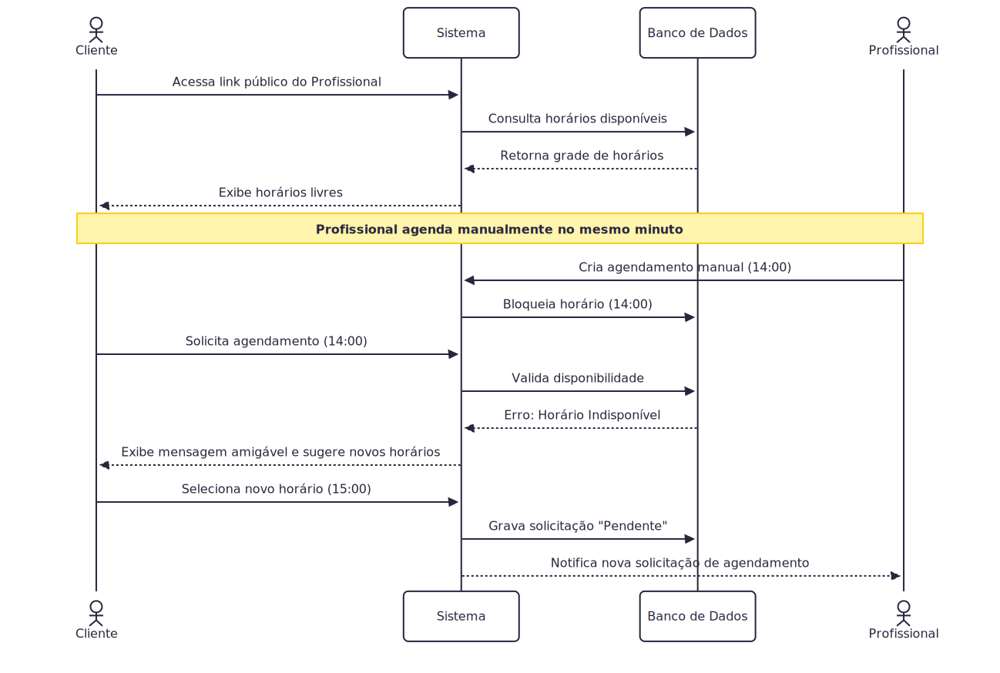

### Fluxo 2: Cancelamento de Agendamento pelo Profissional
Neste fluxo, o profissional precisa cancelar um atendimento. O sistema deve garantir que o histórico seja mantido, a receita não seja contabilizada indevidamente e o cliente seja notificado (caso os canais estejam ativos).

  
Flowchart

  

### Fluxo 3: Exclusão de Entidade com Dependências (Tentativa de deletar Serviço)
Este diagrama ilustra a regra de negócio que impede a exclusão (Hard Delete) de dados que possuem histórico atrelado, aplicando a inativação (Soft Delete).

  
Flowchart

  

<!-- #endregion -->

<h1>4. Mockups e Experiência do Usuário (UX)</h1>

> [!NOTE]
> Esta seção apresenta a visualização inicial do Planici antes da implementação, com nos mockups desenvolvidos no Figma (mobile-first).

**Ferramenta Utilizada:** Figma

[Link do protótipo](https://www.figma.com/design/rWWne0gLS6YsVEuz4c7Amg/Planici?node-id=0-1&t=J5LLtwXO2fQxcF8H-1) _também disponível no [README.md](../README.md)_

<!-- #region 4.1 Fluxo de Navegação -->

<h2>4.1 Fluxo de Navegação</h2>

O fluxo é dividido em três zonas funcionais:

**Onboarding:** `loading`->`login`->`register` (fluxo multi-step)

**Setup do negócio:** Após o primeiro login, o usuário é direcionado para criar seu tenant (o negócio que ele gerencia): `tenants`->`tenants/new` (tipo -> nome/detalhes -> confirmação)

**Área principal:** Após o setup, o usuário acessa o dashboard com acesso às seções: `agenda`, `clientes`, `serviços`, `forms` e `planos`.

**Fluxo Linear:** `login -> register -> tenants/new -> dashboard -> agenda/clientes/serviços`

O perfil do usuário é independente do tenant, o mesmo usuário pode gerenciar múltiplos negócios, semelhante ao modelo de organizações do Sup.

  
Fluxograma

  

<!-- #endregion -->

<!-- #region 4.2 Wireframes -->

<h2>4.2 Wireframes ou Mockups das Telas</h2>

Os mockups do Planici foram desenvolvidos no Figma seguindo uma abordagem mobile-first. As telas abaixo representam os principais pontos de interação do usuário, desde o primeiro acesso até a entrada na área principal da aplicação.

### Fluxo Principal de Onboarding e Autenticação

#### Tela Inicial — Login / Registro

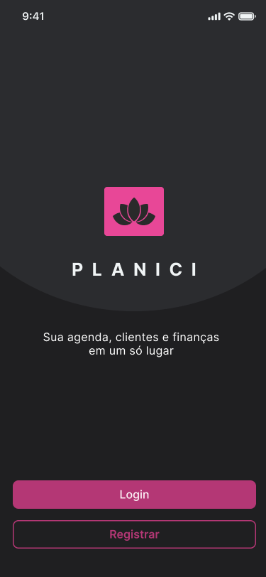

**Descrição:**  
Ponto de entrada do aplicativo. O usuário escolhe entre acessar uma conta existente ou iniciar um novo cadastro.

**Ações principais:**

- Clicar em **Login**;
- Clicar em **Registrar**.

**Requisitos relacionados:** RF-01, RF-02.

---

#### Registro — Passo 1: Dados Básicos

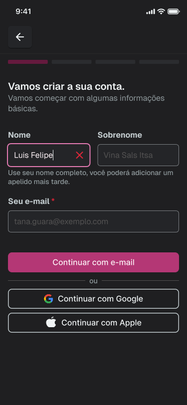

**Descrição:**  
Primeira etapa do cadastro. O usuário informa nome, sobrenome e e-mail, ou escolhe continuar utilizando autenticação externa, como Google ou Apple.

**Ações principais:**

- Informar nome;
- Informar sobrenome;
- Informar e-mail;
- Continuar com Google;
- Continuar com Apple;
- Avançar para a próxima etapa.

**Requisitos relacionados:** RF-01, RF-02.

---

#### Registro — Passo 2: Verificação de E-mail

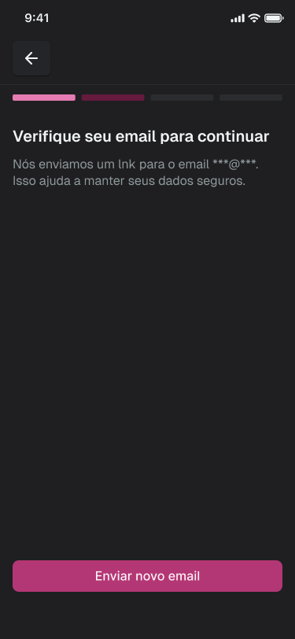

**Descrição:**  
Após informar o e-mail, o sistema orienta o usuário a verificar sua caixa de entrada. Essa etapa garante que a conta esteja associada a um endereço válido.

**Ações principais:**

- Verificar o e-mail informado;
- Solicitar reenvio do link de confirmação, se necessário;
- Continuar o cadastro após a confirmação.

**Requisitos relacionados:** RF-01.

---

#### Registro — Passo 3: Definição de Senha

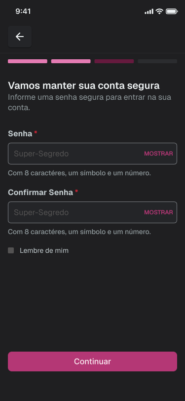

**Descrição:**  
O usuário cria uma senha segura para acessar o sistema. A interface informa os critérios mínimos exigidos, como quantidade mínima de caracteres, presença de número e símbolo.

**Ações principais:**

- Informar senha;
- Confirmar senha;
- Visualizar os critérios de segurança;
- Avançar para a próxima etapa.

**Requisitos relacionados:** RF-01, RNF-15.

---

#### Registro — Passo 4: Informações Pessoais

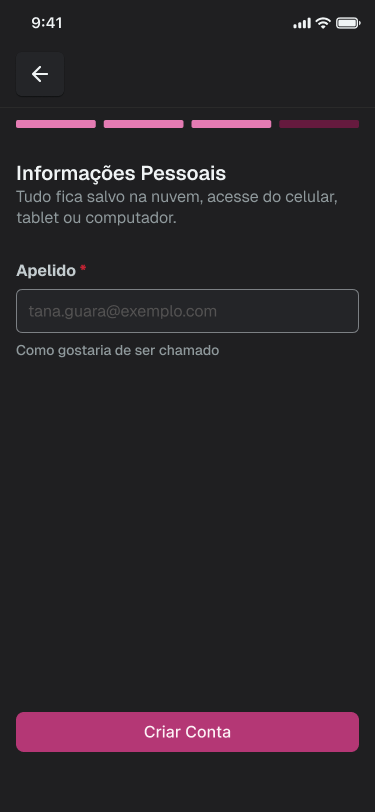

**Descrição:**  
O usuário define um apelido ou nome de exibição. Essa informação permite personalizar a forma como o sistema se comunica com o usuário, sem depender apenas do nome completo cadastrado.

**Ações principais:**

- Informar apelido;
- Revisar a informação preenchida;
- Criar a conta.

**Requisitos relacionados:** RF-04.

---

#### Registro — Passo 5: Termos de Serviço

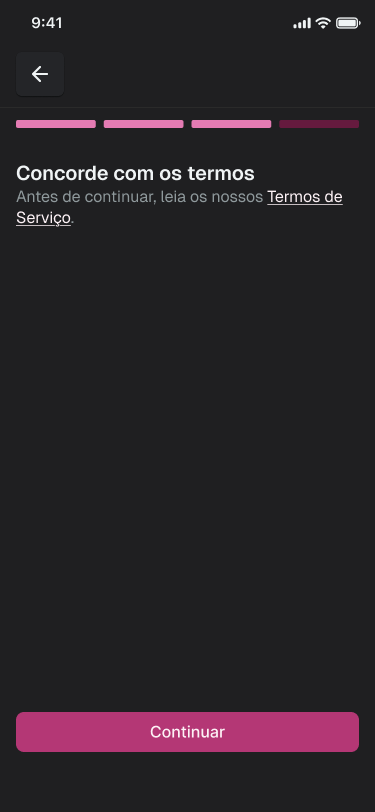

**Descrição:**  
Antes de finalizar o cadastro, o usuário deve aceitar os Termos de Serviço da aplicação. Essa etapa formaliza o consentimento necessário para uso do sistema.

**Ações principais:**

- Acessar os Termos de Serviço;
- Aceitar os termos;
- Continuar para a aplicação.

**Requisitos relacionados:** RNF-12, RNF-15.

---

### Setup do Negócio — Tenant

#### Empresas — Lista de Tenants

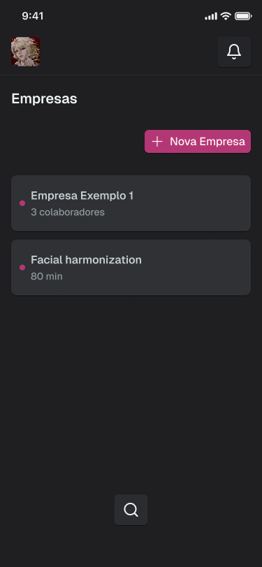

**Descrição:**  
Após o login, o usuário visualiza os negócios aos quais possui acesso. Cada empresa representa um tenant, ou seja, um espaço de trabalho independente dentro do sistema.

**Ações principais:**

- Visualizar empresas cadastradas;
- Selecionar uma empresa existente;
- Criar uma nova empresa;
- Acessar notificações ou opções do perfil.

**Requisitos relacionados:** RF-04, RF-05, RF-06.

---

#### Empresas — Estado Vazio

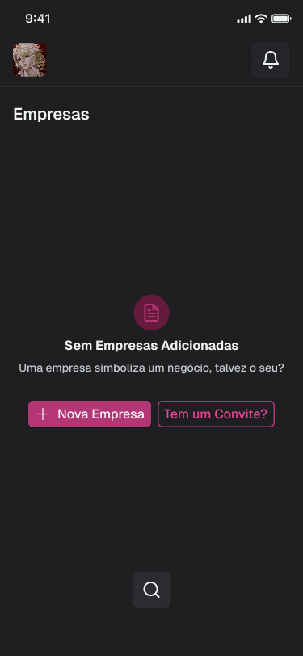

**Descrição:**  
Quando o usuário ainda não possui nenhuma empresa cadastrada ou vinculada à sua conta, o sistema apresenta uma tela de estado vazio com chamadas claras para ação.

**Ações principais:**

- Criar nova empresa;
- Ingressar em uma empresa existente por convite.

**Requisitos relacionados:** RF-04, RF-05.

---

#### Novo Tenant — Passo 1: Área de Atuação

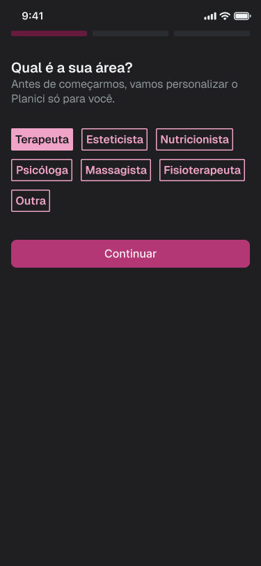

**Descrição:**  
O usuário seleciona sua área profissional. Essa informação será utilizada para adaptar a linguagem da aplicação ao contexto do usuário.

**Ações principais:**

- Selecionar uma área profissional;
- Escolher a opção **Outra**, caso a área não esteja listada;
- Continuar para a personalização do sistema.

**Requisitos relacionados:** RF-43, RN-23.

---

#### Novo Tenant — Passo 1b: Área Personalizada

**Descrição:**  
Caso o usuário selecione a opção **Outra**, o sistema permite informar manualmente uma área de atuação. Essa resposta pode ser usada para sugerir nomes personalizados para as seções da aplicação.

**Ações principais:**

- Informar área de atuação personalizada;
- Confirmar a informação;
- Prosseguir para a etapa de personalização.

**Requisitos relacionados:** RF-43, RN-23.

---

#### Novo Tenant — Passo 2: Personalização dos Nomes

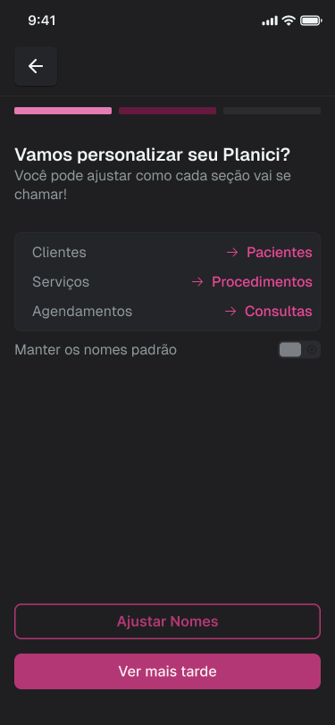

**Descrição:**  
O sistema sugere a renomeação das principais seções da aplicação com base na área escolhida. Por exemplo, para uma terapeuta, “Clientes” pode se tornar “Pacientes”, “Serviços” pode se tornar “Procedimentos” e “Agendamentos” pode se tornar “Consultas”.

**Ações principais:**

- Visualizar sugestões de nomes personalizados;
- Ajustar os nomes das seções;
- Manter os nomes padrão;
- Concluir ou adiar a personalização.

**Requisitos relacionados:** RF-43, RN-22, RN-23.

---

### Área Principal da Aplicação

#### Visão Geral das Telas Principais

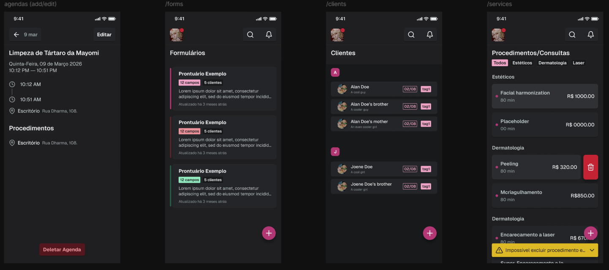

**Descrição:**  
Após concluir o setup do negócio, o usuário acessa a área principal do sistema. Essa visão apresenta os principais módulos do Planici: agenda, formulários, clientes e procedimentos/serviços.

**Ações principais por módulo:**

- **Agenda:** visualizar e editar agendamentos, consultar horários, procedimentos e localização;
- **Formulários:** visualizar formulários cadastrados e criar novos modelos;
- **Clientes:** buscar clientes, visualizar registros e criar novos cadastros;
- **Procedimentos/Consultas:** visualizar serviços cadastrados, adicionar novos procedimentos, excluir ou expandir categorias.

**Requisitos relacionados:** RF-07 a RF-43.

---

<!-- #endregion -->

<!-- #region 4.3 Fluxo de interação do usuário -->

## 4.3 Fluxo de Interação do Usuário

O fluxo de interação escolhido para representar a experiência principal do Planici é o onboarding completo do profissional, desde o primeiro acesso até a entrada na área principal do sistema. Esse fluxo foi selecionado por ser essencial para validar a proposta de valor do produto: permitir que um profissional autônomo configure rapidamente seu espaço de trabalho e comece a organizar sua rotina.

### Fluxo: criação de conta, configuração do tenant e acesso ao dashboard

1. O usuário acessa a tela inicial do Planici.
2. O usuário escolhe entre entrar em uma conta existente ou criar uma nova conta.
3. Caso escolha criar conta, o usuário informa seus dados básicos: nome, sobrenome e e-mail.
4. O sistema solicita a verificação do e-mail informado.
5. Após a verificação, o usuário define uma senha segura.
6. O usuário informa um apelido ou nome de exibição.
7. O usuário aceita os Termos de Serviço e conclui o cadastro.
8. Após o primeiro login, o sistema verifica se o usuário já participa de algum tenant.
9. Caso o usuário ainda não possua tenant, o sistema exibe o estado vazio da tela de empresas.
10. O usuário escolhe entre criar um novo tenant ou ingressar em um tenant existente por convite.
11. Ao criar um novo tenant, o usuário seleciona sua área de atuação.
12. Caso a área não esteja disponível, o usuário seleciona “Outra” e informa uma área personalizada.
13. O sistema sugere nomes personalizados para as seções principais da aplicação.
14. O usuário aceita, ajusta ou mantém os nomes padrão.
15. O sistema cria o tenant e direciona o usuário para a área principal.
16. O usuário acessa o dashboard e passa a navegar entre agenda, clientes, serviços, formulários e planos.

### Representação visual do fluxo


<!-- #endregion -->

# 5. Arquitetura do Sistema

> [!NOTE]
> Esta seção apresenta a visualização da arquitetura geral do Planici, e como ele será construído.

<!-- #region 5.1 Diagrama C4 -->

<h2>5.1 Diagrama C4</h2>

<!-- #region CONTEXTO -->

<h3>Nível 1: Diagrama de Contexto</h3>

> [!TIP]
> A visão macro do sistema. O foco não é a tecnologia, mas sim como o software se encaixa no ecossistema e no mundo real.

  
Diagrama

  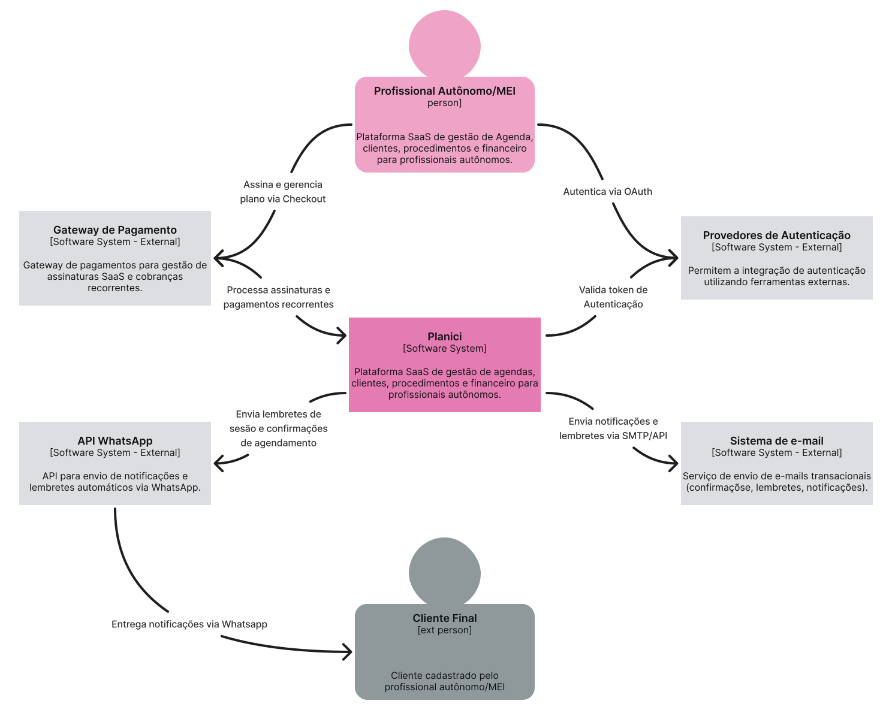

<!-- #endregion 5.1.1 -->

<!-- #region CONTAINERS -->

<h3>Nível 2: Diagrama de Container</h3>

> [!TIP]
> O primeiro "zoom". Este diagrama é a decomposição do sistema em unidades de execução independentes.

  
Diagrama

  

<!-- #endregion 5.1.2 -->

<!-- #region COMPONENTES -->

<h3>Nível 3: Diagrama de Componentes</h3>

> [!TIP]
> Este diagrama decompõe o sistema em seus componentes internos, detalhando responsabilidades e interações.

  
Diagrama

  

<!-- #endregion 5.1.2 -->

<!-- #endregion 5.1 -->

<!-- #region 5.2 Diagrama ER -->

<h2>5.2 Modelo de Dados</h2>

> [!TIP]
> O arquivo .dbml em 'docs/schema.dbml' apresenta o modelo de dados usado no website _dbdiagram.io_.

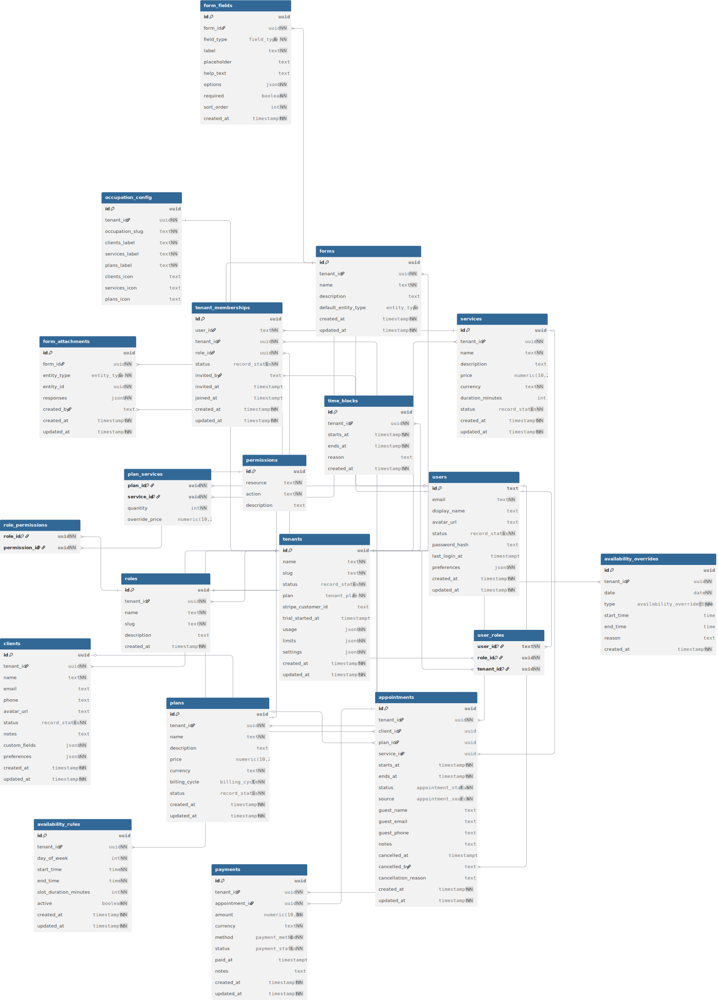

<!-- #endregion -->

<!-- #region 5.3 Principais Componentes -->

## 5.3 Principais Componentes
 
O Planici é organizado em três camadas principais: frontend, backend e infraestrutura.

Cada uma é composta por módulos com responsabilidades bem delimitadas.
 
### 5.3.1 Frontend — Next.js
 
A interface web do Planici é construída em Next.js com abordagem mobile-first. É dividida em três zonas funcionais:
 
**Área autenticada**: acessível apenas ao profissional logado. Concentra os módulos de agenda, clientes, serviços, planos, formulários personalizados e visão financeira. Todas as operações nessa zona exigem um token JWT válido e vínculo com um tenant ativo.
 
**Fluxo de onboarding**: cobre o registro de conta, login (e-mail/senha e OAuth), recuperação de senha, criação ou seleção de tenant e personalização de labels. É o caminho obrigatório antes de qualquer acesso à área autenticada.
 
**Link público de agendamento**: página acessível sem autenticação, gerada por tenant. Permite que clientes externos visualizem horários disponíveis e solicitem agendamentos. Totalmente separada da área autenticada para não expor nenhum dado interno do profissional.
 
### 5.3.2 Backend — NestJS
 
O backend segue DDD, arquitetura hexagonal event-driven com CQRS, organizando a lógica em módulos independentes por domínio:
 
**Auth module**: gerencia autenticação por e-mail/senha com bcrypt, OAuth via Google e Apple, emissão e rotação de tokens JWT, refresh tokens e controle de acesso baseado em papéis (RBAC). É o ponto de entrada de toda requisição autenticada.
 
**Tenant module**: isola dados por espaço de trabalho, aplica Row-Level Security em conjunto com o banco, gerencia convites de colaboradores, permissões granulares e configurações gerais do tenant, incluindo personalização de labels e ocupação profissional.
 
**Scheduling module**: responsável pela lógica de disponibilidade (fixa e livre), criação e validação de agendamentos, detecção de conflitos de horário, bloqueios manuais e controle do fluxo de agendamentos pendentes oriundos do link público.
 
**Domain module**: agrupa os cadastros centrais do negócio: clientes, serviços/procedimentos, planos/pacotes e formulários personalizados. Cada entidade segue regras de inativação ao invés de exclusão quando possui histórico vinculado.
 
**Finance module**: registra e edita pagamentos por atendimento, calcula o resumo de receitas por período, compara períodos e gera o ranking de procedimentos mais realizados e mais rentáveis. Considera apenas pagamentos com status "pago" na agregação de receita.
 
**Notification module**: consome eventos de agendamento (confirmação, cancelamento, remarcação) e produz mensagens para as filas do RabbitMQ, que as entrega via e-mail ou WhatsApp (Evolution API). Lembretes automáticos são disparados apenas para agendamentos com status confirmado.
 
### 5.3.3 Infraestrutura
 
**PostgreSQL (master-slave)**: banco de dados relacional com replicação por streaming. O nó master recebe todas as escritas; a réplica atende leituras. Row-Level Security é aplicado em todas as tabelas com `tenant_id`, garantindo isolamento mesmo em caso de erro na camada de aplicação. Backup diário automático com retenção mínima de sete dias (RPO menor ou igual a 24h).
 
**RabbitMQ**: message broker que desacopla os fluxos assíncronos do ciclo HTTP. Mantém filas independentes para envio de e-mail, WhatsApp e registro de logs de auditoria, garantindo que falhas em integrações externas não impactem o tempo de resposta das operações principais.
 
**Observabilidade e CI/CD**: monitoramento de uptime com alerta automático em até cinco minutos após falha detectada. Pipeline de CI/CD com gate de testes obrigatório antes do deploy em produção. Branches protegidas no repositório e logs de auditoria retidos por no mínimo 90 dias para rastreabilidade de incidentes.

<!-- #endregion -->

<!-- #region 5.4 Stack Tecnológica -->

<h2>5.4 Stack Tecnológica</h2>

### Next.js - Frontend
**Motivo da escolha:** Next.js foi escolhido pela sua renderização server-side (SSR), performance otimizada e SEO nativo. Sua arquitetura baseada em file-system routing simplifica a organização do frontend, e o ecossistema React por baixo garante produtividade e acesso a uma quantidade enorme de bibliotecas.

O suporte nativo a TypeScript reforça a consistência de tipos entre backend e frontend, reduzindo erros de integração.

### NestJS - Backend
**Motivo da escolha:** NestJS foi escolhido como framework de backend por se alinhar diretamente com três pilares arquiteturais que guiam este projeto:

#### **1. Compatibilidade com Domain-Driver Design e Arquitetura Hexagonal**
O projeto adota como modelo de referência o repositório [domain-drive-hexagon](https://github.com/Sairyss/domain-driven-hexagon/tree/master), que aconselha a separação entre camadas de domínio, aplicação e infraestrutura, além de uso de ports & adapters para isolar a lógica de negócio de frameworks externos. O NestJS viabiliza essa estrutura de forma nativa: seu sistema de módulos (`  @Modules  `), injeção de dependência (DI Container), e decorators permite organizar o código exatamente nas camadas descritas pelo modelo.

#### **2. Suporte às boas práticas de backend em TypeScript**
Seguindo as diretrizes do [backend-best-practices](https://github.com/Sairyss/backend-best-practices), o projeto prioriza: validação robusta de entrada (via à `class-validator`, `class-transformer` e `zod`, integrados nativamente ao NestJS), tratamento centralizado de erros, uso de DTOs para contratos de API bem definidos, e separação clara entre camadas de comando e queries (padrão CQRS).

O NestJS oferece o móudlo `@nestjs/cqrs` que implementa CQRS de forma idiomática, além de pipes, guards e interceptors que encapsulam preocupações transversais como autenticação, logging e validação sem poluir a lógica de negócio.

#### **3. Preparado para padrões de sistemas distribuídos**
Com referência ao [system-design-patterns](https://github.com/Sairyss/system-design-patterns), o projeto considera desde o início padrões como idempotência, mensageria e resiliência. O NestJS possui suporte oficial a microservices e camadas de transporte (Redis, RabbitMQ, Kafka, gRPC), o que significa que caso o sistema cresça e exija decomposição em serviços independentes, a migração é estruturalmente suportada sem reescrever a base do código.

### PostgreSQL (replica master-slave) - Banco de Dados
**Motivo da escolha:** O PostgreSQL foi escolhido como banco de dados principal por ser o SGBD relacional open-source com o conjunto de funcionalidades mais maduro disponível, combinando confirmidade ACID, suporte nativo a JSON/JSONB (crucial para o domínio da aplicação), tipos avançados e extensibilidade via extensões.

#### Modelo master-slave (replicação por streaming):
O projeto adota a topologia master-slave com replicação assíncrona por streaming nativa do PostgreSQL. As motivações são:
* O nó master recebe todas as operações de escrita (como criação de usuários, persistência de eventos de domínio, etc).
* O nó de réplica recebe os dados do master em tempo real e fica disponível exclusivamente para leitura.

Essa separação implementa na infraestrutura o mesom princípio que o padrão CQRS implementa no código: comandos (escrita) e queries (leitura).

### RabbitMQ - Message Broker (mensageria assíncrona)

**Motivo da escolha:** O RabbitMQ foi escolhido como broker de mensagens para desacoplar os fluxos que não precisam de resposta imediata do clico de vida da requisição HTTP principal. Os três casos de uso centrais são: **logs de auditoria, notificações via whatsapp** e **notificações via e-mail**.

<!-- #endregion -->

# 6. Segurança e Privacidade

> [!NOTE]
> A segurança do Planici é um requisito essencial, pois o sistema armazena informações de profissionais autônomos, clientes, agenda, serviços, planos, pagamentos, formulários personalizados e configurações do espaço de trabalho. Como o sistema opera em modelo multi-tenant, a principal preocupação de segurança é garantir que cada profissional ou empresa acesse somente os dados do seu próprio tenant.

As medidas de segurança do sistema serão organizadas em cinco frentes principais:

1. autenticação segura;
2. autorização e controle de permissões;
3. isolamento de dados por tenant;
4. proteção contra vulnerabilidades comuns em aplicações web;
5. privacidade e conformidade com a LGPD.

<!-- 6.1 Segurança da Aplicação -->

## 6.1 Segurança da Aplicação

### Autenticação

O Planici permitirá autenticação por e-mail e senha, além de autenticação externa por Google e Apple OAuth. Para contas criadas com senha, a senha não será armazenada em texto puro. O sistema deverá armazenar apenas o hash da senha, utilizando bcrypt com fator de custo adequado.

Medidas previstas:

- armazenamento de senhas com hash seguro;
- validação de senha forte no cadastro;
- verificação de e-mail durante o fluxo de criação de conta;
- recuperação de senha por link temporário enviado por e-mail;
- uso de tokens de autenticação com tempo de expiração;
- invalidação de sessões ou tokens em caso de logout ou troca de senha.

### Autorização e Permissões

O sistema terá controle de acesso baseado em papéis e permissões, especialmente para tenants com múltiplos usuários. Cada usuário poderá estar vinculado a um ou mais tenants, e suas permissões dependerão do papel atribuído dentro daquele espaço de trabalho.

Exemplos de papéis previstos:

- **Owner:** responsável principal pelo tenant, com acesso total;
- **Admin:** gerencia configurações, usuários e dados operacionais;
- **Member:** acessa funcionalidades operacionais permitidas;
- **Viewer:** possui acesso limitado para consulta.

As permissões poderão ser definidas por recurso e ação, por exemplo:

- `clients:create`;
- `clients:read`;
- `appointments:update`;
- `payments:read`;
- `settings:manage`.

Com isso, será possível criar perfis como “acesso somente à agenda” ou “acesso a clientes e serviços, mas sem acesso financeiro”.

### Isolamento por Tenant

O Planici utiliza arquitetura multi-tenant. Portanto, clientes, serviços, planos, agendamentos, pagamentos, formulários, configurações e colaboradores devem estar vinculados a um tenant.

A regra principal é:

> um usuário só pode acessar dados de um tenant se possuir vínculo autorizado com esse tenant.

Para reforçar esse isolamento, todas as consultas e operações sensíveis deverão considerar o `tenant_id`. Além da validação na aplicação, o banco de dados deverá aplicar Row-Level Security (RLS) nas tabelas que possuem `tenant_id`, reduzindo o risco de vazamento entre tenants mesmo em caso de erro de implementação na API.

### Proteção contra OWASP Top 10

O desenvolvimento do Planici deverá considerar as principais categorias de risco do OWASP Top 10, especialmente:

- **Broken Access Control:** mitigado por validação de permissões, vínculo com tenant e RLS no banco;
- **Cryptographic Failures:** mitigado por TLS, hash de senha e armazenamento seguro de credenciais;
- **Injection:** mitigado pelo uso de ORM/query builder com queries parametrizadas;
- **Security Misconfiguration:** mitigado por variáveis de ambiente, CORS restrito, headers de segurança e separação entre ambientes;
- **Authentication Failures:** mitigado por senhas fortes, tokens com expiração e recuperação de senha segura;
- **Security Logging and Monitoring Failures:** mitigado por logs de ações críticas e alertas de falhas.

### Segurança de Transporte

Todo tráfego entre cliente e servidor deverá ocorrer via HTTPS, utilizando TLS 1.2 ou superior. Isso protege dados sensíveis contra interceptação durante login, cadastro de clientes, envio de formulários, registro de pagamentos e uso do link público de agendamento.

Também devem ser configurados headers de segurança, como:

- CORS restrito aos domínios permitidos;
- Content Security Policy (CSP);
- X-Frame-Options ou equivalente;
- proteção contra MIME sniffing;
- cookies seguros, caso cookies sejam utilizados.

### Proteção da API

A API deverá implementar mecanismos de proteção contra abuso e ataques automatizados.

Medidas previstas:

- rate limit por IP e/ou por usuário;
- validação de entrada em todos os endpoints;
- paginação obrigatória em listagens com muitos registros;
- bloqueio ou limitação de tentativas repetidas de login;
- tratamento seguro de erros, sem exposição de stack trace ao usuário final;
- logs internos para falhas críticas e tentativas suspeitas.

### Dados Sensíveis e Credenciais de Integração

Algumas informações exigem cuidado especial, como:

- hash de senha;
- tokens de sessão;
- tokens de recuperação de senha;
- credenciais de integração com WhatsApp ou e-mail;
- dados pessoais de clientes;
- observações e respostas de formulários personalizados.

Credenciais de integração não devem ser exibidas integralmente após o cadastro. Quando possível, devem ser criptografadas em repouso ou armazenadas em serviço seguro de secrets. Tokens temporários, como recuperação de senha ou verificação de e-mail, devem possuir expiração e não devem ser reutilizáveis após o uso.

### Auditoria e Monitoramento

Ações críticas devem ser registradas para fins de auditoria, rastreabilidade e investigação de incidentes. Os logs devem registrar informações suficientes para análise, mas sem armazenar dados sensíveis desnecessários.

Eventos auditáveis:

- login e logout;
- falhas repetidas de autenticação;
- criação, alteração e exclusão/inativação de clientes;
- criação, alteração e cancelamento de agendamentos;
- alteração de permissões;
- exportação de relatórios;
- solicitação de exclusão de conta ou dados;
- alterações nas configurações do tenant;
- alteração de credenciais de notificação.

Os logs devem conter, quando aplicável:

- identificador do usuário;
- identificador do tenant;
- ação executada;
- data e hora;
- endereço IP;
- recurso afetado.

<!-- #endregion -->

<!-- #region 6.2 Privacidade e LGPD -->

## 6.2 Privacidade e LGPD

O Planici deverá seguir os princípios da Lei Geral de Proteção de Dados (LGPD), especialmente finalidade, necessidade, transparência, segurança e prevenção. Como o sistema lida com dados de profissionais e clientes, a coleta deve ser limitada ao necessário para executar as funcionalidades do produto.

### Dados Coletados

O sistema poderá coletar e armazenar os seguintes dados:

#### Dados do profissional

- nome;
- sobrenome;
- e-mail;
- apelido ou nome de exibição;
- foto de perfil, quando informada;
- senha em formato de hash, quando o cadastro for feito por e-mail e senha;
- preferências de interface;
- vínculo com tenants.

#### Dados do tenant / empresa

- nome do espaço de trabalho;
- slug ou identificador público;
- área de atuação;
- configurações de personalização;
- labels customizadas, como “Clientes”, “Pacientes”, “Serviços” ou “Consultas”;
- plano contratado;
- configurações de notificações;
- credenciais de integração, quando fornecidas pelo usuário.

#### Dados de clientes cadastrados pelo profissional

- nome;
- e-mail;
- telefone;
- observações;
- preferências de notificação;
- histórico de atendimentos;
- respostas de formulários personalizados;
- arquivos ou imagens anexadas, se essa funcionalidade for utilizada.

#### Dados de agenda e atendimento

- data e horário de início e fim;
- status do agendamento;
- cliente relacionado;
- serviço ou plano relacionado;
- origem do agendamento, como profissional ou link público;
- dados de convidado no link público, como nome, e-mail e telefone;
- motivo de cancelamento, quando aplicável.

#### Dados financeiros

- valor do pagamento;
- moeda;
- forma de pagamento;
- status do pagamento;
- data de pagamento;
- observações financeiras.

### Finalidade do Tratamento

Os dados serão tratados para permitir que o profissional utilize as funcionalidades principais do Planici, incluindo:

- criação e acesso à conta;
- gerenciamento de tenants;
- cadastro e consulta de clientes;
- controle de serviços, procedimentos e planos;
- criação e acompanhamento de agendamentos;
- envio de notificações de confirmação, lembrete, cancelamento ou remarcação;
- controle de pagamentos;
- geração de relatórios financeiros;
- personalização da experiência da aplicação.

O Planici não deverá utilizar os dados para finalidades incompatíveis com o funcionamento do sistema sem consentimento ou base legal adequada.

### Minimização de Dados

O sistema deverá coletar apenas os dados necessários para cada funcionalidade. Campos opcionais devem ser claramente identificados na interface.

Exemplos:

- para criar uma conta, o sistema precisa de dados básicos do usuário;
- para cadastrar um cliente, o nome é obrigatório, enquanto telefone, e-mail e observações podem ser opcionais;
- para solicitar um agendamento pelo link público, o cliente deve informar apenas os dados necessários para identificação e contato;
- formulários personalizados devem ser configurados pelo próprio profissional, evitando coleta excessiva por padrão.

### Dados Potencialmente Sensíveis

Como o Planici pode ser utilizado por terapeutas, nutricionistas, personal trainers e outros profissionais de atendimento personalizado, existe a possibilidade de o usuário inserir informações potencialmente sensíveis em campos livres, observações ou formulários personalizados.

Por isso, o sistema deverá:

- evitar solicitar dados sensíveis por padrão;
- indicar que campos livres devem ser usados apenas quando necessário;
- permitir que o profissional defina quais informações serão coletadas nos formulários;
- proteger respostas de formulários com as mesmas regras de autenticação, autorização e isolamento por tenant;
- deixar claro que o Planici não substitui prontuários eletrônicos, sistemas médicos regulamentados ou documentos clínicos oficiais.

### Consentimento e Transparência

Durante o cadastro, o usuário deverá aceitar os Termos de Serviço e a Política de Privacidade. O aceite deve ser registrado com:

- identificador do usuário;
- data e hora do aceite;
- versão do documento aceito;
- endereço IP, quando aplicável.

A Política de Privacidade deve explicar de forma clara:

- quais dados são coletados;
- por que os dados são coletados;
- onde os dados são armazenados;
- por quanto tempo os dados são mantidos;
- com quem os dados podem ser compartilhados;
- como o usuário pode solicitar acesso, correção, exportação ou exclusão dos dados.

### Compartilhamento com Terceiros

O Planici poderá se comunicar com serviços externos apenas quando necessário para funcionamento de funcionalidades específicas, como:

- envio de e-mails;
- envio de notificações por WhatsApp;
- autenticação via Google ou Apple;
- processamento de pagamentos, caso essa funcionalidade seja implementada no futuro;
- infraestrutura de hospedagem, banco de dados, backup e monitoramento.

O compartilhamento deve ser limitado ao mínimo necessário para execução da funcionalidade. O sistema não deve vender dados pessoais nem compartilhar dados com terceiros para fins de marketing sem consentimento explícito.

### Armazenamento e Retenção

Os dados serão armazenados em banco de dados relacional, com separação lógica por tenant. O sistema deverá manter backups automáticos para reduzir risco de perda de dados.

Diretrizes de retenção:

- dados operacionais ficam armazenados enquanto a conta ou tenant estiver ativo;
- dados inativados podem ser mantidos quando necessários para histórico, relatórios e integridade financeira;
- logs de auditoria devem possuir retenção mínima definida;
- backups devem seguir política de retenção própria;
- dados excluídos da aplicação poderão permanecer em backups por tempo limitado, até expiração do ciclo de retenção.

### Solicitação de Acesso, Exportação e Remoção de Dados

O usuário deverá poder solicitar acesso, correção, exportação ou exclusão de seus dados, conforme previsto pela LGPD.

No MVP, caso ainda não exista uma tela automatizada para isso, essas solicitações poderão ser feitas por canal de suporte definido pelo projeto. Em versões futuras, o sistema poderá oferecer uma área de configurações para o próprio usuário solicitar:

- exportação dos dados em formato JSON ou CSV;
- alteração de dados cadastrais;
- exclusão da conta;
- exclusão ou inativação do tenant;
- exclusão de clientes cadastrados, quando não houver dependências históricas.

A exclusão de dados deve respeitar as regras de negócio do sistema. Por exemplo, clientes, serviços, planos ou pagamentos com histórico associado podem ser inativados em vez de removidos imediatamente, preservando consistência financeira, auditoria e integridade dos relatórios.

Quando a exclusão definitiva for aplicável, ela deverá remover ou anonimizar os dados pessoais associados, respeitando o prazo definido na política de privacidade e as limitações técnicas de backups.

### Responsabilidades do Usuário

O profissional que utiliza o Planici também é responsável pelos dados que decide cadastrar sobre seus próprios clientes. Assim, o sistema deverá orientar o usuário a:

- cadastrar apenas informações necessárias;
- evitar inserir dados sensíveis sem necessidade;
- manter dados atualizados;
- respeitar pedidos de exclusão ou correção feitos por seus clientes;
- configurar adequadamente permissões de colaboradores;
- proteger suas credenciais de acesso.

### Medidas de Privacidade por Design

O Planici adotará medidas de privacidade desde a concepção do sistema:

- coleta mínima de dados;
- campos opcionais claramente identificados;
- isolamento por tenant;
- permissões por papel;
- logs de auditoria para ações críticas;
- criptografia no tráfego;
- não exposição de senhas, tokens ou credenciais;
- inativação segura de registros com histórico;
- exportação e exclusão de dados conforme solicitação do usuário.

<!-- #endregion-->

# 7. Planejamento do Projeto

| Marco | Descrição | Prazo |
|---|---|---|
| M1 | Setup técnico do projeto, incluindo criação dos repositórios, estrutura inicial do frontend e backend, configuração do banco de dados, variáveis de ambiente, autenticação base e prova de conceito da comunicação entre interface, API e banco. | Semanas 1 e 2 |
| M2 | Implementação da base do sistema: cadastro, login, recuperação de senha, criação/seleção de tenant, perfil do usuário e estrutura inicial de permissões. Este marco garante que o usuário consiga acessar o sistema e operar dentro de um espaço de trabalho isolado. | Semanas 3 e 4 |
| M3 | Implementação dos cadastros principais do domínio: clientes, procedimentos/serviços e planos/pacotes. Também inclui busca, edição, inativação e vínculo básico entre cliente, serviço e plano. | Semanas 5 e 6 |
| M4 | Implementação da agenda e dos agendamentos, incluindo configuração de disponibilidade, criação manual de agendamento, edição, cancelamento, bloqueio de horários e visualização em formato diário ou semanal. | Semanas 7 e 8 |
| M5 | Implementação do link público de agendamento e fluxo de confirmação pelo profissional. Neste marco, o cliente externo poderá solicitar um horário sem possuir conta, e o profissional poderá confirmar ou recusar a solicitação. | Semana 9 |
| M6 | Implementação dos módulos de pagamento e visão financeira, incluindo registro de pagamento por atendimento, status de pagamento, resumo de receitas por período e ranking básico de procedimentos. | Semana 10 |
| M7 | Implementação das funcionalidades complementares do MVP, como formulários personalizados, configurações do espaço de trabalho, personalização de labels e notificações básicas por e-mail ou WhatsApp, conforme viabilidade técnica. | Semana 11 |
| M8 | Testes, validação e melhorias gerais, incluindo testes de fluxo principal, correção de bugs, revisão de segurança, validação de isolamento por tenant, ajustes de responsividade, acessibilidade e desempenho. | Semana 12 |
| M9 | Preparação da entrega final, incluindo revisão da documentação, prints atualizados, ajustes nos diagramas, publicação/deploy da aplicação, roteiro de apresentação e validação final com o usuário-alvo. | Semana 13 |

# 8. Referências

## Legislação e Regulamentação

BRASIL. *Lei nº 13.709, de 14 de agosto de 2018*. Lei Geral de Proteção de Dados
Pessoais (LGPD). Brasília, DF: Presidência da República, 2018. Disponível em:
https://www.planalto.gov.br/ccivil_03/_ato2015-2018/2018/lei/l13709.htm.
Acesso em: 21 mai. 2026.

## Arquitetura e Boas Práticas

SAIRYSS. *Domain-Driven Hexagon*. GitHub, 2022. Disponível em:
https://github.com/Sairyss/domain-driven-hexagon. Acesso em: 21 mai. 2026.

SAIRYSS. *Backend Best Practices*. GitHub, 2022. Disponível em:
https://github.com/Sairyss/backend-best-practices. Acesso em: 21 mai. 2026.

SAIRYSS. *System Design Patterns*. GitHub, 2022. Disponível em:
https://github.com/Sairyss/system-design-patterns. Acesso em: 21 mai. 2026.

OPEN WEB APPLICATION SECURITY PROJECT (OWASP). *OWASP Top Ten*. 2021.
Disponível em: https://owasp.org/www-project-top-ten. Acesso em: 19 mai. 2026.

WORLD WIDE WEB CONSORTIUM (W3C). *Web Content Accessibility Guidelines
(WCAG) 2.1*. 2018. Disponível em: https://www.w3.org/TR/WCAG21.
Acesso em: 19 mai. 2026.

## Frameworks e Tecnologias

VERCEL. *Next.js Documentation*. 2024. Disponível em: https://nextjs.org/docs.
Acesso em: 20 mai. 2026.

NESTJS. *NestJS Documentation*. 2024. Disponível em: https://docs.nestjs.com.
Acesso em: 20 mai. 2026.

THE POSTGRESQL GLOBAL DEVELOPMENT GROUP. *PostgreSQL Documentation*.
2024. Disponível em: https://www.postgresql.org/docs. Acesso em: 10 mar. 2026.

VMWARE (PIVOTAL). *RabbitMQ Documentation*. 2024. Disponível em:
https://www.rabbitmq.com/documentation.html. Acesso em: 12 mai. 2026.

## Soluções Concorrentes Analisadas

ACUITY SCHEDULING. *Acuity Scheduling*. 2024. Disponível em:
https://pt-br.acuityscheduling.com. Acesso em: 12 abr. 2026.

MINHA AGENDA. *MinhaAgenda App*. 2024. Disponível em:
https://minhaagendaapp.com.br. Acesso em: 13 abr. 2026.

GOOGLE. *Google Calendar*. 2024. Disponível em:
https://calendar.google.com. Acesso em: 13 abr. 2026.

## Ferramentas de Projeto

FIGMA INC. *Figma — Design Tool*. 2024. Disponível em: https://www.figma.com.
Acesso em: 21 mai. 2026.

HOLLOWAYTIM. *DBML — Database Markup Language*. dbdiagram.io, 2024.
Disponível em: https://dbdiagram.io. Acesso em: 21 mai. 2026.
